For [README english](https://github.com/FPGALUAN/Level_1_KV260_FPGA/blob/main/README-en.md)


# 🎓 Thiết Kế Phần Cứng và Hệ Thống SoC trên FPGA – Level 1 (Kria KV260)

Chào mừng bạn đến với **Level 1** trong series **Thiết kế phần cứng và hệ thống SoC trên FPGA**.  
Repository này chứa toàn bộ tài liệu, mã nguồn và hướng dẫn liên quan đến việc hiện thực một mô-đun phần cứng đơn giản và tích hợp vào hệ thống SoC trên bo mạch **Xilinx Kria KV260**.

---
# Video hướng dẫn chi tiết

Các bước sẽ được trình bày chi tiết trong video hướng dẫn tương ứng bên dưới, vui lòng bấm vào video bên dưới để xem chi tiết từng bước 👇👇👇.  
 
[](https://www.youtube.com/watch?v=iHpeTRM6k9U)

Hoặc truy cập link: https://youtu.be/iHpeTRM6k9U 
---

## I. Yêu cầu thuật toán

Dự án này hiện thực một **bộ tăng tốc phần cứng** để thực hiện phép nhân ma trận A và vector X:

> **Y = A × X**

<p align="center">
  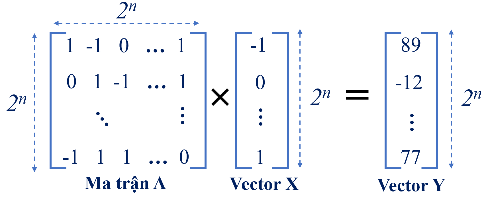
</p>

trong đó:
- `A` là ma trận vuông kích thước 2^n × 2^n (n ≤ 14),
- `X` là vector đầu vào có độ dài 2^n,
- `Y` là vector kết quả có độ dài 2^n.

- Các phần tử của ma trận **A** và vector **X** chỉ nhận giá trị trong tập {1, 0, -1}.
- Toàn bộ dữ liệu A, X, Y được biểu diễn bằng số nguyên 16-bit có dấu.
- Hệ thống hỗ trợ cấu hình kích thước động thông qua các thanh ghi cấu hình.
- Bộ tăng tốc bao gồm:
  - **FSM (Finite State Machine)** với 4 trạng thái: `IDLE`, `LOAD`, `EXECUTE`, `DONE`.
  - **BRAM nội bộ** để lưu trữ A, X, Y.
  - Giao tiếp điều khiển sử dụng **PIO (Programmed I/O)**.
  - Truyền dữ liệu sử dụng **AXI-DMA**, băng thông **128-bit mỗi chu kỳ**.
Bài học được thiết kế cho những người mới bắt đầu với phát triển hệ thống SoC trên nền FPGA.

---

## II. Giới thiệu và Thiết cần dùng
### A. Giới thiệu về PIO và DMA:

<p align="center">
  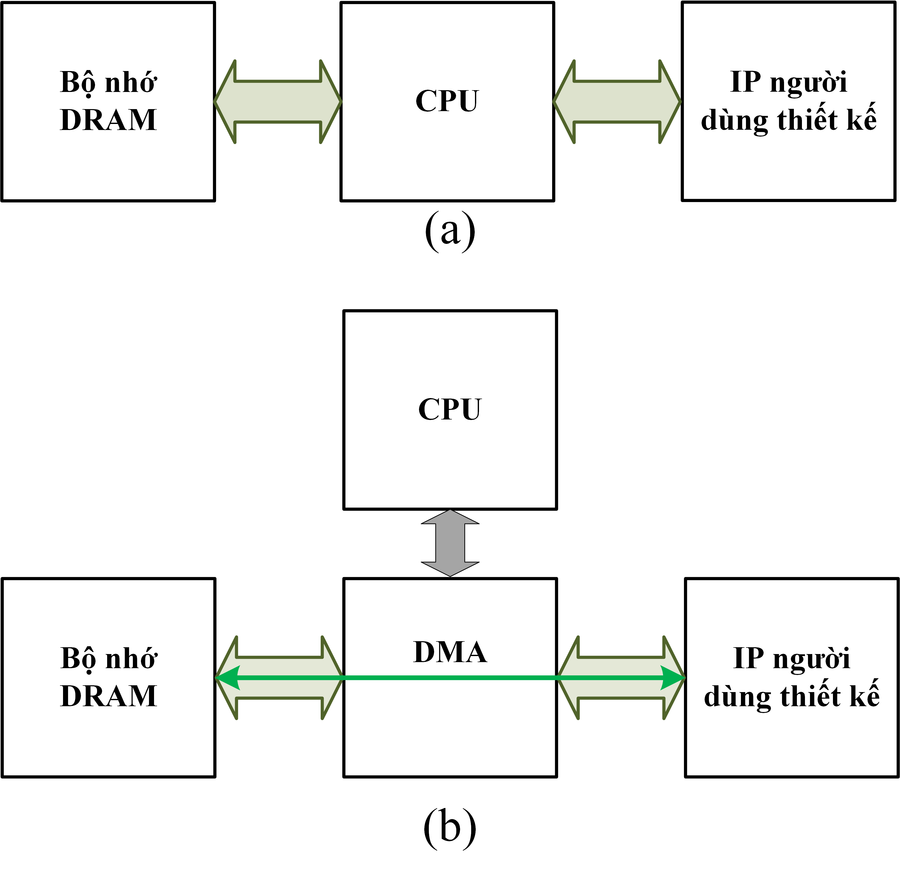
</p>
Trong các hệ thống SoC FPGA, DRAM thường được kết nối với các IP người dùng thiết kế để cung cấp dung lượng lưu trữ cao, đồng thời hỗ trợ truy xuất dữ liệu nhanh chóng cho các phép toán tính toán hoặc xử lý tín hiệu. DRAM lưu trữ các dữ liệu tạm thời cho các IP người dùng thiết kế. Cách thức sử dụng DRAM trong hệ thống SoC FPGA có thể thực hiện qua hai phương thức chính: PIO (Programmed I/O-Đầu ra vào được lập trình) và DMA (Direct Memory Access- Truy cập bộ nhớ trực tiếp). Trong phương thức PIO, CPU trực tiếp điều khiển việc truyền tải dữ liệu giữa DRAM và các IP thông qua các lệnh I/O, như được mô tả trong Hình (a) bên trên. Phương thức này dễ triển khai nhưng có thể gây tải nặng cho CPU vì CPU phải xử lý tất cả các thao tác truyền nhận dữ liệu. Ngược lại, DMA cho phép truyền tải dữ liệu giữa DRAM và các IP mà không cần sự can thiệp của CPU, giúp giảm tải cho CPU và tối ưu hóa băng thông, như mô tả trong Hình (b) bên trên. 

<p align="center">
  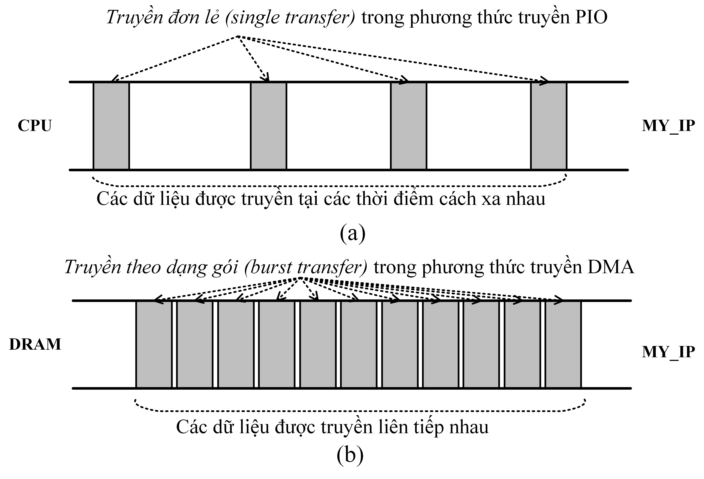
</p>
Hình trên minh họa sự khác biệt giữa phương thức truyền PIO và DMA. Trong phương thức truyền PIO, như thể hiện ở Hình (a) bên trên, truyền đơn lẻ (single transfer) yêu cầu CPU điều khiển từng lần truyền dữ liệu giữa DRAM và MY_IP, với mỗi đơn vị dữ liệu được xử lý riêng biệt. Phương thức này cần sự can thiệp của CPU vào mỗi thao tác truyền tải, với CPU phải gửi lệnh và xử lý từng đơn vị dữ liệu, điều này làm giảm hiệu suất và hiệu quả băng thông vì CPU phải thực hiện quá nhiều thao tác cho mỗi đơn vị dữ liệu. Ngược lại, trong phương thức truyền DMA, như thể hiện ở Hình (b) bên trên, dữ liệu được truyền theo dạng gói (burst transfer), cho phép dữ liệu được truyền liên tục từ DRAM vào MY_IP mà không cần sự can thiệp của CPU. Dữ liệu trong DMA có thể được truyền liên tục hoặc cách xa nhau tùy theo yêu cầu của ứng dụng. Việc truyền liên tục dữ liệu trong các gói giúp tận dụng tối đa băng thông và giảm thiểu độ trễ, vì DMA có khả năng truyền tải dữ liệu từ các vùng bộ nhớ liền kề mà không cần sự gián đoạn.

<p align="center">
  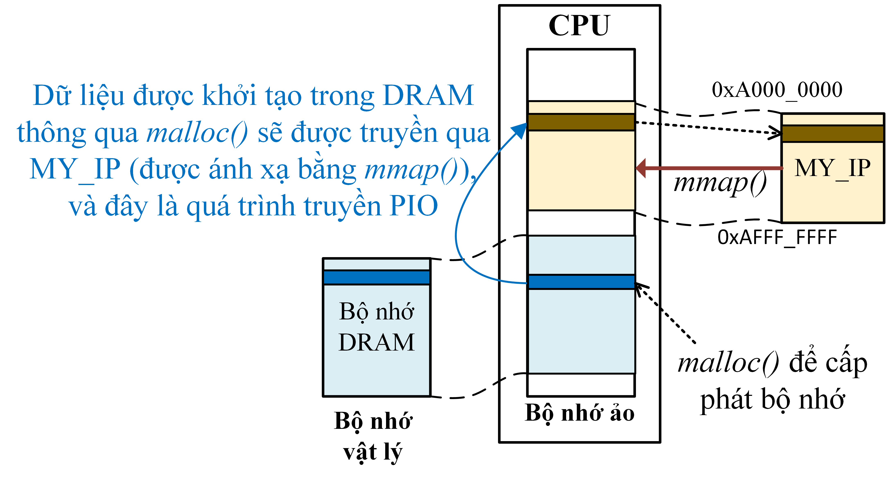
</p>

Hình trên minh họa quá trình truyền dữ liệu được khởi tạo trong DRAM thông qua malloc() và sau đó truyền vào MY_IP, nơi MY_IP được ánh xạ vào bộ nhớ ảo thông qua mmap(). Quá trình này thể hiện việc sử dụng bộ nhớ ảo để cấp phát bộ nhớ, sau đó truyền dữ liệu từ bộ nhớ DRAM vào MY_IP. Đây là một ví dụ về quá trình truyền PIO (Programmed I/O), trong đó CPU điều khiển việc truyền tải dữ liệu giữa DRAM và MY_IP thông qua các lệnh I/O. Trong quá trình này, MY_IP sử dụng bộ nhớ ảo đã được ánh xạ từ vùng bộ nhớ vật lý của DRAM, giúp dữ liệu được truy cập và truyền gián tiếp từ DRAM vào MY_IP.

<p align="center">
  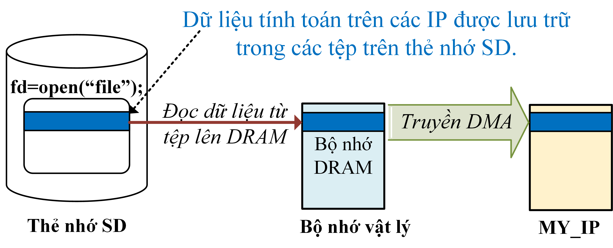
</p>

Hình trên mô tả truyền dữ liệu từ DRAM đến IP thiết kế thông qua phương pháp truyền DMA. Dữ liệu được lưu trữ trong các tệp trên thẻ nhớ SD và sau đó được đọc vào bộ nhớ DRAM thông qua các lệnh truy xuất tiêu chuẩn như open("file"). Sau khi dữ liệu đã có mặt trong DRAM, quá trình truyền dữ liệu từ DRAM đến MY_IP được thực hiện thông qua DMA, giúp giảm tải cho CPU và tối ưu hóa băng thông. Quá trình này không yêu cầu sự can thiệp của CPU và đảm bảo hiệu suất truyền tải dữ liệu nhanh chóng và hiệu quả giữa bộ nhớ và các IP xử lý.

### B. Giới thiệu về BRAM:

Bộ nhớ Block RAM (BRAM) là một thành phần quan trọng trong FPGA, cung cấp khả năng lưu trữ dữ liệu trực tiếp trên chip với độ trễ thấp và băng thông cao. BRAM có kích thước lớn hơn so với LUTRAM (RAM tạo thành từ các LUT), vì vậy nó thường được sử dụng để lưu trữ các khối dữ liệu lớn hơn, hỗ trợ các ứng dụng đòi hỏi dung lượng bộ nhớ cao hơn. Được cấu trúc dưới dạng các khối bộ nhớ riêng biệt và độc lập, BRAM cho phép thiết kế linh hoạt trong việc lưu trữ và truy xuất dữ liệu, đặc biệt hữu ích cho các ứng dụng cần tốc độ xử lý cao như xử lý tín hiệu số, điều khiển hệ thống, và xử lý dữ liệu trong các hệ thống SoC. Trong thiết kế IP, BRAM thường được sử dụng như bộ nhớ toàn cục (global memory) để lưu trữ các dữ liệu lớn cần được truy cập bởi nhiều thành phần xử lý khác nhau, hoặc như bộ nhớ cục bộ (local memory) để lưu trữ dữ liệu tạm thời và trạng thái trong các lõi xử lý cụ thể. Sự đa dụng này giúp BRAM trở thành một lựa chọn phổ biến trong các thiết kế FPGA phức tạp.

<p align="center">
  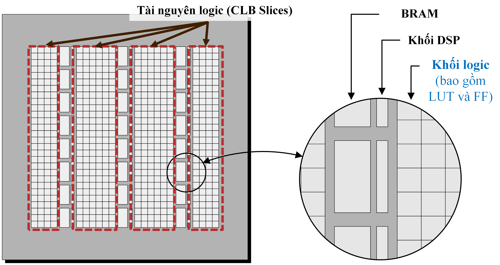
  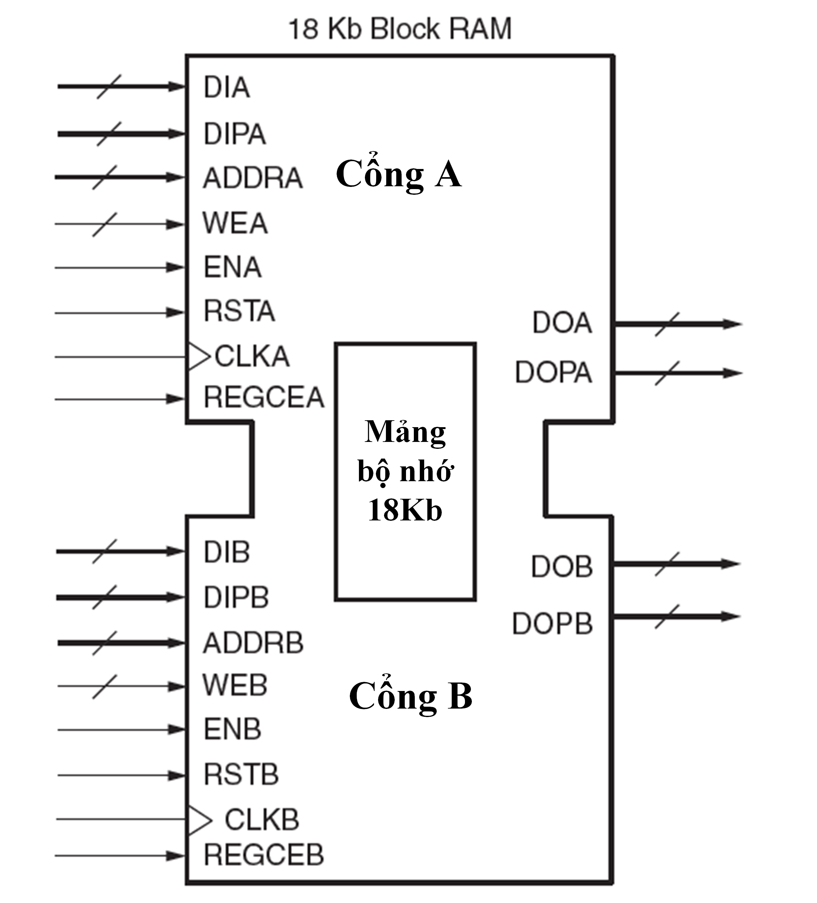
</p>


Hình trên mô tả giao diện của một khối BRAM có dung lượng 18 Kb. Bộ nhớ BRAM hỗ trợ giao diện hai cổng (cổng A và cổng B), cho phép đọc và ghi độc lập. Mỗi cổng bao gồm các tín hiệu dữ liệu đầu vào (DIA/DIB), địa chỉ (ADDRA/ADDRB), xung nhịp (CLKA/CLKB), tín hiệu điều khiển ghi (WEA/WEB), và tín hiệu điều khiển đầu ra (DOA/DOB). Mỗi cổng của BRAM, A và B, đều có các tín hiệu riêng để điều khiển và truyền dữ liệu. Tín hiệu đầu vào dữ liệu (DIA/B) và tín hiệu đầu vào kiểm tra chẵn lẻ (DIPA/B) cung cấp dữ liệu và kiểm tra tính toàn vẹn của dữ liệu được ghi vào bộ nhớ. Tín hiệu địa chỉ (ADDRA/B) xác định vị trí dữ liệu cần truy xuất hoặc ghi vào. Tín hiệu WEA/B là tín hiệu cho phép ghi theo chiều rộng byte, quyết định việc ghi dữ liệu vào bộ nhớ. ENA/B là tín hiệu cho phép hoạt động của cổng; khi không hoạt động, không có dữ liệu nào được ghi vào BRAM và tín hiệu đầu ra vẫn giữ nguyên trạng thái trước đó. Tín hiệu RSTA/B được sử dụng để thiết lập lại hoặc đặt lại đồng bộ các thanh ghi đầu ra khi DO_REG = 1. CLKA/B là tín hiệu đầu vào xung nhịp cho cổng A hoặc B, điều khiển tốc độ hoạt động của bộ nhớ. Tín hiệu đầu ra dữ liệu (DOA/B) và tín hiệu đầu ra kiểm tra chẵn lẻ (DOPA/B) cung cấp dữ liệu và thông tin kiểm tra chẵn lẻ từ bộ nhớ. Cuối cùng, REGCEA/B là tín hiệu cho phép xung nhịp thanh ghi đầu ra, điều khiển hoạt động của các thanh ghi này.

- Tham khảo nội dung về **Bộ nhớ trên FPGA** ở thư mục :  
  - `Tai_Lieu_Tham_Khao/Thiết Kế Bộ Nhớ.pdf`

### C. Danh sách thiết bị:
Dưới đây là danh sách các thiết bị phần cứng cần chuẩn bị để thực hành Level 0 trên bo mạch **Kria KV260 FPGA**.

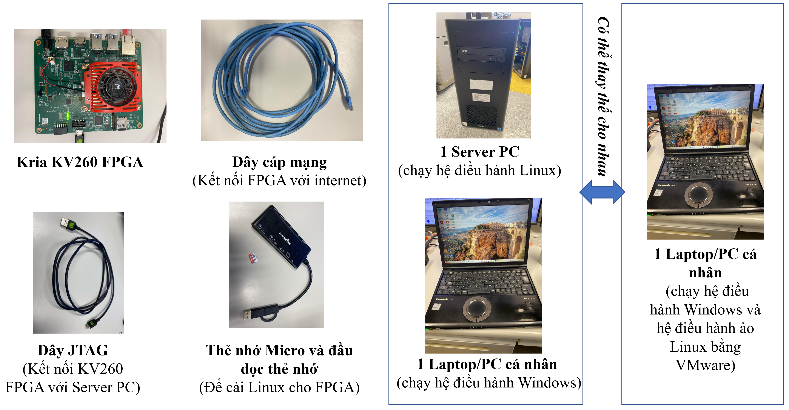

- **Kria KV260 FPGA**: Bo mạch chính dùng để triển khai hệ thống SoC và chạy ứng dụng nhúng.

- **Dây cáp mạng (LAN)**: Dùng để kết nối FPGA với Internet thông qua router/switch, hỗ trợ cập nhật và debug qua SSH.

- **Dây JTAG**: Kết nối từ FPGA đến Server PC để nạp bitstream, debug hoặc hoạt động như dây UART để hiện thị console của Linux trên FPGA.

- **Thẻ nhớ MicroSD và đầu đọc thẻ**: Dùng để tạo image khởi động (BOOT.BIN + Linux kernel + rootfs) và cài hệ điều hành cho FPGA.

- **Server PC (Linux)**: Cài đặt công cụ thiết kế phần cứng (Vivado), công cụ PetaLinux, và thực hiện build toàn bộ hệ thống.

- **Laptop/PC cá nhân (Windows hoặc Linux)**: Dùng để kết nối SSH đến Server, hoặc truyền file (WinSCP). Nếu dùng Windows, cần cài **VMware** để chạy Linux.

⚠️ **Lưu ý:** Bạn có thể thay thế **1 Server PC và 1 Laptop/PC** thành **1 Laptop/PC duy nhất**, miễn là máy có cài đặt Linux để cài PetaLinux.

### D. Kết nối thiết bị

Trước khi bắt đầu quy trình thiết kế phần cứng, cần kết nối và thiết lập các thiết bị như sau:

- **KV260 FPGA**: kết nối với router qua **dây mạng** để có internet, và kết nối với Server PC qua **dây JTAG** để nạp bitstream, debug.
- **Server PC**: dùng để cài **Vivado** và **Petalinux**, kết nối mạng và đầu đọc thẻ nhớ để chuẩn bị Linux cho FPGA.
- **Laptop**: sử dụng để điều khiển Server PC và KV260 thông qua **kết nối SSH** (qua MobaXterm, VSCode, hoặc Terminal).

⚠️ **Lưu ý**:  
- Server PC và Laptop cần nằm chung mạng nội bộ (LAN/WiFi).
- Thẻ nhớ microSD sẽ được dùng để nạp hệ điều hành Linux vào FPGA.

<p align="center">
  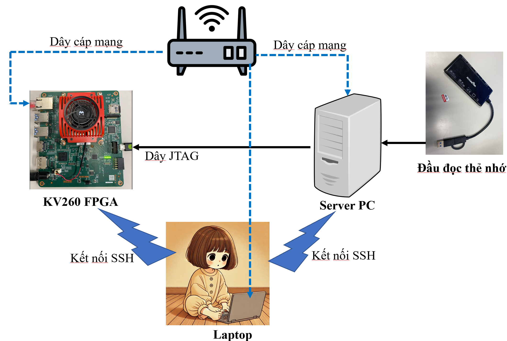
</p>

---

## III. Chi tiết từng bước trong quy trình thiết kế

<p align="center">
  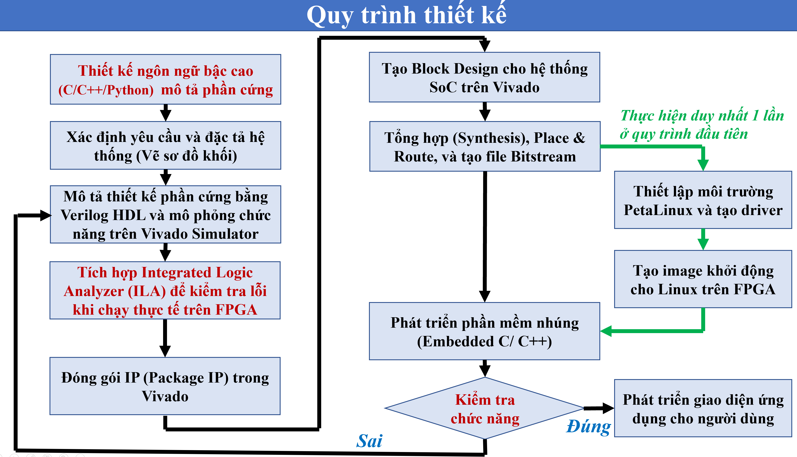
</p>

Quy trình thiết kế hệ thống SoC trên FPGA gồm 8 bước tuần tự, bắt đầu từ việc xác định yêu cầu và mô tả phần cứng bằng Verilog, đến đóng gói IP, thiết kế hệ thống trên Vivado, thiết lập PetaLinux, và cuối cùng là phát triển phần mềm nhúng để điều khiển phần cứng đã thiết kế.

Kế tiếp tôi sẽ trình bày chi tiết 8 bước trên.

### A. Bước 1: Thiết kế ngôn ngữ bậc cao (C/C++/Python)  mô tả phần cứng

Trong bước này, chúng ta sử dụng ngôn ngữ bậc cao C để mô tả và kiểm thử thuật toán nhân **ma trận A × vector Y**.

Mục tiêu:
- Hiểu rõ **bản chất hoạt động** của phép nhân ma trận–vector.
- Chuẩn bị **dataset đầu vào và đầu ra đúng**, phục vụ cho việc so sánh khi test module Verilog.
- Tiết kiệm thời gian hơn so với viết Verilog trực tiếp trong giai đoạn đầu.

📂 Mã nguồn C được đặt trong thư mục: `C_Code_MatrixVector`

Lý do sử dụng ngôn ngữ bậc cao:

- **Tiết kiệm thời gian phát triển**: So với việc viết Verilog ngay từ đầu, việc hiện thực thuật toán bằng C/C++ giúp nhanh chóng kiểm tra tính đúng đắn của thuật toán, nhất là với kích thước ma trận lớn.
- **Tạo dữ liệu chuẩn để so sánh**: Kết quả từ chương trình C/C++ sẽ được lưu lại để so sánh với kết quả từ mạch Verilog. Việc này đặc biệt quan trọng trong giai đoạn debug hoặc xác minh chức năng (functional verification).


### B. Bước 2: Xác định yêu cầu và đặc tả hệ thống (vẽ sơ đồ khối)

Ở Level 1, hệ thống được mở rộng để xử lý **ma trận kích thước lớn** và truyền dữ liệu thông qua **DMA**, đồng thời thực hiện tính toán song song nhiều phần tử mỗi chu kỳ bằng **khối nhân–cộng song song (PMAU)**.

Sơ đồ khối tổng thể gồm các thành phần:

- **Máy trạng thái (FSM)**: điều khiển luồng dữ liệu qua các trạng thái:  
  `IDLE` → `LOAD` → `EXECUTE` → `DONE`

- **BRAM lưu trữ**:
  - `Cụm 8 BRAM` cho **ma trận A**
  - `Cụm 8 BRAM` cho **vector X**
  - `Cụm 8 BRAM` cho **vector Y**

- **Khối xử lý nhân cộng song song (PMAU)**:
  - Gồm nhiều bộ nhân `×` kết hợp bộ cộng `+` theo dạng cây (reduction tree)
  - Dữ liệu đầu vào từ BRAM A và X
  - Kết quả đầu ra ghi vào BRAM Y theo từng dòng

- **Ghi chú từ sơ đồ chi tiết**:
    - Mỗi BRAM có độ rộng 16-bit và chiều sâu 2^11 ( 8 BRAM lưu trữ 2^14 giá trị 16-bit).
    - Dữ liệu được truyền từ **DDR → BRAM** thông qua **AXI DMA**, sau đó đưa vào khối xử lý.
    - PMAU có cấu trúc **song song 8 nhân**, mỗi nhân thực hiện phép nhân `A[i][j] × X[j]`, sau đó cộng dồn theo dạng cây nhị phân.
    - Kết quả dòng `Y[i]` được ghi trở lại BRAM vector Y.

<div style="text-align: center;">
  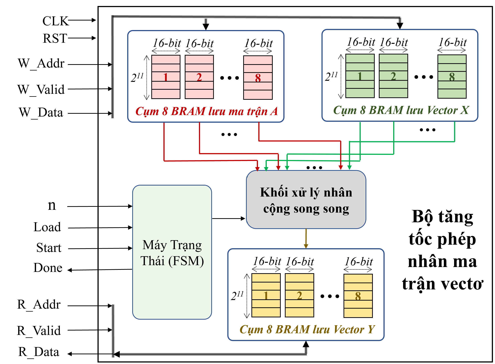
  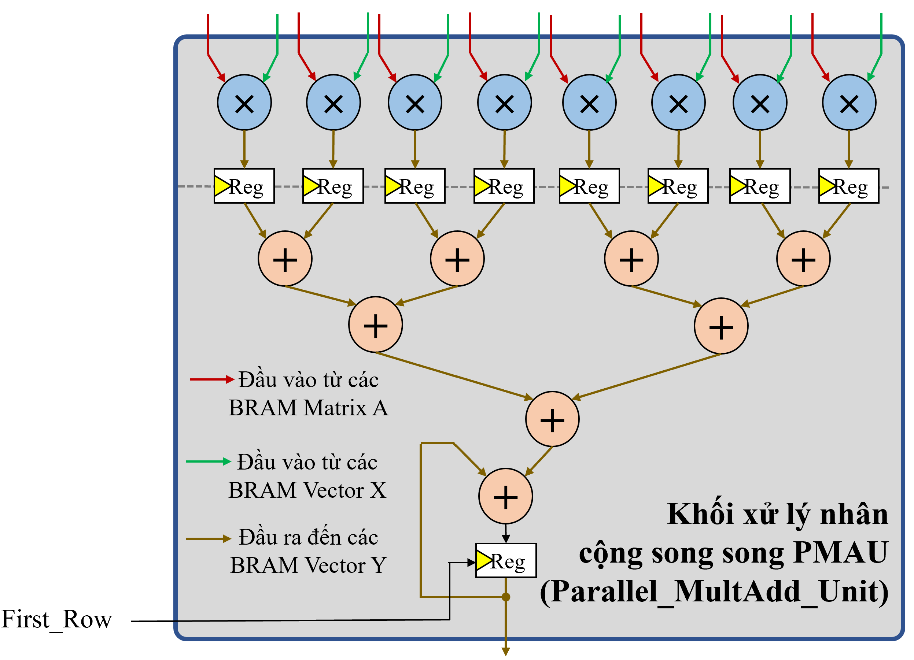
</div>

### 🧠 Lưu ý về giới hạn BRAM và DMA truyền nhiều lần

Trong thiết kế, mỗi cụm 8 BRAM có khả năng lưu trữ tối đa:

- `2^14` giá trị 16-bit (tức 16 KB dữ liệu)

Tuy nhiên, khi kích thước ma trận tăng lớn hơn `2^7 × 2^7 = 2^14` phần tử (tương đương `n > 7`), thì tổng số phần tử trong **ma trận A** sẽ vượt quá khả năng lưu trữ của cụm BRAM hiện tại.
Ví dụ:
- Với `n = 10`, ma trận A có kích thước `2^10 × 2^10 = 2^20` phần tử.
- Mỗi cụm 8 BRAM chỉ chứa được `2^14` giá trị → cần **2^20 / 2^14 = 2^6 = 64 lần truyền DMA** để nạp toàn bộ A.
Giải pháp: Truyền DMA từng phần (batch-wise DMA transfer)

Để xử lý dữ liệu vượt kích thước BRAM, hệ thống sử dụng cơ chế **truyền DMA lặp lại nhiều lần**, theo từng phần nhỏ như sau:

1. **Chia ma trận A thành nhiều batch** theo từng dòng (hoặc khối con), mỗi batch chứa tối đa `2^14` phần tử.
2. **Gửi batch A[k] từ DDRAM → cụm 8 BRAM A** qua DMA.
3. Dữ liệu `vector X` có độ dài `2^n`, cũng được chia thành batch nếu cần, nhưng thường có thể giữ nguyên trong BRAM do kích thước nhỏ hơn.
4. Thực hiện phép nhân `Y_batch = A[k] × X`.
5. **Kết quả Y_batch** được ghi vào cụm BRAM Y, sau đó DMA ghi trả về DDRAM.
6. Tiếp tục với batch tiếp theo đến khi toàn bộ `Y` được xử lý.

### Tổng kết:

| Thành phần | Số phần tử tối đa | Hướng xử lý |
|------------|------------------|-------------|
| Ma trận A  | 2ⁿ × 2ⁿ          | Chia theo dòng, truyền DMA nhiều lần |
| Vector X   | 2ⁿ               | Thường giữ cố định trong BRAM |
| Vector Y   | 2ⁿ               | Ghi theo từng batch vào BRAM, rồi DMA trả về |

💡 Cách tiếp cận này cho phép hệ thống xử lý ma trận cực lớn mà không vượt giới hạn tài nguyên FPGA nội bộ. Đây là kỹ thuật thường gặp trong các hệ thống tăng tốc AI hoặc DSP quy mô lớn.

### C. Bước 3: Mô tả thiết kế phần cứng và mô phỏng chức năng

- Viết mã **Verilog HDL** mô tả mạch số thực hiện phép nhân ma trận A và vector X với các giá trị trong ma trận và vector sử dụng **dữ liệu 16-bit có dấu**.

- **Mã nguồn RTL Verilog** được đặt trong thư mục:  
  - ```text
    RTL/
    ├── Matrix_Vector_Multiplication.v  // Module top xử lý nhân ma trận-vector
    └── PMAU.v                          // Khối xử lý song song Parallel Multiply-Accumulate Unit
    ```
  
- Mô phỏng chức năng cho khối xử lý PMAU:
    - **Testbench:** `TB/PMAU_tb.v`
    - Chạy mô phỏng bằng **Vivado Simulator**
    - Kết quả kiểm tra được hiển thị trực tiếp trong cửa sổ console (PASS/FAIL từng trường hợp)

-Mô phỏng toàn hệ thống Matrix × Vector:
    - **Testbench:** `TB/Matrix_Vector_Multiplication_tb.v`
    - Kết quả `Y_out` sẽ được ghi ra file: `C_Code_MatrixVector/Vector_Y_Hardware.txt` để so sánh kết quả này với file đầu ra chuẩn sinh bởi C code `C_Code_MatrixVector/Vector_Y_Result.txt`.

- **Project Vivado (2022.2)** đã cấu hình sẵn cho mô phỏng nằm trong thư mục:  
  - `Simulation/`

<p align="center">
  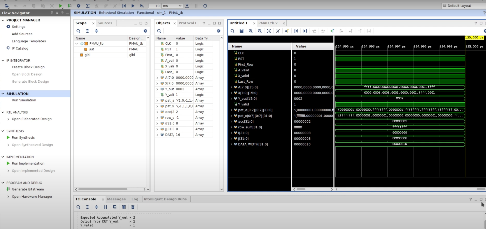
</p>

### D. Bước 4: Tích hợp Integrated Logic Analyzer (ILA) để kiểm tra lỗi khi chạy thực tế trên FPGA
- **ILA là gì?**  
  ILA (Integrated Logic Analyzer) là một IP lõi do Xilinx cung cấp, cho phép người dùng quan sát các tín hiệu bên trong FPGA trong thời gian thực, giống như một máy hiện sóng tích hợp trực tiếp vào chip.

- **Tại sao cần ILA?**  
  Khi chạy thiết kế trên FPGA thực tế, có những lỗi không thể phát hiện qua mô phỏng như:
  - DMA truyền sai địa chỉ hoặc sai chiều
  - FSM không chuyển trạng thái đúng
  - Dữ liệu ghi sai vào BRAM hoặc ghi chậm 1 chu kỳ
  - Các tín hiệu bị xung glitch hoặc không đồng bộ
  → ILA cho phép kiểm tra trực tiếp các tín hiệu bên trong mạch đang hoạt động để tìm và sửa lỗi nhanh chóng.

- **Vivado hỗ trợ 2 loại ILA chính:**
  - **ILA (thường)**  
     - Là IP ILA thông thường, không có chuẩn giao tiếp cố định.
     - Được tích hợp trực tiếp bằng cách:
       - Gọi module `ila_0` trong mã Verilog top-level (nối tín hiệu cần quan sát vào cổng `probe`)
       - Hoặc kéo IP ILA vào Block Design và nối tín hiệu cần debug
     - Phù hợp để quan sát FSM, các tín hiệu điều khiển, dữ liệu từ BRAM, v.v.
     - Đơn giản, linh hoạt, dùng được với mọi thiết kế RTL.

  - **System ILA**  
     - Là phiên bản ILA cao cấp có giao tiếp chuẩn **AXI4-Lite** hoặc **AXI4-Stream**.
     - Được thiết kế để **gắn vào các bus AXI trong hệ thống SoC** hoặc Zynq MPSoC.
     - Được sử dụng bằng cách kéo thả IP `System ILA` vào Block Design (không tích hợp trực tiếp trong module RTL).
     - Hữu ích khi cần debug các bus AXI như: AXI DMA, AXI BRAM Controller, AXI Interconnect.
     - Có thể theo dõi nhiều kênh AXI cùng lúc và hỗ trợ trigger nâng cao.

- **Cách sử dụng ILA trong Vivado:**
  - Mở Block Design hoặc mã Verilog top-level
  - Kéo IP `ILA` hoặc `System ILA` từ IP Catalog
  - Kết nối các tín hiệu cần debug vào cổng `probe` (ILA) hoặc interface AXI (System ILA)
  - Set các cổng cần debug bằng cách:
    - Trong Block Design: chọn tín hiệu → chuột phải → **Set as Debug**
    - Trong Verilog: khai báo `ila_0` và nối vào tín hiệu cần quan sát
  - Chạy **Synthesis**, **Implementation** và **Generate Bitstream**
  - Mở **Vivado Hardware Manager**, kết nối tới FPGA, nạp `.bit` và bắt đầu quan sát tín hiệu

- **Lưu ý khi dùng ILA:**
  - Đặt trigger condition để chỉ ghi lại tín hiệu khi cần (ví dụ khi `Start = 1`)
  - Không nên debug quá nhiều tín hiệu để tránh vượt giới hạn tài nguyên LUT/FF
  - Có thể dùng nhiều probe để theo dõi song song nhiều tín hiệu

- **Ví dụ sử dụng:**
  - Dùng ILA để kiểm tra xem FSM có chuyển trạng thái đúng không
  - Dùng System ILA để kiểm tra xem DMA có đọc/ghi đúng địa chỉ, đúng burst length không
  - Dùng ILA để quan sát `Valid_out`, `Y_out` có xuất hiện đúng lúc không

<p align="center">
  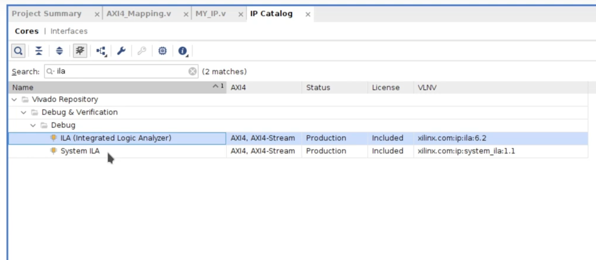
</p>

### E. Bước 5: Đóng gói IP (Package IP) trong Vivado

Sau khi mô tả phần cứng bằng **Verilog HDL** và mô phỏng thành công, chúng ta tiến hành **đóng gói thiết kế thành một IP** để có thể tái sử dụng và tích hợp vào hệ thống SoC trong các bước tiếp theo.

Hình dưới minh họa cách **IP tự thiết kế (`MY_IP`)** được tích hợp vào hệ thống SoC và kết nối với CPU thông qua **AXI4 Bus**. Tín hiệu đầu vào/ra của mạch (`W_Addr`, `W_Valid`, `W_Data`, `Start`,...) được ánh xạ qua giao diện AXI4-Full thông qua lớp `AXI4 Mapping`.

<p align="center">
  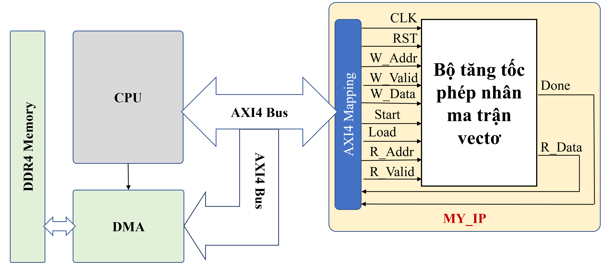
</p>

- Tham khảo nội dung về **hệ thống bus bao gồm AXI4-Full** ở thư mục :  
  - `Tai_Lieu_Tham_Khao/Hệ Thống Bus.pdf`
  
Các bước thực hiện:

1. Mở Vivado, chọn menu **Tools → Create and Package New IP**
2. Chọn kiểu IP: từ mã RTL có sẵn (`Package your current project`)
3. Điền thông tin định danh cho IP:
   - Tên IP (`MY_IP`)
   - Phiên bản (ví dụ: `1.0`)
   - Mô tả chức năng (Multiply-Accumulate core with FSM control)
4. Cấu hình các cổng tín hiệu I/O và địa chỉ giao tiếp:
   - Mapping tín hiệu qua chuẩn **AXI4-Full** nếu dùng giao tiếp với CPU
5. Kiểm tra lại toàn bộ cấu hình
6. Nhấn **Package IP** để đóng gói và thêm IP này vào Vivado IP Catalog

> Đây là bước cần thiết để có thể sử dụng lại IP trong các Block Design.

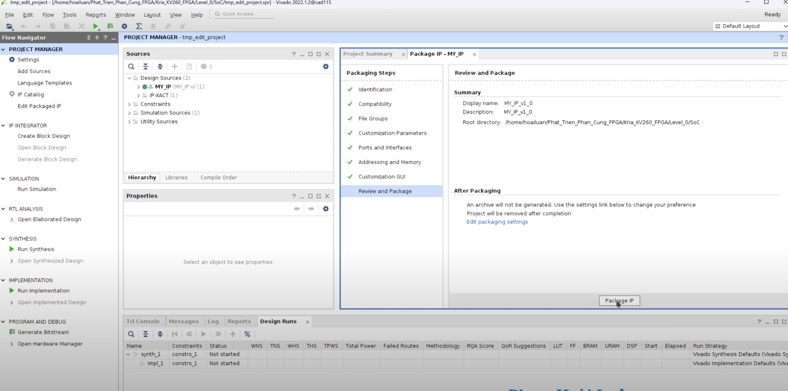

### F. Bước 6: Tạo Block Design cho hệ thống SoC trên Vivado

Sau khi đóng gói IP thành công, ta tiến hành tạo hệ thống SoC bằng cách sử dụng **Block Design** trong Vivado.

Các thành phần chính trong sơ đồ Block Design:

- **ZYNQ MPSoC**: bộ xử lý chính điều khiển hệ thống, cấu hình chân và kết nối AXI.
- **IP tự thiết kế (MY_IP_v1_0)**: chứa phần cứng tính nhân ma trận và vector, được kết nối thông qua chuẩn **AXI4-Full**.
- **AXI SmartConnect**: cầu nối giữa các master/slave sử dụng giao thức AXI.
- **Reset module**: đồng bộ hóa tín hiệu reset giữa phần xử lý và phần lập trình.

#### Các thao tác cần thực hiện trong Vivado:

1. Tạo **Block Design mới** từ menu **IP Integrator**.
2. Thêm các thành phần chính vào sơ đồ (ZYNQ MPSoC, MY_IP_v1_0, AXI SmartConnect, Reset).
3. Dùng **Run Block Automation** để tự động cấu hình ZYNQ.
4. Kết nối các cổng AXI và Reset đúng cách.

<p align="center">
  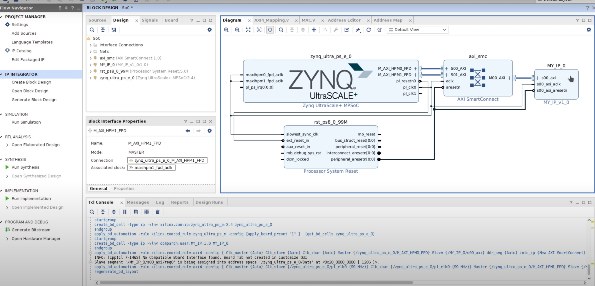
</p>

### G. Bước 7: Tổng hợp (Synthesis), Place & Route, và tạo file Bitstream

Sau khi hoàn tất sơ đồ kết nối:

1. **Chuột phải vào Block Design** → chọn **"Generate Output Products"**.
2. **Chuột phải lần nữa** → chọn **"Create HDL Wrapper"** để sinh mã top-level cho thiết kế.
3. Cuối cùng, nhấn **"Generate Bitstream"** để chạy toàn bộ các bước:
   - Synthesis (tổng hợp)
   - Implementation (triển khai)
   - Bitstream Generation (tạo file cấu hình FPGA)

> Đây là bước quan trọng để chuyển thiết kế thành file cấu hình `.bit` có thể nạp lên FPGA và file `.xsa` để cài đặt Petalinux cho FPGA.


### H. Bước 8: Thiết lập môi trường PetaLinux và tạo driver

Sau khi hoàn tất thiết kế phần cứng và tạo Block Design trong Vivado, bước tiếp theo là **xuất file phần cứng (`.xsa`)** để sử dụng trong PetaLinux nhằm tạo hệ điều hành và driver phù hợp cho hệ thống.

#### 1. Xuất file phần cứng (`.xsa`) từ Vivado

- Trong Vivado, sau khi **Generate Bitstream** thành công:
  - Vào menu: **File → Export → Export Hardware**
  - Chọn:Include bitstream
  - File `.xsa` sẽ được tạo ra (ví dụ: `SoC_wrapper.xsa`)

#### 2. Cài đặt PetaLinux

- Tải bộ cài **PetaLinux 2022.2** từ trang chính thức Xilinx:
    🔗 https://www.xilinx.com/support/download/index.html/content/xilinx/en/downloadNav/embedded-design-tools/archive.html


##### Cài đặt các gói phụ thuộc (Ubuntu/Debian)

```bash
sudo apt-get install tofrodos gawk xvfb git libncurses5-dev tftpd zlib1g-dev zlib1g-dev:i386 \
libssl-dev flex bison chrpath socat autoconf libtool texinfo gcc-multilib \
libsdl1.2-dev libglib2.0-dev screen pax libtinfo5 xterm build-essential net-tools
```
	
##### Cấp quyền thực thi cho file `.run`

```bash
chmod +x petalinux-v2022.2-*.run
```

#####  Chạy trình cài đặt

```bash
./petalinux-v2022.2-*.run
```

- Trong quá trình cài đặt, trình cài đặt sẽ hiển thị các thỏa thuận bản quyền:
	- Dùng PgUp / PgDn để đọc
	- Nhấn q để thoát khỏi phần hiển thị
	- Nhấn y để đồng ý và tiếp tục

#### 3. Xây dựng môi trường phần cứng

##### Thiết lập môi trường làm việc Petalinux

##### **Source** đến thư mục cài đặt Petalinux để sử dụng được các lệnh `petalinux-*`:
```bash
source <đường_dẫn_cài_petalinux>/2022.2/settings.sh
```

##### Tải bộ cài BSP cho KV260 FPGA từ trang chính thức Xilinx:
    🔗 https://www.xilinx.com/support/download/index.html/content/xilinx/en/downloadNav/embedded-design-tools/archive.html

##### Tạo project PetaLinux từ BSP
```bash	
petalinux-create -t project -s <đường_dẫn_tới_file_BSP>.bsp --name KV260_Linux
cd KV260_Linux
 ```
 
##### Import phần cứng (.xsa) vào project Sau khi bạn export file .xsa từ Vivado (có chứa bitstream), hãy dùng lệnh sau để tích hợp phần cứng vào project:
```bash
petalinux-config --get-hw-description=<path_to_the_hw_description_file> 
 ```
##### Cấu hình kernel bootargs thủ công Sau khi chạy petalinux-config, hệ thống sẽ mở giao diện curses để bạn cấu hình sâu hơn. Điều chỉnh cấu hình kernel bootargs Trong cửa sổ cấu hình, thực hiện các bước sau:
 
 ```text
Subsystem AUTO Hardware Settings  --->
    DTG Settings  --->
        Kernel Bootargs  --->
            [ ] generate boot args automatically
            (user-defined) user set kernel bootargs
 ```
 
Dán đoạn bootargs dưới đây vào phần user set kernel bootargs:
```bash
earlycon console=ttyPS1,115200 root=/dev/mmcblk1p2 rw rootwait cpuidle.off=1 uio_pdrv_genirq.of_id=generic-uio clk_ignore_unused init_fatal_sh=1 cma=256M
 ```
📌 Cấu hình này giúp khởi động đúng thiết bị, bật driver UIO, cấp vùng bộ nhớ CMA, và giữ clock cho các IP tự thiết kế trong PL.

##### Chỉnh sửa Device Tree (system-user.dtsi)

Để hệ điều hành Linux có thể sử dụng **IP tự thiết kế trong PL** thông qua driver `uio`, bạn cần chỉnh sửa file **Device Tree Overlay**.
Trong file ở đường dẫn `KV260_Linux/project-spec/meta-user/recipes-bsp/device-tree/files/system-user.dtsi`, chỉnh lại file thành: 
```dts
/include/ "system-conf.dtsi"
/ {
    reserved-memory {
        #address-cells = <2>;
        #size-cells = <2>;
        ranges;
        reserved: buffer@0 {
                no-map;
                reg = <0x8 0x0 0x0 0x80000000>;
        };
    };

    amba: axi {
        /* GDMA */
        fpd_dma_chan1: dma-controller@fd500000 {
            compatible = "generic-uio";
        };

        fpd_dma_chan2: dma-controller@fd510000 {
            compatible = "generic-uio";
        };

        fpd_dma_chan3: dma-controller@fd520000 {
            compatible = "generic-uio";
        };

        fpd_dma_chan4: dma-controller@fd530000 {
            compatible = "generic-uio";
        };

        fpd_dma_chan5: dma-controller@fd540000 {
            compatible = "generic-uio";
        };

        fpd_dma_chan6: dma-controller@fd550000 {
            compatible = "generic-uio";
        };

        fpd_dma_chan7: dma-controller@fd560000 {
            compatible = "generic-uio";
        };

        fpd_dma_chan8: dma-controller@fd570000 {
            compatible = "generic-uio";
        };
    };

    amba_pl@0 {
        MY_IP@a0000000 {
                compatible = "generic-uio";
        };
    };

    ddr_high@000800000000 {
        compatible = "generic-uio";
        reg = <0x8 0x0 0x0 0x80000000>;
    };
};

```
File `system-user.dtsi` mẫu được lưu trong thư mục `KV260_Linux` ở github.

##### Sau đó tiến hành build project

```bash
petalinux-build
```

### J. Bước 9: Tạo image khởi động và rootfs cho Linux trên SoC FPGA

Sau khi build project thành công, gõ lệnh này để đóng gói file khởi động BOOT.BIN cùng với U-Boot phù hợp cho hệ thống.

```bash
petalinux-package --boot --force --u-boot
```

Sau đó cắm SD card vào PC, tiến hàn phân vùng và định dạng thẻ nhớ SD. **Bạn có thể làm theo hướng dẫn chi tiết trong Video hướng dẫn bên trên ** từ phút **53:40 đến 1:03:18** tại link (https://youtu.be/F1vxzkd7_DI?si=RyHPx3zzii_RXPgk):

📥 [Tải file Debian rootfs tại đây](https://drive.google.com/file/d/1ZcJYuVHpn8ER11nLCjwCUjfc5ykqP0tM/view?usp=sharing)

> File rootfs này chứa hệ điều hành Debian đã được cấu hình sẵn cho kiến trúc ARM64, hỗ trợ giao diện XFCE và dễ dàng cài đặt thêm ứng dụng bằng `apt`.

### K. Bước 10: Phát triển phần mềm nhúng (Embedded C/ C++)

Trước khi chạy chương trình, cần đảm bảo các thiết bị UIO (User I/O) đã được hệ điều hành nhận diện.

-Kiểm tra danh sách UIO hiện có:
 ```bash
 ls /sys/class/uio/
 cat /sys/class/uio/uioX/name (ví dụ cat /sys/class/uio/uio13/name)
 ```
-Đảm bảo có các thiết bị với tên như sau (thứ tự có thể thay đổi): **MY_IP** (tên IP tự thiết kế), **dma-controller** (DMA AXI), ddr_high (vùng DMA dùng chung với PS)

👉 Nếu không thấy hoặc tên sai, cần kiểm tra lại **system-user.dtsi** trong quá trình build PetaLinux.

Sau khi đã chuẩn bị đầy đủ hệ điều hành Linux trên FPGA, chúng ta tiến hành chạy chương trình nhúng điều khiển IP tự thiết kế bằng ngôn ngữ **C/C++**.

#### Thư mục code
Trong repo GitHub này, thư mục `Embedded_Software` chứa toàn bộ mã nguồn C điều khiển IP MAC thông qua giao tiếp PIO.

#### Cách chạy

1. Mở phần mềm **WinSCP** để kết nối từ máy tính cá nhân đến board **KV260 FPGA** (qua SSH).
2. **Copy toàn bộ thư mục `Embedded_Software`** từ repo này vào thư mục `/home/debian/` trên KV260.
3. Trên terminal (hoặc qua MobaXterm), truy cập vào thư mục đã copy:
   ```bash
   ssh debiang@<địa chỉ IP của KV260 FPGA> (Ví dụ 192.168.1.10)
   cd Embedded_Software
   sh Clear_txt_file.sh -> để xóa các file txt
   run_Matrix_Multiplication.sh -> để chạy nhân ma trận trên CPU bằng code C và tạo ra các file txt
   run_main.sh -> để chạy code C điều khiển FPGA và so sánh kết quả từ FPGA và code C
   ```
---

# 📬 Mọi góp ý hoặc liên hệ để giải đáp lỗi khi thực hiện project này vui lòng liên hệ:

- Facebook: [https://www.facebook.com/pham.luan.921/](https://www.facebook.com/pham.luan.921/)
- Email: [luanph@uit.edu.vn](mailto:luanph@uit.edu.vn)

Rất cảm ơn sự đồng hành và ủng hộ của bạn 🙏  
**Chúc bạn học FPGA thật vui và hiệu quả!**

Nếu bạn thấy nội dung mình chia sẻ **hữu ích, thực tế và có giá trị học tập hoặc nghiên cứu**, bạn có thể **ủng hộ** mình một chút để tiếp thêm động lực ra những phần tiếp theo chất lượng hơn.

**Donate:** Bạn đọc có thể ủng hộ lab bằng tài khoản bên dưới, mọi khoản tiền đóng góp sẽ được sử dụng để mua thiết bị và phần mềm phục vụ cộng đồng

---

<p align="center">
  
</p>
