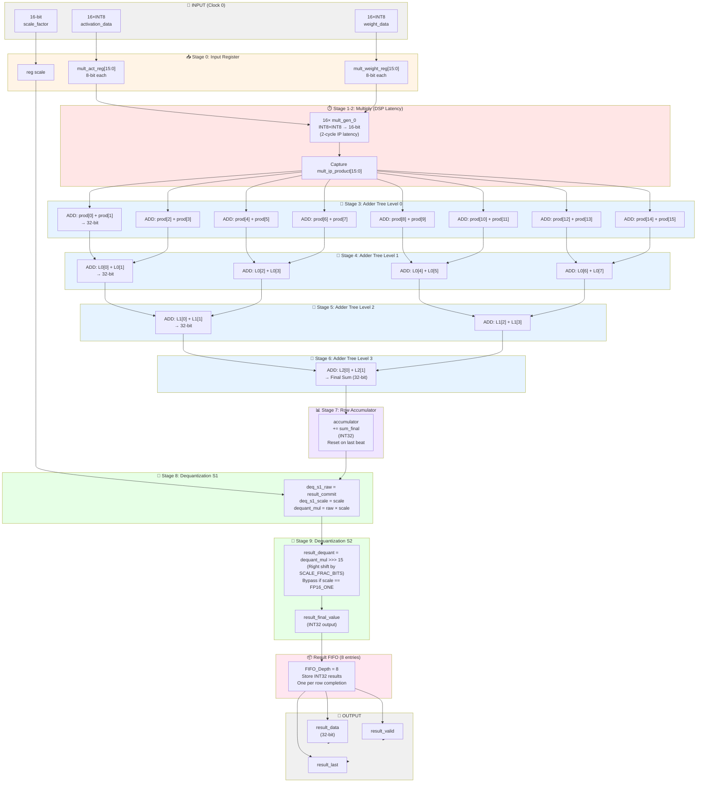

# PMAU_Full Pipeline Architecture

## Pipeline Diagram



## Pipeline Timing Summary

| Stage | Operation | Latency | Registers | Output Width |
|-------|-----------|---------|-----------|--------------|
| 0 | Input capture | 1 | mult_act_reg, mult_weight_reg | 8×16 bits |
| 1-2 | DSP multiply | 2 | mult_pipe[15:0] | 16×16 bits |
| 3 | Adder L0 (pair sum) | 1 | sum_pipe[0][7:0] | 8×32 bits |
| 4 | Adder L1 (quad sum) | 1 | sum_pipe[1][3:0] | 4×32 bits |
| 5 | Adder L2 (octal sum) | 1 | sum_pipe[2][1:0] | 2×32 bits |
| 6 | Adder L3 (final sum) | 1 | sum_pipe[3][0] | 1×32 bits |
| 7 | Accumulate | 1 | accumulator | 32 bits |
| 8 | Dequant S1 | 1 | deq_s1_raw, deq_s1_scale | 32 bits |
| 9 | Dequant S2 | 1 | deq_s2_value | 32 bits |
| - | Result FIFO | 0 | 8×32 bits | 32 bits |
| **Total** | **Complete** | **~11** | **Multiple stages** | **INT32 output** |

## Data Flow Details

### Input Channels (Synchronized)
- `activation_valid` & `weight_valid` must both be asserted
- Both must have matching `activation_last` & `weight_last`
- When synchronized, `input_fire` allows data to advance

### Backpressure Logic
```
reserved_result_slots = fifo_count_after_pop + pending_result_count

can_accept_pair = 
    incoming_last_match &&
    ((!incoming_pair_last) || (reserved_result_slots < FIFO_DEPTH))

activation_ready = can_accept_pair && weight_valid
weight_ready = can_accept_pair && activation_valid
```

### Scaling/Dequantization
- Input scale: 16-bit fixed-point (SCALE_FRAC_BITS = 15)
- FP16_ONE bypass: `16'h3c00` → use raw accumulator without scaling
- Dequant formula: `(raw_acc × scale) >> 15`
- Width: 32-bit × 16-bit → 48-bit → shifted back to 32-bit

### Result FIFO
- Depth: 8 entries (power of 2)
- Tracks row completion via `result_last` flag
- Enables decoupling of MAC pipeline from result readback
- Prevents input stall when BRAM write is slower

## Key Features
✅ **16 parallel INT8×INT8 multipliers** (16 DSP blocks)
✅ **Registered binary adder tree** (4 levels)
✅ **Row accumulator** for multi-beat vectors
✅ **Fixed-point scaling** with bypass
✅ **Result FIFO** for throughput decoupling
✅ **Full handshake backpressure** between pipeline stages
✅ **Throughput**: 1 beat/clock (when FIFO available)
