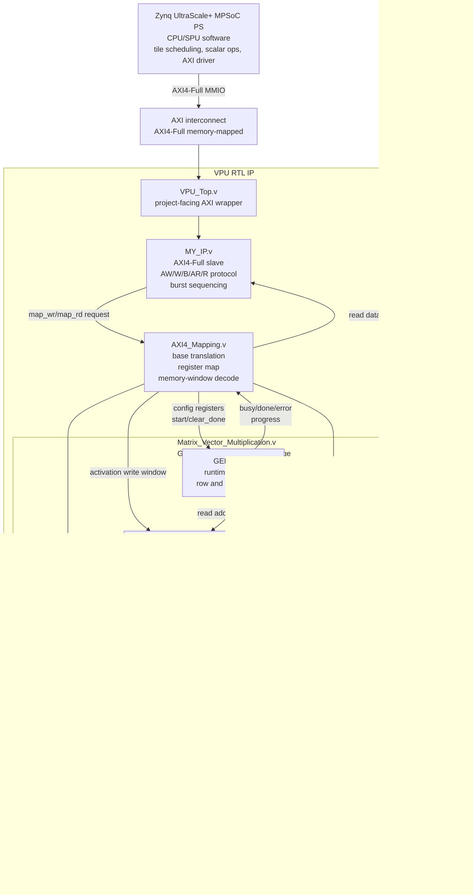

# DATN SoC Architecture Overview

## Architecture Goal

This project targets an INT8-quantized Gemma3-1B accelerator on the Xilinx ZCU104. The current architecture prioritizes:

- extending usable context length through tiled tensor, weight, and KV-cache management;
- keeping the VPU as a fast and timing-friendly INT8 datapath;
- running the SPU and scalar/non-linear operations on the CPU/PS;
- using AXI4-Full memory-mapped access for PS-side data loading, runtime configuration, VPU start control, and result readback.

## High-Level Block Diagram

The old linear drawing was correct at hierarchy level, but it hid an important
detail: `PMAU_Full` does not talk to the PS or the BRAM address map directly.
`Matrix_Vector_Multiplication` is the local controller between BRAM storage and
the PMAU datapath.



## AXI4-Full Address Map

`AXI4_Mapping.v` is now an internal module under `MY_IP`. It owns the local register map, memory-window decode, and optional physical-base translation from `40'h00A0_0000_00` into the local VPU offset space. If the Vivado AXI interconnect already strips the base address, the local address is passed through unchanged.

| Local offset | Purpose |
|---:|---|
| `0x0000_0000` | CTRL: start / clear done |
| `0x0000_0010` | STATUS: done, busy, error |
| `0x0000_0020` | ROWS |
| `0x0000_0030` | COLS |
| `0x0000_0040` | COL_BEATS, write 0 to derive it from COLS in hardware |
| `0x0000_0050` | SCALE placeholder / fixed-point scale |
| `0x0000_0060` | MODE placeholder |
| `0x0000_0070` | LIMITS: MAX_ROWS, MAX_COL_BEATS |
| `0x0000_0080` | PROGRESS: active row / column beat |
| `0x0000_0090` | CAPABILITY: packed mode and result packing limits |
| `0x0001_0000` | Activation BRAM write window |
| `0x0010_0000` | Weight BRAM write window |
| `0x0020_0000` | Result BRAM read window |

## Local Memory Organization

The VPU uses `Dual_Port_BRAM.v` for three internal storage regions:

- activation BRAM: written by the PS through AXI, read by the VPU during compute;
- weight BRAM: written by the PS through AXI, read by the VPU using `row * MAX_COL_BEATS + col_beat`;
- result BRAM: written by the VPU with INT32 row results, read by the PS through AXI.

Default parameters:

| Parameter | Value |
|---|---:|
| `NUM_LANES` | 16 |
| `AXI_DATA_WIDTH` | 128 |
| `MAX_ROWS` | 256 |
| `MAX_COL_BEATS` | 32 (16 packed q8_0 blocks per launch) |

Local tile capacity with the default parameters in the current RTL:

- activation: `MAX_COL_BEATS * 16 bytes = 32 * 16 = 512 bytes`;
- weight: `MAX_ROWS * MAX_COL_BEATS * 16 bytes = 256 * 32 * 16 = 131072 bytes = 128 KiB`;
- result: `RESULT_WORD_DEPTH * 16 bytes = 1024 * 16 = 16384 bytes = 16 KiB`;
- maximum vector length per row: `MAX_COL_BEATS * NUM_LANES = 32 * 16 = 512` INT8 elements.

`RESULT_WORD_DEPTH` is larger than `MAX_ROWS` because packed q8 partial mode can
produce up to `MAX_ROWS * MAX_GROUP_Q8_BLOCKS = 256 * 16 = 4096` INT32 partials.
With four INT32 lanes per 128-bit AXI word, this gives `4096 / 4 = 1024` result
words.

Activation and weight tiles should be written as full 128-bit beats with all WSTRB bits enabled. If the last vector beat has fewer than 16 INT8 elements, software should zero-pad the unused lanes before starting the VPU.

## Runtime Flow

1. The CPU computes or loads the activation and weight tile from DDR.
2. The CPU writes activation data to `ACT_BASE`.
3. The CPU writes weight data to `WEIGHT_BASE`.
4. The CPU writes `ROWS`, `COLS`, and optionally `COL_BEATS`.
5. The CPU writes CTRL start.
6. The GEMV core reads activation and weight BRAM beats.
7. The GEMV read pipeline aligns synchronous BRAM outputs and feeds them into `PMAU_Full`.
8. `PMAU_Full` computes INT8 dot products and returns INT32 row or packed-block results.
9. The GEMV core writes results into result BRAM.
10. The CPU polls or receives the done status and reads results.
11. CPU/SPU software runs RoPE, RMSNorm, Softmax, SiLU, quantization, and KV packing.

## Pipeline Boundary

The high-speed pipeline is inside the VPU:

```text
activation/weight BRAM read
  -> GEMV synchronous-read alignment pipeline
  -> PMAU input valid/ready handshake
  -> INT8 multipliers
  -> registered adder tree
  -> accumulator/dequant/result FIFO
  -> GEMV result write logic
  -> result BRAM
```

The SPU currently runs on the CPU. CPU-side functions that can be pipelined or vectorized include RoPE, RMSNorm, Softmax, SiLU, quantization, Serial2Parallel packing, and scale-zero FIFO packing.

## ZCU104 Integration Notes

- The IP should be connected inside a Vivado Block Design through an AXI interconnect. The AXI signals should not be mapped directly to FPGA package pins.
- Full-system implementation must be rerun after connecting the real PS, AXI interconnect, clock, and reset network.
- `Dual_Port_BRAM.v` is only a local memory primitive wrapper. It does not replace DDR or a large KV cache.
- For longer context lengths, tensors and weights should be tiled from DDR while BRAM is used as near-compute staging storage.
