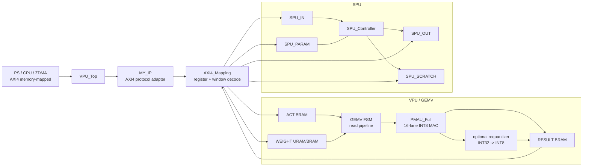
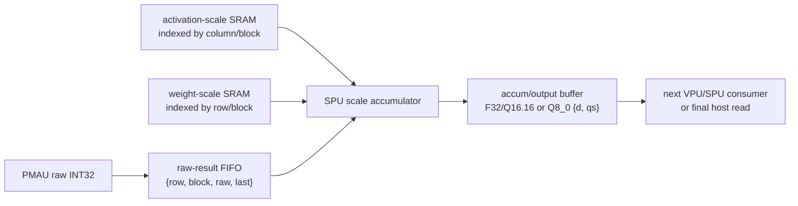

# RTL VPU/SPU — kiến trúc, dataflow và trạng thái hiện tại

Tài liệu này mô tả **source RTL hiện có** trong thư mục `DATN_RTL/RTL`. Nó
phân biệt rõ các datapath đang hoạt động với các interface/module được đặt sẵn
cho phase tiếp theo. Đây là tài liệu kiến trúc, không thay thế register map của
host driver hay báo cáo Vivado.

## 1. Phạm vi và các sự thật quan trọng

- VPU thực hiện MAC `INT8 × INT8` trong `PMAU_Full` với 16 lane song song;
  raw dot product của một Q8 block là `INT32`.
- Contract đang phù hợp với `Q8_0 weight × F32 activation -> F32 dst` là
  **raw-result mode**: host lượng tử hóa activation thành Q8_0, VPU trả raw
  `INT32` cho từng block, sau đó nơi sở hữu scale phải thực hiện:

  ```text
  y[row, col] = Σblock(raw_i32[row, block] × d_act[col, block] × d_weight[row, block])
  ```

- RTL cũng có mode `INT8 result`, nhưng mode này hiện chỉ là
  `arithmetic_shift + saturate`. Nó **không** mang `d_out` hay scale Q8_0 theo
  block; vì vậy không được coi là output Gemma/Q8_0 hoàn chỉnh.
- SPU có datapath thật cho `QUANT_Q8_0`, `Q8_SCALE_ACCUM` và `COPY`. SiLU,
  RMSNorm, RoPE, Softmax mới là interface reservation; capability của chúng là
  `0` và không được dùng như dữ liệu numerical.
- VPU và SPU hiện cùng nằm dưới `AXI4_Mapping`, nhưng **chưa có stream/FIFO
  trực tiếp VPU -> SPU**. Mọi trao đổi giữa hai khối hiện phải đi qua software
  và các MMIO windows. Điều này là giới hạn kiến trúc quan trọng.

## 2. Cây hierarchy

```text
VPU_Top
└─ MY_IP
   └─ AXI4_Mapping
      ├─ u_gemv : Matrix_Vector_Multiplication
      │  ├─ Activation Dual_Port_BRAM
      │  ├─ Weight Dual_Port_BRAM / XPM URAM banks + shards
      │  ├─ Result Dual_Port_BRAM
      │  ├─ PMAU_Full
      │  │  └─ 16 × mult_gen_0 (signed INT8 × INT8)
      │  └─ VPU_Result_Requantizer
      └─ u_spu : SPU_Top
         ├─ SPU_Controller
         │  ├─ SPU_Quantize_Q8_0
         │  └─ SPU_Q8_Scale_Accum
         ├─ SPU_Local_Memory
         │  ├─ SPU_IN BRAM
         │  ├─ SPU_OUT BRAM
         │  ├─ SPU_PARAM BRAM
         │  └─ SPU_SCRATCH BRAM
         ├─ SPU_SiLU_Mul       (reserved, supported=0)
         ├─ SPU_RMSNorm        (reserved, supported=0)
         ├─ SPU_RoPE           (reserved, supported=0)
         └─ SPU_Softmax        (reserved, supported=0)
```



`PARAM --- CTRL` là đường memory port có sẵn, không có nghĩa controller hiện
dùng mọi command đều đọc PARAM. Cụ thể `Q8_SCALE_ACCUM` hiện đọc descriptor từ
`SPU_IN`.

## 3. Interface ngoài: AXI4 và address map

### 3.1 Chuỗi AXI

`VPU_Top.v` chỉ là wrapper mà Block Design nhìn thấy. Nó chuyển nguyên các
kênh AXI4-Full (`AW/W/B/AR/R`) xuống `MY_IP.v`.

`MY_IP.v`:

- nhận một write burst, tách mỗi beat thành `map_wr_en`, địa chỉ, data và
  `WSTRB` cho `AXI4_Mapping`;
- xử lý INCR address progression, response B, ID và `RLAST`;
- gửi một local read tại một thời điểm và đợi `map_rd_valid` trước khi trả R;
- không hỗ trợ nhiều local read outstanding. Đây là chủ ý đơn giản hóa,
  nhưng giới hạn băng thông readback Result.

`AXI4_Mapping.v` đổi địa chỉ local thành register operation, VPU memory
operation hoặc SPU memory operation. Các memory words đều rộng 128 bit
(16 byte), phù hợp với AXI data width mặc định.

### 3.2 VPU windows

| Window | Offset local | Hướng thông thường | Ý nghĩa |
|---|---:|---|---|
| ACT | `0x0001_0000..0x0001_FFFF` | host/DMA write, VPU read | activation beat, 16 signed INT8/word |
| WEIGHT | `0x0010_0000..0x001F_FFFF` | host/DMA write, VPU read | weight beat, 16 signed INT8/word |
| RESULT | `0x0020_0000..0x0020_FFFF` | VPU write, host/DMA read | raw INT32 hoặc packed INT8 tùy mode |

Trong packed-Q8 compact layout, WEIGHT payload của một run được địa chỉ hóa:

```text
weight_word_index = row * active_col_beats + col_beat
```

`active_col_beats` là cấu hình của run, không phải luôn là `MAX_COL_BEATS`.
Host, DMA staging và RTL phải cùng dùng công thức này.

### 3.3 SPU windows

| Window | Offset local | Chức năng dự kiến |
|---|---:|---|
| SPU_IN | `0x0030_0000..0x0033_FFFF` | input payload hoặc descriptor command |
| SPU_OUT | `0x0034_0000..0x0037_FFFF` | output payload/accumulator record |
| SPU_PARAM | `0x0038_0000..0x003B_FFFF` | hằng số, weight/scale/LUT dành cho future ops |
| SPU_SCRATCH | `0x003C_0000..0x003F_FFFF` | metadata, temporary output, future multi-pass ops |

Address aperture của mỗi window là 256 KiB, nhưng `SPU_WORD_DEPTH=4096` và
word width 16 byte. Vì thế **dung lượng thật đã implement của mỗi window chỉ
64 KiB**. Access có index `>= 4096` bị báo lỗi. Software phải đọc capability
SPU `[31:16]` thay vì giả định toàn bộ aperture có backing storage.

### 3.4 VPU register map

| Offset | Read / write | Nội dung |
|---:|---|---|
| `0x0000` | W | CTRL: bit 0 START, bit 1 CLEAR_DONE |
| `0x0010` | R | status `{error, busy, done}` |
| `0x0020` | R/W | `cfg_rows` |
| `0x0030` | R/W | `cfg_cols` |
| `0x0040` | R/W | `cfg_col_beats`; 0 cho auto từ cols |
| `0x0050` | R/W | `cfg_scale`; raw mode thường dùng FP16 one |
| `0x0060` | R/W | `cfg_mode` |
| `0x0070` | R | limits: rows ở `[15:0]`, max beats ở `[31:16]` |
| `0x0080` | R | progress: active row và active col beat |
| `0x0090` | R | capability VPU |

VPU capability hiện công bố:

- bit 0: packed raw Q8 block mode;
- bit 1: compact active-stride WEIGHT layout;
- bit 2: **0** — output Q8_0 có scale metadata chưa được integrate;
- `[15:8]`: `MAX_GROUP_Q8_BLOCKS`;
- `[31:16]`: số Result word implement.

### 3.5 SPU register map

| Offset | Read / write | Nội dung |
|---:|---|---|
| `0x00A0` | W/R | CTRL start/clear_done/soft_reset; read status + error code |
| `0x00B0` | R | mirror SPU status |
| `0x00C0` | R/W | SPU mode |
| `0x00D0` | R/W | SPU length |
| `0x00E0`, `0x00E4` | R/W | AUX0/AUX1, hiện dành sẵn cho command extension |
| `0x00F0` | R | SPU capability |

SPU capability:

- bit 0 framework present;
- bit 1 quantize-to-INT8 payload;
- bit 2 SiLU, bit 3 RMSNorm, bit 4 RoPE, bit 5 Softmax — hiện đều 0;
- bit 6 Q8 raw-block scale accumulation;
- bit 7 copy self-test;
- `[31:16]` word depth của từng SPU RAM.

## 4. VPU dataflow chi tiết

### 4.1 Nạp một tile

1. Host/DMA ghi ACT payload vào ACT window. Một word là 16 `int8_t` liên tiếp.
2. Host/DMA ghi WEIGHT payload vào WEIGHT window theo compact row-major
   active stride.
3. Host ghi `ROWS`, `COLS` hoặc `COL_BEATS`, `MODE`, `SCALE`, clear done và
   cuối cùng set START.
4. `AXI4_Mapping` register request thành `cfg_*` và pulse `ctrl_start` cho
   `Matrix_Vector_Multiplication`.
5. GEMV chốt config tại START và vào `S_VALIDATE`. Sai rows, beats lẻ trong
   packed mode, hoặc vượt `MAX_ROWS/MAX_COL_BEATS/MAX_GROUP_Q8_BLOCKS` sẽ vào
   `S_ERROR` trước khi đọc memory.

### 4.2 Read pipeline và PMAU

GEMV có các state compute chính:

```text
S_IDLE -> S_VALIDATE -> S_RUN -> S_WAIT_RESULT
                           |          |
                           |          +-> next row/block hoặc drain
                           +-> S_REQUANT_RESULT (chỉ INT8 mode)
                                      -> S_DRAIN_RESULT -> S_DONE
```

Trong `S_RUN`:

1. GEMV phát `read_beat_idx` và địa chỉ ACT/WEIGHT.
2. ACT BRAM và weight RAM là synchronous, nên address/data/`last` đi qua
   pipeline valid `request -> d -> q -> x`.
3. Khi PMAU cùng ready cho activation và weight, GEMV phát một cặp beat:

   ```text
   activation_data[127:0] = 16 × signed INT8
   weight_data[127:0]     = 16 × signed INT8
   ```

4. `PMAU_Full` đăng ký operands, dùng 16 `mult_gen_0` signed multipliers,
   delay metadata theo `MULT_IP_LATENCY=3`, rồi reduce bằng cây adder đã
   pipeline (`log2(16)=4` tầng).
5. PMAU accumulator cộng partial theo beat cho tới `activation_last` và
   `weight_last`, sau đó đưa raw result qua FIFO depth 8.
6. GEMV nhận `pmau_result_valid`, bắt tay `pmau_result_ready`, rồi ghi result
   theo contract của mode.

PMAU có thể nhận một paired beat mỗi cycle sau khi pipeline đầy, nhưng end to
end throughput còn phụ thuộc read pipeline, raw-result boundary, BRAM write và
host transfer.

### 4.3 Raw packed-Q8 mode — contract đang dùng để giữ scale đúng

`compute_mode[0]=1`, `compute_mode[1]=0` chọn packed raw Q8. Một Q8 block có
32 payload bytes, tương ứng hai 128-bit beats. Với group có `G` blocks:

```text
ACT:     G × 2 beats
WEIGHT:  rows × G × 2 beats
RESULT:  rows × G signed INT32 partials
```

GEMV cố ý dừng/chờ result sau từng Q8 block trong raw mode. Result ordering
là row-major:

```text
flat = row * group_blocks + block
result_word = flat / 4
result_lane = flat % 4
```

Một RESULT word chứa bốn `INT32`. Khối này không biết `d_act`/`d_weight`; raw
value chỉ là:

```text
raw[row, block] = Σlane(qs_act[block][lane] × qs_weight[row][block][lane])
```

Scale phải được áp dụng theo đúng block sau đó. Đây là lý do raw mode tạo nhiều
result traffic, nhưng là contract numerical đầy đủ hơn global shift INT8.

### 4.4 Optional INT8-result mode — không phải Q8_0 output đầy đủ

Bits mode:

| Bit | Tên logic | Ý nghĩa |
|---:|---|---|
| 0 | group mode | packed Q8 blocks, hai beats/block |
| 1 | result_i8 | chọn Result BRAM pack 16 INT8/word |
| 2 | accum_clear | xóa `result_accum_mem` ở group đầu |
| 3 | result_emit | chỉ emit byte final ở group cuối |

Khi `result_i8=1`, `result_accum_mem[row]` giữ raw INT32 giữa các group K.
Ở final group, value đi qua ba stage để giữ timing:

```text
raw accumulator register
-> VPU_Result_Requantizer
-> INT8 write register
-> Result BRAM
```

`VPU_Result_Requantizer` thực hiện arithmetic right shift theo `cfg_scale[4:0]`
và clamp `[-128, 127]`. Output pack 16 `INT8` trong một word 128 bit.

**Giới hạn numerical:** đây không bao gồm `d_act × d_weight` theo Q8 block và
không phát `d_out`. Vì vậy byte này là fixed-point/debug result, không phải
tensor Q8_0 semantic có thể ghi trực tiếp vào `dst` F32 hoặc node Gemma kế tiếp.

### 4.5 Bộ nhớ VPU

- ACT dùng BRAM và có port nạp từ AXI/MMIO cùng port read compute.
- WEIGHT được bank/shard; đường compute dùng `Dual_Port_BRAM` với `USE_URAM=1`
  cho access pattern write-by-host/read-by-compute. XPM URAM là simple-dual-port
  và write full word, phù hợp payload weight 128-bit.
- RESULT dùng BRAM byte-write để GEMV cập nhật lane INT32 hoặc lane INT8 trong
  word 128 bit.

Không có ping-pong bank selection cho ACT/WEIGHT/RESULT trong contract hiện
tại. DMA/host phải không ghi một window khi GEMV đang đọc/ghi window đó.

## 5. SPU dataflow chi tiết

### 5.1 SPU memory và hai port

`SPU_Local_Memory` instantiate bốn `Dual_Port_BRAM` độc lập. Mỗi RAM có:

- Port A: AXI4_Mapping/MMIO, dùng cho host hoặc DMA;
- Port B: `SPU_Controller`, dùng cho command datapath.

Đọc là synchronous. Controller có explicit wait-state (`*_READ -> *_WAIT ->
*_CAPTURE`) để không lấy data trước latency BRAM. Các window hiện dùng BRAM;
không tự đổi thành URAM vì command hiện tại cho phép cả hai port read/write và
cần ownership protocol khác để infer simple-dual-port URAM đúng.

### 5.2 Mode `COPY` (`0x7F`)

Mục đích là self-test memory path:

```text
SPU_IN[word 0..len-1]
  -> controller read/wait
  -> SPU_OUT[word 0..len-1]
```

Không làm arithmetic. `len` là số word 128-bit và phải nằm trong `WORD_DEPTH`.

### 5.3 Mode `QUANT_Q8_0` (`0x01`)

Input là signed INT16 values trong `SPU_IN`; `len` là số element. Controller:

1. đọc 4 word 128-bit để thu 32 INT16 values;
2. phát `SPU_Quantize_Q8_0`;
3. quantizer dùng divider dùng chung tuần tự để tránh suy luận nhiều divider
   combinational;
4. ghi 32 `qs` INT8 thành 2 word 128-bit ở `SPU_OUT`;
5. ghi metadata mỗi block ở `SPU_SCRATCH[block]`:

   ```text
   [15:0] = amax/scale quantizer
   [16]    = zero_block
   ```

Mode này tạo payload INT8, nhưng output metadata hiện chưa được định nghĩa là
`ggml block_q8_0.d` hoàn chỉnh và chưa được VPU host path sử dụng tự động.

### 5.4 Mode `Q8_SCALE_ACCUM` (`0x06`)

Đây là primitive gần nhất với việc đưa scale accumulation từ CPU vào PL.
Mỗi `SPU_IN[word]` là một descriptor 128 bit:

```text
[31:0]  signed raw INT32
[47:32] activation scale FP16
[63:48] weight scale FP16
[79:64] row_id
[80]    last_block
[81]    clear_accum
```

Controller đọc descriptor từ `SPU_IN`, gửi vào `SPU_Q8_Scale_Accum`. Primitive:

```text
FP16 d_act -> unsigned Q16.16
FP16 d_weight -> unsigned Q16.16
contribution = raw × (d_act × d_weight)  [Q16.16]
accum_mem[row_id] = previous_or_zero + contribution
```

Nếu `last_block=1`, controller ghi one output record tuần tự vào `SPU_OUT`:

```text
[15:0]  row_id
[79:16] signed accumulated Q16.16
```

Sau command, `SPU_SCRATCH[0][31:0]` chứa số output record được tạo. Negative,
NaN và infinity FP16 scale bị reject; zero scale hợp lệ.

### 5.5 SiLU, RMSNorm, RoPE, Softmax

`SPU_SiLU_Mul`, `SPU_RMSNorm`, `SPU_RoPE`, `SPU_Softmax` có tên/interface
trong hierarchy để giữ ổn định command surface. Mỗi module chỉ trả completion
marker khi start; `supported=0`. `SPU_Controller` không nhận các mode đó và
trả `ERR_BAD_MODE`.

Chúng chưa có các datapath cần thiết:

- SiLU: approximation/LUT, multiplication gate × up, streaming output;
- RMSNorm: sum-square, reduce, rsqrt, weight read và scale;
- RoPE: sin/cos table, position/head addressing, pair rotation;
- Softmax: max pass, exp approximation, sum pass, normalization, attention
  scratch/streaming.

Software không được coi `done` marker là kết quả numerical của các operator
này.

## 6. Tương tác VPU ↔ SPU: hiện có và chưa có

### 6.1 Điều đã có

- Hai khối có cùng clock/reset và cùng AXI address decoder.
- VPU có raw partial `INT32` theo `{row, block}`.
- SPU có primitive nhận `{raw, d_act, d_weight, row_id, clear, last}` và giữ
  accumulator theo row.
- Cả hai có on-chip RAM riêng, status/done/error riêng và capability riêng.

### 6.2 Điều chưa có

Không có bất kỳ wire/FIFO/arbiter nào từ `Matrix_Vector_Multiplication` sang
`SPU_Controller` hoặc `SPU_Local_Memory`. Vì thế flow sau **chưa tồn tại**:

```text
PMAU raw partial -> SPU scale accumulator -> VPU RESULT -> next GEMV
```

SPU cũng không có port nào ghi ACT BRAM VPU, đọc WEIGHT URAM VPU, hay ghi
RESULT BRAM VPU. Các SPU windows không phải alias của VPU windows.

### 6.3 Flow hiện tại nếu software muốn dùng SPU

```text
host reads VPU raw result
-> host prepares 128-bit SPU descriptors with raw/d_act/d_weight
-> host writes SPU_IN
-> host starts SPU mode 0x06 and waits done
-> host reads SPU_OUT
```

Flow này chỉ dùng SPU command primitive, **không giảm** result round-trip tới
CPU. Nó hữu ích để validate fixed-point arithmetic, không phải final fast path.

### 6.4 Flow mục tiêu để giữ data on-chip

Để SPU thực hiện mục tiêu “store lâu nhất và dùng lại liên tục”, cần thay đổi
kiến trúc thành stream/descriptor on-chip:



Để flow này đúng và nhanh, cần thêm rõ ràng:

1. producer/consumer ready-valid giữa GEMV và SPU;
2. scale SRAM table có format/addressing chung với host packer;
3. tag `{tensor, column, row, block, group, last}` để tránh trộn tile;
4. backpressure: GEMV không ghi đè FIFO khi SPU chưa nhận;
5. output semantic đã chốt: F32/Q16.16 final hoặc Q8_0 `{d_out, qs_out}`;
6. bank ownership/ping-pong khi input next tile được DMA nạp song song;
7. completion chỉ khi result final đã visible ở buffer đúng owner.

Không được chỉ nối `raw` vào existing SPU command FSM mà không có streaming
contract; mỗi command memory round-trip sẽ tái tạo overhead host hiện tại.

## 7. File-by-file overview

| File | Vai trò | Ghi chú dataflow |
|---|---|---|
| `VPU_Top.v` | AXI top wrapper | không xử lý arithmetic/memory map |
| `MY_IP.v` | AXI4-Full slave adapter | one ordered local read pending |
| `AXI4_Mapping.v` | register/window decoder | instantiate GEMV và SPU |
| `Matrix_Vector_Multiplication.v` | GEMV scheduler, local memory integration | raw and optional INT8 result contracts |
| `PMAU_Full.v` | 16-lane INT8 MAC pipeline | mult IP, adder tree, accumulator, FIFO |
| `VPU_Result_Requantizer.v` | global shift/saturate | chưa Q8 scale-aware |
| `Dual_Port_BRAM.v` | BRAM/URAM wrapper | synchronous dual-port, URAM weight mode |
| `SPU_Top.v` | SPU command/memory wrapper | capability source |
| `SPU_Controller.v` | command FSM | COPY, QUANT, SCALE_ACCUM |
| `SPU_Local_Memory.v` | 4 x 128-bit RAM | MMIO port + controller port |
| `SPU_Quantize_Q8_0.v` | sequential 32-value quantizer | one shared divider, avoids timing-heavy unroll |
| `SPU_Q8_Scale_Accum.v` | Q8 scale-aware fixed-point accumulator | descriptor-based, isolated from VPU stream |
| `SPU_SiLU_Mul.v` | reserved future function | `supported=0` |
| `SPU_RMSNorm.v` | reserved future function | `supported=0` |
| `SPU_RoPE.v` | reserved future function | `supported=0` |
| `SPU_Softmax.v` | reserved future function | `supported=0` |

## 8. Correctness and performance implications

### 8.1 Correctness gates

Before enabling an INT8 final result for Gemma:

1. validate raw `INT32` by block against a reference dot product;
2. validate scale association `d_act[col,block]` and `d_weight[row,block]`;
3. validate accumulated F32/Q16.16 value across split K groups;
4. define and validate output scale/format if destination is quantized;
5. validate tensor layout at `dst` and downstream consumer;
6. then advertise capability and switch host path.

### 8.2 Current bottlenecks visible from RTL

- Raw mode waits for each 32-element Q8 block result so scales can be applied
  later. This preserves contract but creates many result boundaries.
- A single ACT/WEIGHT/RESULT active bank means no compute/load/read overlap.
- `MY_IP` serializes local result reads.
- No direct VPU->SPU stream means raw values leave the VPU path before SPU can
  use them.
- SPU local RAM is BRAM-based and currently private; it is not an activation
  cache for next GEMV.

The correct optimization order is: prove numerical contract, introduce VPU-SPU
streaming scale accumulation, add result/output format, then add ping-pong
banking and persistent weight/activation residency. Raising clock or changing
only output width cannot remove these architectural round trips.

## 9. Operational checklist for a run

1. Read `REG_LIMITS`, `REG_CAPS`, and `REG_SPU_CAPS` and reject incompatible
   bitstream/host contracts.
2. Keep ACT/WEIGHT compact active-stride configuration identical in host and
   RTL.
3. Never overlap host/DMA writes with GEMV reads of the same current bank.
4. In raw mode, read exactly `rows × group_blocks` INT32 partials, packed four
   per RESULT word.
5. In optional INT8 mode, read sixteen bytes per RESULT word and require a
   valid scale/output semantic before use in a model tensor.
6. For SPU, poll done/error; verify capability before interpreting output.
7. Treat `supported=0` scalar modules as unavailable even if their marker
   instance is visible in hierarchy.

