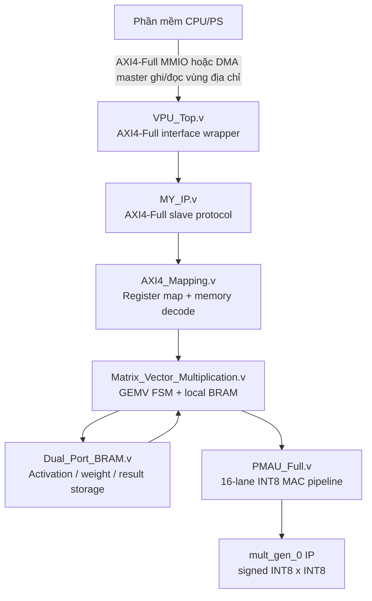
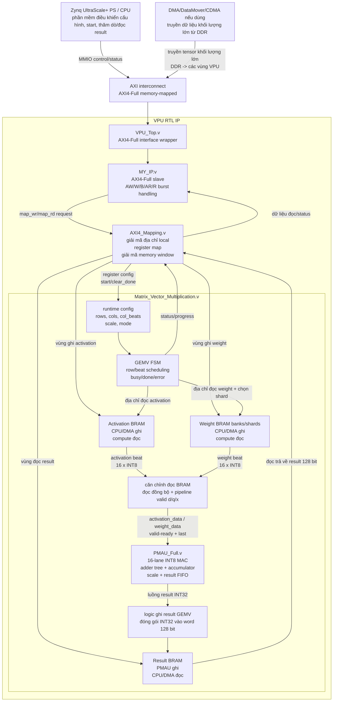
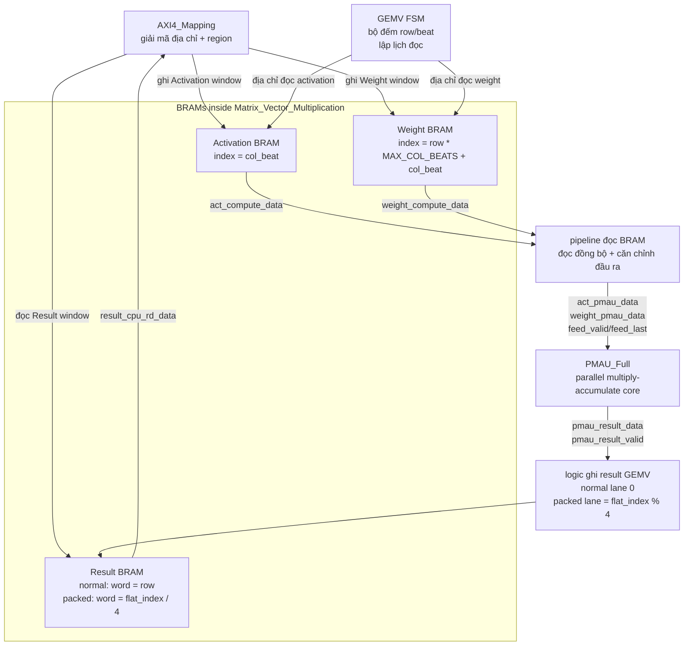
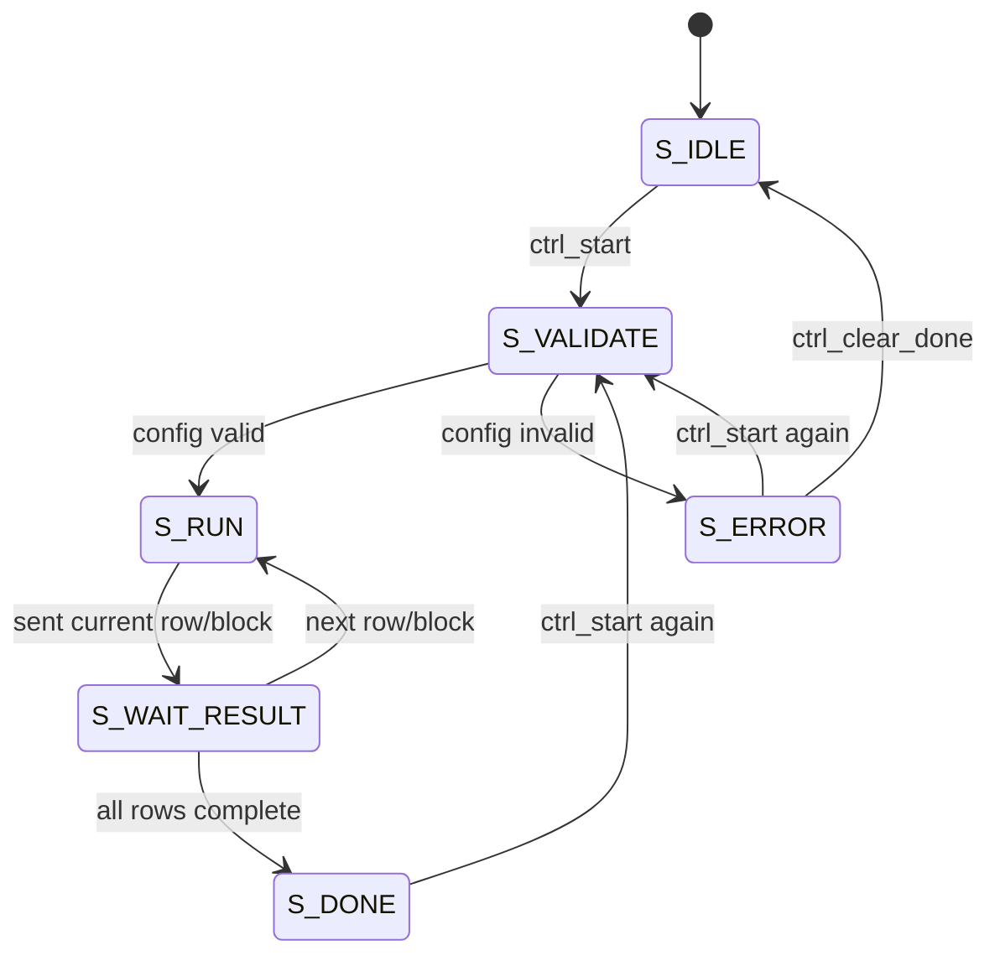
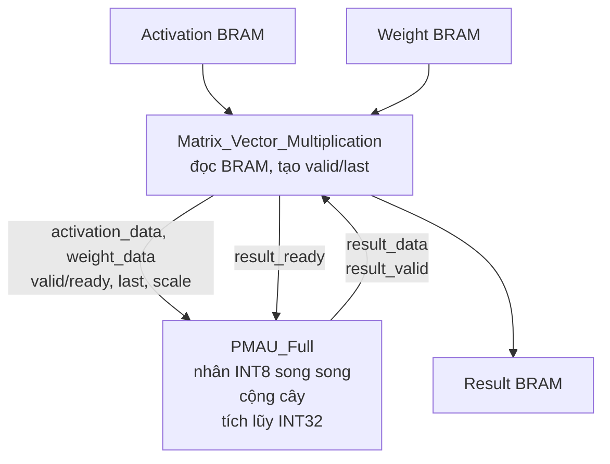
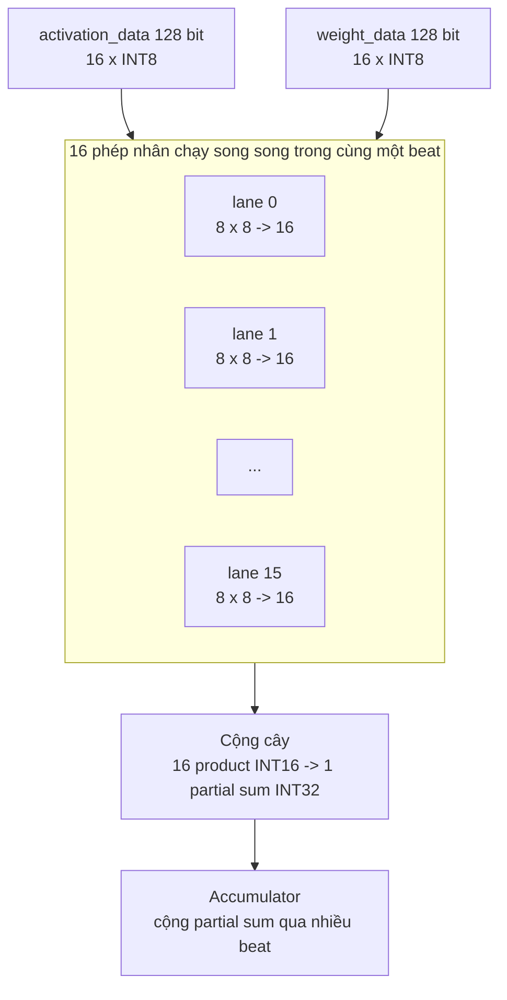
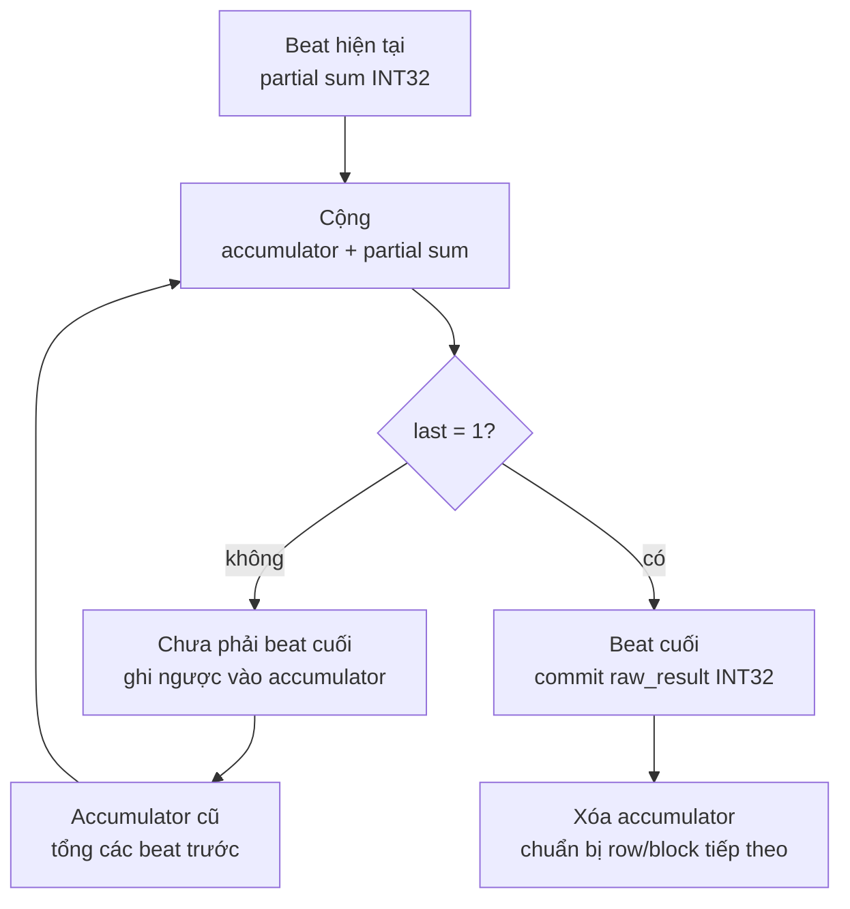
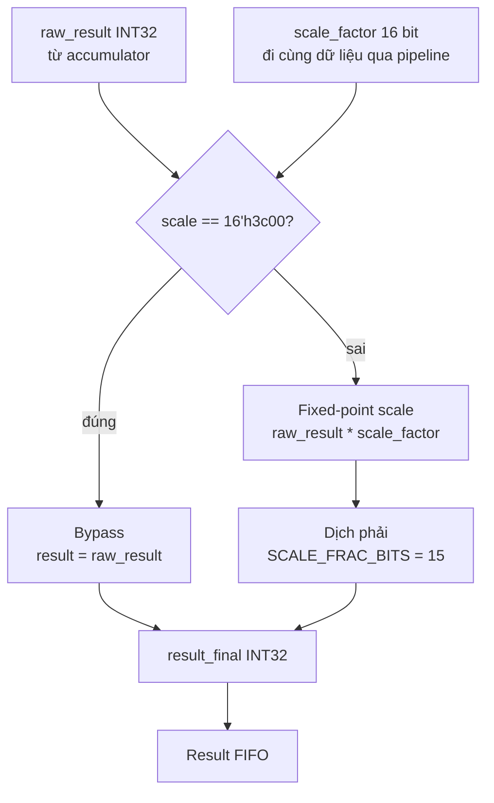
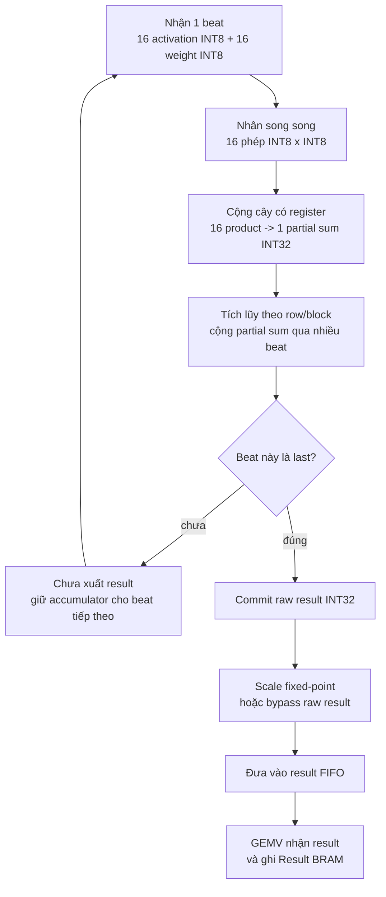
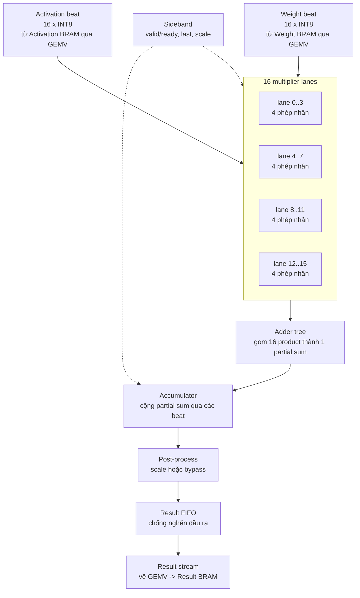

# Giải thích RTL VPU INT8

Tài liệu này mô tả các file trong thư mục `RTL/` theo góc nhìn kiến trúc và luồng dữ liệu. Các file wrapper, AXI, mapping, GEMV và BRAM được mô tả theo chức năng trong hệ thống. Riêng `PMAU_Full.v` được trình bày chi tiết hơn về đường dữ liệu, cơ chế nhân-cộng, accumulator, dequantization và kết nối với các khối còn lại.

## 1. Cây phân cấp RTL



Quan hệ giữa các file RTL được tổ chức theo phân tầng. `VPU_Top` là điểm nhận giao tiếp AXI4-Full từ phía PS/interconnect và chuyển toàn bộ nhóm tín hiệu bus xuống `MY_IP`. `MY_IP` xử lý protocol AXI và tạo request đọc/ghi nội bộ cho `AXI4_Mapping`. `AXI4_Mapping` giải mã request thành truy cập register hoặc truy cập vùng nhớ local, sau đó kết nối tới `Matrix_Vector_Multiplication`. GEMV chứa BRAM cục bộ và FSM compute; khối này đọc activation/weight từ BRAM, cấp dữ liệu cho PMAU, nhận kết quả và ghi lại vào Result BRAM. PMAU thực hiện datapath số học INT8, còn `mult_gen_0` là multiplier IP được instantiate theo từng lane bên trong PMAU.

Hierarchy trong code:

```text
VPU_Top
  `- MY_IP
       `- AXI4_Mapping
            `- Matrix_Vector_Multiplication
                 |- Dual_Port_BRAM: activation
                 |- Dual_Port_BRAM: weight banks/shards
                 |- Dual_Port_BRAM: result
                 `- PMAU_Full
                      `- NUM_LANES x mult_gen_0
```

Thiết kế có hai phần chính:

- Phần giao tiếp và điều khiển: `VPU_Top`, `MY_IP`, `AXI4_Mapping`, FSM trong `Matrix_Vector_Multiplication`.
- Phần tính toán: activation/weight BRAM, pipeline đọc, `PMAU_Full`, result BRAM.

### 1.1. Hình ý tưởng tổng quan giao tiếp giữa các khối

CPU/Zynq không giao tiếp trực tiếp với PMAU. CPU hoặc DMA master phát transaction AXI tới vùng địa chỉ của VPU. `AXI4_Mapping` giải mã địa chỉ, còn `Matrix_Vector_Multiplication` là khối trung gian đọc/ghi BRAM và cấp dữ liệu cho PMAU.



Luồng dữ liệu ở mức hệ thống bắt đầu từ phía Zynq hoặc DMA. Phần mềm truy cập VPU thông qua vùng địa chỉ AXI4-Full: ghi vào Activation window để cập nhật Activation BRAM, ghi vào Weight window để cập nhật Weight BRAM, đọc từ Result window để lấy dữ liệu trong Result BRAM. `MY_IP` xử lý giao thức AXI cho các giao dịch này, còn `AXI4_Mapping` chuyển địa chỉ AXI thành region/index nội bộ cho GEMV. Khi phép tính bắt đầu, GEMV đọc BRAM cục bộ, căn độ trễ đọc RAM, rồi cấp từng cặp beat activation/weight cho PMAU. Kết quả PMAU tạo ra là luồng INT32; GEMV đóng gói luồng này vào word 128 bit và ghi xuống Result BRAM để CPU hoặc DMA đọc lại sau.

PMAU không nằm trên bus AXI. PMAU chỉ nhận các tín hiệu nội bộ như `activation_data`, `weight_data`, `valid`, `ready`, `last`, `scale` và `result_data`. Zynq/DMA nạp dữ liệu và cấu hình qua AXI; GEMV là khối trực tiếp cấp dữ liệu cho PMAU.

### 1.2. Ba BRAM giao tiếp với PMAU như thế nào?

BRAM không kết nối trực tiếp với PMAU bằng một bus riêng. `Matrix_Vector_Multiplication` là tầng trung gian giữa BRAM và PMAU:

- Với activation và weight: GEMV đọc BRAM, căn thời gian dữ liệu, rồi đưa vào PMAU.
- Với result: PMAU tạo kết quả, GEMV nhận kết quả đó và ghi vào result BRAM.



Với activation và weight, BRAM lưu dữ liệu đầu vào cho đường tính toán. FSM của GEMV phát địa chỉ đọc, BRAM trả dữ liệu sau độ trễ đọc đồng bộ, rồi pipeline `d/q/x` căn dữ liệu với tín hiệu `last`. Khi PMAU sẵn sàng nhận dữ liệu đầu vào, GEMV đưa `act_pmau_data` và `weight_pmau_data` vào PMAU.

Với result, PMAU phát `pmau_result_data` kèm `pmau_result_valid`. GEMV kiểm tra `pmau_result_fire`, tính địa chỉ/lane cần ghi, tạo byte strobe, rồi ghi vào Result BRAM. Trong normal mode, mỗi row dùng một word result 128 bit và ghi lane INT32 thấp. Trong packed q8 partial mode, các partial INT32 được pack bốn giá trị vào một word 128 bit bằng công thức `word = flat_index / 4`, `lane = flat_index % 4`.

## 2. Giải thích cơ bản các file còn lại

### 2.1. `VPU_Top.v`

`VPU_Top` là điểm kết nối ngoài của VPU với bus AXI4-Full. Module này nhận đầy đủ năm kênh AXI gồm địa chỉ ghi `AW`, dữ liệu ghi `W`, phản hồi ghi `B`, địa chỉ đọc `AR` và dữ liệu đọc `R`, sau đó nối các kênh này xuống `MY_IP` để tầng dưới xử lý handshake, burst và response. Ngoài nhóm tín hiệu bus, `VPU_Top` cũng truyền các parameter hệ thống như độ rộng AXI, số lane tính toán, độ rộng dữ liệu INT8/INT32, độ rộng scale và giới hạn tile xuống chuỗi module bên trong. Nhờ đó toàn bộ đường giao tiếp bên ngoài đi vào một cổng thống nhất, còn phần xử lý protocol, mapping địa chỉ, BRAM và compute được triển khai ở các tầng sau.

### 2.2. `MY_IP.v`

`MY_IP` là tầng chuyển đổi giữa giao tiếp AXI4-Full ở phía `VPU_Top` và giao tiếp request nội bộ ở phía `AXI4_Mapping`. Module này xử lý các kênh AXI chuẩn ở phía master và tạo các tín hiệu nội bộ gồm `map_wr_en`, `map_wr_addr`, `map_wr_data`, `map_wr_strb`, `map_rd_en` và `map_rd_addr`. Nhờ đó `AXI4_Mapping` không cần xử lý trực tiếp `AWVALID`, `WVALID`, `BREADY`, `ARVALID`, `RREADY` hoặc handshake burst.

Ở chiều ghi, CPU hoặc DMA trước hết phát địa chỉ ghi trên kênh `AW`. Khi `s00_axi_awvalid` gặp `s00_axi_awready`, tín hiệu `aw_fire` xuất hiện và `MY_IP` chốt `AWADDR`, `AWLEN`, `AWSIZE`, `AWBURST` và `AWID` vào các thanh ghi `wr_addr_r`, `wr_len_r`, `wr_size_r`, `wr_burst_r`, `wr_id_r`. Sau đó module mở `s00_axi_wready` để nhận các beat dữ liệu trên kênh `W`. Mỗi lần `w_fire` xảy ra, RTL tạo một xung `map_wr_en_r` đúng một chu kỳ, đồng thời đưa địa chỉ hiện tại, dữ liệu `WDATA` và byte strobe `WSTRB` sang `AXI4_Mapping`. Sau mỗi beat, địa chỉ ghi được cập nhật bằng hàm `axi_next_addr`. Nếu burst là `INCR`, địa chỉ tăng thêm `2^AWSIZE` byte; nếu không phải `INCR`, địa chỉ được giữ nguyên. Khi gặp `WLAST` hoặc bộ đếm beat chạm `AWLEN`, module kết thúc burst ghi và trả response qua kênh `B`.

Đoạn kênh ghi này giúp DMA nạp activation/weight theo burst. DMA chỉ cần gửi một burst AXI liên tục; `MY_IP` tách burst đó thành từng beat nội bộ để `AXI4_Mapping` giải mã thành Activation window hoặc Weight window. Với cấu hình thường dùng `C_S00_AXI_DATA_WIDTH = 128`, mỗi beat rộng 16 byte, khớp với một word 128 bit trong BRAM cục bộ của GEMV. Vì vậy nếu DMA truyền đúng beat 128 bit, mỗi nhịp `map_wr_en` tương ứng một entry activation hoặc weight trong memory window.

Ở chiều đọc, `MY_IP` nhận địa chỉ đọc trên kênh `AR`. Khi `ar_fire` xảy ra, module chốt `ARADDR`, `ARLEN`, `ARSIZE`, `ARBURST` và `ARID`, sau đó phát `map_rd_en_r` xuống `AXI4_Mapping`. Vì dữ liệu đọc có thể cần đi qua register map hoặc Result BRAM, `MY_IP` không trả `RDATA` ngay lập tức mà giữ trạng thái pending bằng `rd_pending_r`. Khi `AXI4_Mapping` báo `map_rd_valid`, dữ liệu `map_rd_data` được đưa ra kênh `R`, `RID` được khôi phục từ ID đã chốt, `RLAST` được tạo theo beat cuối của burst, và `RRESP` được đặt thành `SLVERR` nếu `map_rd_error = 1`. Nhờ vậy lỗi giải mã địa chỉ hoặc đọc result ngoài range từ tầng dưới vẫn được phản ánh đúng lên AXI master.

`MY_IP` giới hạn luồng đọc ở mức một request đọc đang chờ xử lý: địa chỉ đọc chỉ được nhận khi không có read pending, không có `RVALID` đang chờ master nhận, và không có giao dịch ghi/response đang chiếm đường. Thiết kế này không hỗ trợ nhiều giao dịch outstanding đồng thời, nhưng phù hợp với `AXI4_Mapping` và GEMV vì hai khối này xử lý request nội bộ theo thứ tự. Ở cuối file, `MY_IP` instantiate `AXI4_Mapping` cùng clock/reset và truyền toàn bộ parameter hệ thống xuống tầng dưới.

### 2.3. `AXI4_Mapping.v`

`AXI4_Mapping` nhận request local từ `MY_IP` và giải mã địa chỉ để chọn hành động bên trong VPU. `MY_IP` đã xử lý protocol AXI4-Full ở mức kênh `AW/W/B/AR/R`; `AXI4_Mapping` nhận địa chỉ, dữ liệu, strobe và hướng truy cập. Từ các thông tin này, mapping xác định access vào register điều khiển, Activation window, Weight window hoặc Result window.

File này định nghĩa giao diện địa chỉ giữa phần mềm/DMA và compute core. Phần mềm ghi/đọc các offset cố định; mapping chuyển các offset đó thành `cfg_*`, `ctrl_start`, `ctrl_clear_done`, `mm_wr_region`, `mm_wr_index`, `mm_rd_region`, `mm_rd_index` cho GEMV.

```text
CPU hoặc DMA
  -> AXI interconnect
  -> VPU_Top
  -> MY_IP: xử lý AXI4-Full protocol
  -> AXI4_Mapping: giải mã địa chỉ local, register, memory window
  -> Matrix_Vector_Multiplication
```

Trong RTL hiện tại, địa chỉ có thể đi vào dưới dạng địa chỉ physical có base `0xA0000000` hoặc dưới dạng offset nội bộ. Nếu `ENABLE_BASE_TRANSLATION` bật và địa chỉ lớn hơn hoặc bằng `VPU_BASE_ADDR`, hàm `to_local_addr` trừ base này để đưa về offset nội bộ. Sau đó phần giải mã làm việc với 32 bit offset nội bộ. Cách này giúp cùng một RTL dùng được trong cả trường hợp interconnect đưa địa chỉ đầy đủ lẫn trường hợp interconnect đã bỏ base.

Khi hệ thống dùng physical base, địa chỉ mà phần mềm/DMA nhìn thấy sẽ bằng `VPU_BASE_ADDR + local_offset`. Ví dụ register `ROWS` có offset nội bộ `0x0020`, nên nếu base là `0xA0000000` thì địa chỉ physical tương ứng là `0xA0000020`. Trong tài liệu này, các bảng bên dưới dùng offset nội bộ vì đó là cách RTL giải mã bên trong `AXI4_Mapping`.

AXI4-Full được dùng vì VPU cần cả register control lẫn các memory window 128 bit cho activation, weight và result. AXI4-Lite chỉ phù hợp với control/status nhỏ, còn AXI-Stream cần thêm cơ chế địa chỉ, packet framing và result readback. Trong thiết kế này, AXI4-Full memory-mapped phù hợp với yêu cầu CPU và DMA cùng truy cập một không gian địa chỉ thống nhất.

#### Các vùng địa chỉ dữ liệu trực tiếp phục vụ tính toán

Các địa chỉ quan trọng nhất trong `AXI4_Mapping.v` là ba vùng data window dưới đây. Đây không phải là register chọn mode hay register báo trạng thái; đây là vùng địa chỉ mang dữ liệu tính toán chính. Activation window chứa vector/tile đầu vào, Weight window chứa các beat weight của ma trận, còn Result window là nơi CPU/DMA đọc kết quả sau khi GEMV và PMAU xử lý xong.

```verilog
localparam [31:0] ACT_BASE_ADDR    = 32'h0001_0000;
localparam [31:0] ACT_END_ADDR     = 32'h0002_0000;
localparam [31:0] WEIGHT_BASE_ADDR = 32'h0010_0000;
localparam [31:0] WEIGHT_END_ADDR  = 32'h0020_0000;
localparam [31:0] RESULT_BASE_ADDR = 32'h0020_0000;
localparam [31:0] RESULT_END_ADDR  = 32'h0021_0000;

localparam [1:0] REGION_ACT    = 2'd0;
localparam [1:0] REGION_WEIGHT = 2'd1;
localparam [1:0] REGION_RESULT = 2'd2;
```

Các cặp `BASE_ADDR` và `END_ADDR` tạo thành range kiểu `[base, end)`, nghĩa là địa chỉ bắt đầu được tính vào vùng, còn địa chỉ end là mốc kết thúc và không thuộc vùng đó. Vì vậy `WEIGHT_END_ADDR = 0x0020_0000` và `RESULT_BASE_ADDR = 0x0020_0000` không bị chồng lấn: mọi địa chỉ nhỏ hơn `0x0020_0000` vẫn thuộc Weight window, còn từ đúng `0x0020_0000` trở đi mới thuộc Result window.

| Range địa chỉ nội bộ | Hằng RTL | Region nội bộ | Dữ liệu tương ứng | Hướng truy cập chính |
|---:|---|---|---|---|
| `0x0001_0000..0x0001_FFFF` | `ACT_BASE_ADDR` đến trước `ACT_END_ADDR` | `REGION_ACT = 2'd0` | Activation beat, mỗi beat gồm 16 INT8 | CPU/DMA ghi vào, GEMV đọc khi compute |
| `0x0010_0000..0x001F_FFFF` | `WEIGHT_BASE_ADDR` đến trước `WEIGHT_END_ADDR` | `REGION_WEIGHT = 2'd1` | Weight beat của các row ma trận | CPU/DMA ghi vào, GEMV đọc khi compute |
| `0x0020_0000..0x0020_FFFF` | `RESULT_BASE_ADDR` đến trước `RESULT_END_ADDR` | `REGION_RESULT = 2'd2` | Result word 128 bit chứa một hoặc nhiều INT32 | GEMV ghi sau PMAU, CPU/DMA đọc ra |

`REGION_ACT`, `REGION_WEIGHT` và `REGION_RESULT` là mã vùng nội bộ, không phải địa chỉ phần mềm nhìn thấy. Sau khi `AXI4_Mapping` nhận một địa chỉ AXI, hàm `mem_region` so sánh địa chỉ đó với các range ở trên để tạo mã region. Mã region này được truyền xuống GEMV qua `core_wr_region_r` hoặc `core_rd_region`. Nhờ vậy GEMV biết request hiện tại phải tác động vào Activation BRAM, Weight BRAM hay Result BRAM mà không cần tự giải mã địa chỉ AXI.

Vì bus dữ liệu rộng 128 bit, mỗi lần CPU/DMA ghi hoặc đọc một beat tương ứng 16 byte. `AXI4_Mapping` dùng `ADDR_LSB = 4` để đổi địa chỉ byte thành index 128 bit:

```text
index = (local_address - window_base) >> 4
```

Với Activation window, index này chính là `col_beat`. Nếu phần mềm ghi vào `0x0001_0000`, dữ liệu đi vào activation beat 0; ghi vào `0x0001_0010` là activation beat 1; ghi vào `0x0001_0020` là activation beat 2. Trong quá trình tính toán, GEMV đọc Activation BRAM theo cùng `col_beat` đó và đưa mỗi beat 16 INT8 vào PMAU. Với cấu hình mặc định `MAX_COL_BEATS = 32`, Activation BRAM chứa tối đa 32 beat, tức 512 phần tử INT8.

Với Weight window, index là vị trí beat weight trong toàn bộ ma trận đã được flatten theo row-major, không phải riêng `col_beat`:

```text
weight_index = row * MAX_COL_BEATS + col_beat
weight_address = WEIGHT_BASE_ADDR + weight_index * 16
```

Quan hệ index này ảnh hưởng trực tiếp đến flow tính toán. Khi GEMV xử lý row 0, nó đọc các weight beat bắt đầu từ index 0. Khi sang row 1, base weight tăng thêm `MAX_COL_BEATS`. Vì vậy DMA/phần mềm phải nạp weight theo thứ tự từng row, mỗi row chiếm một stride cố định bằng `MAX_COL_BEATS` beat, dù runtime có thể chỉ dùng một phần số beat đó. Layout này giúp GEMV tính địa chỉ weight bằng `weight_row_base_r + read_beat_idx_r`.

Với Result window, CPU/DMA không ghi dữ liệu đầu vào mà đọc kết quả sau compute. Trong normal mode, result của row `r` nằm ở word `r`, lane INT32 thấp của word 128 bit. Trong packed q8 partial mode, GEMV dùng công thức:

```text
flat_index = row * group_blocks + block
word       = flat_index / 4
lane       = flat_index % 4
result_address = RESULT_BASE_ADDR + word * 16
```

Như vậy một word 128 bit trong Result BRAM có thể chứa bốn partial result INT32. `AXI4_Mapping` chỉ cho phép đọc Result window đi xuống GEMV; Activation và Weight window là đường nạp dữ liệu vào compute, còn Result window là đường lấy dữ liệu ra sau compute. Nếu phần mềm ghi vào Result window thì request vẫn có thể được phân loại là memory write, nhưng flow đúng của thiết kế là Result BRAM được ghi bởi GEMV sau khi nhận kết quả từ PMAU, không phải bởi CPU/DMA.

Range địa chỉ nội bộ trong bảng rộng hơn dung lượng BRAM được sử dụng ở cấu hình mặc định. Vì lý do đó, RTL có thêm `mem_index_in_range`: Activation chỉ hợp lệ khi `index < MAX_COL_BEATS`, Weight chỉ hợp lệ khi `index < MAX_ROWS * MAX_COL_BEATS`, và Result chỉ hợp lệ khi `index < RESULT_WORD_DEPTH`. Nếu access nằm trong range địa chỉ nhưng vượt dung lượng BRAM khả dụng, mapping không forward write xuống GEMV hoặc trả lỗi khi đọc result.

#### Flow xử lý một truy cập trong `AXI4_Mapping`

Một truy cập ghi/đọc từ PS hoặc DMA đi qua mapping theo ba lớp xử lý. Trước hết, địa chỉ AXI được đổi về offset nội bộ. Tiếp theo, offset được phân loại: nhỏ hơn `0x0001_0000` là register region; nằm trong `0x0001_0000..0x0001_FFFF` là Activation window; nằm trong `0x0010_0000..0x001F_FFFF` là Weight window; nằm trong `0x0020_0000..0x0020_FFFF` là Result window. Cuối cùng, mapping kiểm tra index có nằm trong dung lượng BRAM khả dụng hay không rồi mới forward xuống GEMV.

Với register write, `AXI4_Mapping` cập nhật các thanh ghi cấu hình hoặc tạo xung điều khiển một chu kỳ. Hàm `apply_wstrb32` cho phép ghi từng byte theo `WSTRB`, nên phần mềm không bắt buộc phải ghi cả 32 bit nếu chỉ muốn sửa một phần giá trị. Với memory write, mapping không tự ghi BRAM mà chỉ đóng gói region, index, data và strobe để GEMV ghi vào đúng BRAM cục bộ. Với read, register được trả trực tiếp từ `reg_read_data`, còn Result window phải đi xuống GEMV để đọc Result BRAM rồi trả về qua `core_rd_valid`.

Vì `AXI_DATA_WIDTH = 128`, mỗi beat memory-mapped rộng 16 byte. Do đó `ADDR_LSB = 4`, và index trong các memory window được tính theo công thức:

```text
index = (local_address - window_base) >> 4
```

Do đó, mỗi lần offset tăng 16 byte thì index tăng thêm một word 128 bit trong BRAM.

#### Quá trình ghi dữ liệu trong `AXI4_Mapping`

Đường ghi bắt đầu khi `MY_IP` phát một beat ghi nội bộ xuống mapping. Ở thời điểm đó, `map_wr_en = 1`, `map_wr_addr` giữ địa chỉ của beat hiện tại, `map_wr_data` giữ 128 bit dữ liệu và `map_wr_strb` cho biết byte nào trong beat được phép ghi. `AXI4_Mapping` trước hết đổi `map_wr_addr` thành `wr_addr_local` bằng `local32(map_wr_addr)`. Nếu địa chỉ đi vào là địa chỉ physical, phần base đã được trừ trước; nếu địa chỉ đã là offset nội bộ thì được giữ nguyên. Từ `wr_addr_local`, RTL quyết định truy cập ghi này là ghi register hay ghi data window.

Với ghi vào data window, điều kiện quan trọng là `core_wr_hit`:

```text
core_wr_hit =
    map_wr_en
    && is_mem_addr(wr_addr_local)
    && mem_index_in_range(wr_addr_local)
```

Điều kiện này yêu cầu beat ghi chỉ được forward xuống GEMV khi địa chỉ thuộc một trong ba vùng `ACT/WEIGHT/RESULT` và index không vượt dung lượng BRAM khả dụng. Khi `core_wr_hit = 1`, mapping chốt bốn thông tin đưa xuống GEMV: `core_wr_region_r`, `core_wr_index_r`, `core_wr_data_r` và `core_wr_strb_r`. `core_wr_region_r` được tạo bởi `mem_region(wr_addr_local)`, nên GEMV biết beat này thuộc Activation, Weight hay Result region. `core_wr_index_r` được tạo bởi `mem_index(wr_addr_local)`, nên GEMV biết ghi vào entry nào trong vùng đó. `core_wr_data_r` giữ nguyên 128 bit data từ AXI, còn `core_wr_strb_r` giữ byte strobe để BRAM chỉ cập nhật những byte hợp lệ.

Khi CPU/DMA ghi vào Activation window, ví dụ `0x0001_0000`, mapping tạo `REGION_ACT` và index 0; GEMV ghi beat này vào Activation BRAM tại địa chỉ 0. Nếu ghi vào `0x0001_0010`, index trở thành 1, tức activation beat tiếp theo. Với Weight window, địa chỉ `0x0010_0000` tạo `REGION_WEIGHT` và index 0; địa chỉ `0x0010_0010` tạo index 1. Khi nạp weight nhiều row, phần mềm hoặc DMA phải tự đặt dữ liệu theo layout `row * MAX_COL_BEATS + col_beat`, vì mapping chỉ chuyển địa chỉ thành index tuyến tính, không tự hiểu tensor shape ở mức thuật toán.

Result window có thể được `is_mem_addr` nhận diện là memory region, nhưng flow ghi của thiết kế không dùng CPU/DMA để tạo kết quả. Result BRAM được ghi bởi GEMV sau khi PMAU trả kết quả. Trong flow vận hành chuẩn, CPU/DMA ghi Activation window và Weight window, còn Result window dùng cho đọc. Nếu phần mềm ghi vào Result window, mapping có thể tạo region/index như một memory write, nhưng dữ liệu này không thuộc luồng tạo result của GEMV/PMAU.

Với write vào register region, địa chỉ nhỏ hơn `0x0001_0000` sẽ không đi theo `core_wr_hit` mà được xử lý ngay trong mapping. Register `0x0000` là control write đặc biệt: ghi bit 0 ở byte thấp tạo `core_start_r` đúng một chu kỳ, ghi bit 1 ở byte thấp tạo `core_clear_done_r` đúng một chu kỳ. Hai bit này không được lưu như register trạng thái lâu dài; chúng là xung điều khiển để GEMV bắt đầu hoặc clear done/error.

Các register cấu hình `0x0020`, `0x0030`, `0x0040`, `0x0050`, `0x0060` lần lượt cập nhật `cfg_rows_reg`, `cfg_cols_reg`, `cfg_col_beats_reg`, `cfg_scale_reg` và `cfg_mode_reg`. Khi cập nhật, RTL dùng `apply_wstrb32`, nghĩa là chỉ những byte có `map_wr_strb[3:0]` bật mới thay đổi. Điều này giúp ghi từ AXI giữ đúng semantics byte-enable. Các register như `STATUS`, `LIMITS`, `PROGRESS`, `CAPABILITY` không có case ghi trong RTL; chúng được dùng để đọc trạng thái hoặc thông tin build-time, không phải để phần mềm ghi cấu hình.

Nếu truy cập ghi không thuộc register hợp lệ hoặc memory index vượt range, mapping sẽ không tạo `core_wr_en_r` và cũng không cập nhật register cấu hình. Một điểm cần nắm rõ là `AXI4_Mapping` không có kênh báo lỗi ghi riêng trả ngược về `MY_IP`; trong `MY_IP`, write response `BRESP` đang cố định OKAY. Vì vậy phần mềm điều khiển nên tự tránh ghi sai vùng hoặc vượt range bằng cách đọc `LIMITS/CAPABILITY` và dùng đúng layout địa chỉ.

#### Quá trình đọc dữ liệu trong `AXI4_Mapping`

Đường đọc bắt đầu khi `MY_IP` phát `map_rd_en = 1` cùng `map_rd_addr`. Tương tự đường ghi, mapping đổi địa chỉ thành `rd_addr_local` bằng `local32(map_rd_addr)`. Sau đó RTL phân truy cập đọc thành hai nhóm chính: đọc register hoặc đọc Result window. Activation và Weight window không được thiết kế để CPU đọc ngược trong flow hiện tại, vì hai vùng đó là đường nạp dữ liệu đầu vào cho compute.

Khi đọc register, mapping không cần đi xuống GEMV. Ngay lúc nhận `map_rd_en`, RTL gọi `reg_read_data(rd_addr_local)` và lưu kết quả vào `rd_pending_reg_data_r`. Một chu kỳ sau, khi pending được xử lý, `map_rd_valid` được đưa lên 1 và `map_rd_data` trả về dữ liệu register. Ví dụ đọc `0x0010` trả `{error, busy, done}` ở các bit thấp; đọc `0x0020` trả lại `cfg_rows_reg`; đọc `0x0070` trả giới hạn `MAX_ROWS` và `MAX_COL_BEATS`; đọc `0x0080` trả row/beat đang chạy; đọc `0x0090` trả capability của core.

Khi đọc Result window, điều kiện quan trọng là:

```text
mmio_core_rd_en =
    map_rd_en
    && is_result_addr(rd_addr_local)
    && mem_index_in_range(rd_addr_local)
```

Nếu điều kiện này đúng, mapping tạo `core_rd_en`, `core_rd_region` và `core_rd_index` để yêu cầu GEMV đọc Result BRAM. `core_rd_region` về bản chất sẽ là `REGION_RESULT`, còn `core_rd_index` là word index trong Result BRAM, tính từ `RESULT_BASE_ADDR`. Mapping không tự tạo result data; nó phải chờ GEMV trả `core_rd_valid` cùng `core_rd_data`. Khi dữ liệu result đã sẵn sàng, mapping đưa `map_rd_valid = 1`, copy `core_rd_data` ra `map_rd_data`, và đưa `map_rd_error = 1` nếu GEMV báo lỗi hoặc nếu valid không đúng như kỳ vọng.

Ví dụ trong normal mode, nếu CPU đọc `0x0020_0000`, mapping tính result index 0, GEMV đọc word 0 của Result BRAM, và lane INT32 thấp chứa result của row 0. Nếu CPU đọc `0x0020_0010`, index là 1, tương ứng word tiếp theo. Trong packed q8 partial mode, mỗi word 128 bit có thể chứa bốn partial INT32, nên phần mềm cần tách lane 32 bit trong word đọc về theo công thức `lane = flat_index % 4`.

Nếu CPU đọc Activation window hoặc Weight window, địa chỉ này không được xem là register và cũng không phải Result window hợp lệ cho đường đọc. Khi đó `rd_pending_error_r` được đặt để cuối cùng `map_rd_error = 1`. `MY_IP` nhận lỗi này và đổi thành `RRESP = SLVERR` trên kênh đọc AXI. Nếu CPU đọc Result window nhưng index vượt `RESULT_WORD_DEPTH`, lỗi cũng đi theo đường tương tự. Như vậy, khác với write path, read path có cơ chế báo lỗi rõ ràng về AXI master.

Tóm lại, write path của `AXI4_Mapping` chủ yếu phục vụ nạp dữ liệu đầu vào và cấu hình: ghi Activation window, ghi Weight window, ghi `ROWS/COLS/COL_BEATS/SCALE/MODE`, rồi ghi start ở `0x0000`. Read path chủ yếu phục vụ quan sát và lấy kết quả: đọc `STATUS/PROGRESS` trong lúc chạy, đọc `LIMITS/CAPABILITY` khi khởi tạo phần mềm điều khiển, và đọc Result window sau khi `done = 1`.

#### Register điều khiển và trạng thái

Các register nằm trong vùng offset nhỏ hơn `0x0001_0000`. Khi đọc register, RTL trả dữ liệu trên bus 128 bit nhưng các thông tin điều khiển chính nằm ở 32 bit thấp. Khi ghi các register cấu hình, chỉ 32 bit thấp được dùng và byte strobe `WSTRB[3:0]` quyết định byte nào được cập nhật.

Dù các register cấu hình được lưu dưới dạng 32 bit trong `AXI4_Mapping`, GEMV chỉ nhận phần cần thiết: `ROWS`, `COLS`, `COL_BEATS` đi xuống GEMV ở 16 bit thấp; `SCALE` đi xuống PMAU theo `SCALE_WIDTH = 16`; `MODE` đi xuống dưới ở 2 bit thấp. Vì vậy phần mềm điều khiển nên coi các bit cao chưa dùng là reserved.

| Offset | Tên | Hướng dùng chính | Ý nghĩa trong flow |
|---:|---|---|---|
| `0x0000` | CTRL/STATUS alias | Ghi control, đọc status | Ghi bit 0 để start GEMV, ghi bit 1 để clear done/error; khi đọc trả về `{error, busy, done}` |
| `0x0010` | STATUS | Read | Cho phần mềm thăm dò trạng thái chạy mà không tác động tới lệnh control |
| `0x0020` | ROWS | Ghi/đọc | Số row của ma trận weight cần tính trong lần chạy hiện tại |
| `0x0030` | COLS | Ghi/đọc | Số phần tử INT8 logic của vector đầu vào; dùng để tự suy ra số beat nếu `COL_BEATS = 0` |
| `0x0040` | COL_BEATS | Ghi/đọc | Số beat 128 bit cần xử lý cho mỗi row hoặc mỗi nhóm tính |
| `0x0050` | SCALE | Ghi/đọc | Hệ số scale 16 bit đưa vào PMAU để post-scale hoặc bypass raw result |
| `0x0060` | MODE | Ghi/đọc | Chọn chế độ compute; hiện bit 0 bật packed q8 partial mode |
| `0x0070` | LIMITS | Read | Trả giới hạn phần cứng: `MAX_ROWS` và `MAX_COL_BEATS` |
| `0x0080` | PROGRESS | Read | Trả row hiện tại và column beat hiện tại để debug/thăm dò tiến độ |
| `0x0090` | CAPABILITY | Read | Trả khả năng của core: có packed q8 mode, số q8 block tối đa, độ sâu result word |

`0x0000` là địa chỉ đặc biệt vì nó vừa là control register khi ghi, vừa là status alias khi đọc. Khi phần mềm ghi bit 0 bằng 1 ở byte thấp, `AXI4_Mapping` không lưu bit này thành một register giữ trạng thái; nó tạo xung `core_start_r` đúng một chu kỳ để GEMV FSM chốt cấu hình và chuyển sang `S_VALIDATE`. Tương tự, ghi bit 1 ở byte thấp tạo xung `core_clear_done_r` để xóa trạng thái done/error sau một lần chạy hoặc sau lỗi cấu hình. Khi đọc lại `0x0000`, dữ liệu trả về giống STATUS: bit 0 là `done`, bit 1 là `busy`, bit 2 là `error`. Cách alias này giúp phần mềm có thể dùng một địa chỉ cho cả phát lệnh và kiểm tra trạng thái nhanh.

`0x0010` là STATUS thuần đọc. Nó tồn tại để phần mềm điều khiển có một địa chỉ chỉ dùng cho việc thăm dò trạng thái, không lẫn với hành vi tạo xung control. Trong flow bình thường, sau khi ghi `start`, CPU có thể đọc STATUS nhiều lần cho đến khi `done = 1`. Nếu `busy = 1`, GEMV đang ở `S_RUN` hoặc `S_WAIT_RESULT`. Nếu `error = 1`, cấu hình bị GEMV đánh giá không hợp lệ, ví dụ số row bằng 0, số beat bằng 0, vượt giới hạn phần cứng hoặc packed mode dùng số beat không phù hợp.

`0x0020` cấu hình `ROWS`, tức số row kết quả cần tạo. Trong GEMV, giá trị này được chốt thành `active_rows_r` khi start. FSM dùng nó để quyết định khi nào kết thúc toàn bộ workload: sau khi xử lý xong row cuối cùng, core đặt `done`. Với parameter hiện tại, giá trị hợp lệ phải nằm trong `1..MAX_ROWS`, mặc định `MAX_ROWS = 256`. Nếu ghi `ROWS = 0` hoặc lớn hơn giới hạn, GEMV sẽ đi vào trạng thái lỗi.

`0x0030` cấu hình `COLS`, tức số phần tử INT8 logic của vector đầu vào. Giá trị này hỗ trợ trường hợp phần mềm không tự tính số beat: nếu `COL_BEATS = 0`, GEMV tự suy ra `requested_col_beats = ceil(COLS / NUM_LANES)`. Với `NUM_LANES = 16`, một beat xử lý 16 phần tử INT8. Nếu `COLS` không chia hết cho 16, phần mềm cần zero-pad phần tử dư trong beat cuối để PMAU không nhân với dữ liệu không hợp lệ.

`0x0040` cấu hình `COL_BEATS`, tức số beat 128 bit thực tế sẽ được GEMV đọc cho mỗi row hoặc block. Nếu register này khác 0, GEMV ưu tiên dùng nó thay vì tự tính từ `COLS`. Giá trị này quyết định số lần GEMV đọc Activation BRAM và Weight BRAM trước khi PMAU được báo `last`. Trong normal mode, `last` được phát ở beat cuối của row. Trong packed q8 partial mode, RTL yêu cầu số beat phải chẵn; cứ mỗi 2 beat tạo một q8 block, và số block không được vượt `MAX_GROUP_Q8_BLOCKS`.

`0x0050` cấu hình `SCALE`. Mapping lưu giá trị này trong `cfg_scale_reg`, còn GEMV truyền `cfg_scale[SCALE_WIDTH-1:0]` vào PMAU. Sau reset, register này mặc định là `32'h0000_3c00`, tương ứng chế độ bypass raw result trong PMAU. Khi scale khác `16'h3c00`, PMAU nhân raw result với scale theo fixed-point rồi dịch phải `SCALE_FRAC_BITS`. Vì scale được chốt theo cấu hình trước khi chạy, phần mềm nên ghi register này trước khi ghi `start`.

`0x0060` cấu hình `MODE`. Trong RTL hiện tại, bit 0 là bit quan trọng nhất: `compute_mode[0] = 1` bật packed q8 partial mode. Khi bit này bằng 0, GEMV tạo một result INT32 cho mỗi row. Khi bit này bằng 1, GEMV chia row thành các q8 block, PMAU commit partial result theo block, và Result BRAM pack nhiều partial INT32 vào các lane 32 bit của word 128 bit. Các bit mode còn lại đang được truyền xuống dưới nhưng chưa có ý nghĩa điều khiển chính trong flow hiện tại.

`0x0070` là `LIMITS`, register đọc để phần mềm biết giới hạn phần cứng mà không cần hard-code trong phần mềm điều khiển. RTL trả `MAX_ROWS` ở bit `[15:0]` và `MAX_COL_BEATS` ở bit `[31:16]`. Với cấu hình mặc định, hai giá trị này lần lượt là 256 và 32. Phần mềm điều khiển có thể đọc LIMITS lúc khởi tạo để kiểm tra workload trước khi nạp dữ liệu.

`0x0080` là `PROGRESS`, register đọc phục vụ debug và thăm dò chi tiết hơn STATUS. Bit `[15:0]` trả `active_row`, tức row hiện tại GEMV đang xử lý. Bit `[31:16]` trả `active_col_beat`, tức beat cột hiện tại trong row/block. Register này không tham gia trực tiếp vào phép tính, nhưng hỗ trợ debug FSM, kiểm tra DMA đã nạp đủ dữ liệu chưa, hoặc theo dõi tiến độ xử lý của core.

`0x0090` là `CAPABILITY`, register mô tả một số khả năng build-time của core. Bit 0 bằng 1 để báo RTL có hỗ trợ packed q8 partial mode. Bit `[15:8]` trả `MAX_GROUP_Q8_BLOCKS`, mặc định 16. Bit `[31:16]` trả `RESULT_WORD_DEPTH`, tức số word 128 bit tối đa của Result BRAM ở layout packed. Với mặc định `MAX_ROWS = 256`, `MAX_GROUP_Q8_BLOCKS = 16`, mỗi word chứa 4 kết quả INT32, nên `RESULT_WORD_DEPTH = 1024`.

#### Trình tự sử dụng các địa chỉ trong một lần chạy

Trong một lần chạy, dữ liệu tính toán bắt đầu từ hai vùng đầu vào. CPU hoặc DMA ghi vector activation vào Activation window `0x0001_0000`, mỗi 16 byte là một beat gồm 16 INT8. Tiếp theo, CPU hoặc DMA ghi ma trận weight vào Weight window `0x0010_0000`, cũng theo từng beat 128 bit, nhưng index weight phải đi theo layout `row * MAX_COL_BEATS + col_beat`. Hai vùng này là dữ liệu mà GEMV sẽ đọc ra để đưa vào PMAU, nên chúng trực tiếp quyết định các phép nhân-cộng được thực hiện trên dữ liệu đầu vào và weight nào.

Các register như `ROWS`, `COLS`, `COL_BEATS`, `SCALE` và `MODE` chỉ cấu hình cách GEMV đọc và diễn giải hai vùng dữ liệu đó. `ROWS` cho biết cần xử lý bao nhiêu row weight; `COL_BEATS` hoặc `COLS` cho biết mỗi row dùng bao nhiêu beat; `SCALE` cho biết PMAU post-scale result như thế nào; `MODE` quyết định kết quả đầu ra là result theo row hay partial result theo q8 block. Sau khi dữ liệu và cấu hình đã sẵn sàng, CPU ghi bit start tại `0x0000`. Lúc này GEMV bắt đầu đọc Activation/Weight BRAM theo index đã nạp, cấp từng beat vào PMAU, rồi ghi kết quả vào Result BRAM.

Khi compute kết thúc, vùng quan trọng cuối cùng là Result window `0x0020_0000`. CPU hoặc DMA đọc vùng này để lấy kết quả. Trong lúc chờ kết quả, CPU có thể đọc `STATUS` ở `0x0010` hoặc `PROGRESS` ở `0x0080`, nhưng các register này chỉ phục vụ quan sát/trạng thái; dữ liệu chính của phép tính vẫn đi theo ba window `Activation -> Weight -> Result`.

Ở mức hệ thống, các địa chỉ trong `AXI4_Mapping.v` định nghĩa giao diện truy cập giữa phần mềm điều khiển, DMA và phần cứng compute. Activation/Weight window quyết định dữ liệu nào được đưa vào BRAM cục bộ; các register cấu hình quyết định GEMV sẽ đọc dữ liệu đó theo shape nào; Result window quyết định phần mềm lấy kết quả ở đâu sau khi PMAU xử lý xong.

### 2.4. `Matrix_Vector_Multiplication.v`

`Matrix_Vector_Multiplication` là GEMV core của VPU. Module này chứa Activation BRAM, Weight BRAM, Result BRAM, FSM điều phối compute, pipeline căn dữ liệu đọc BRAM, instance `PMAU_Full` và logic ghi kết quả.

Luồng xử lý bắt đầu khi `AXI4_Mapping` gửi `ctrl_start` cùng các cấu hình `cfg_rows`, `cfg_cols`, `cfg_col_beats`, `cfg_scale` và `compute_mode`. GEMV chốt cấu hình, kiểm tra giới hạn, sau đó phát request đọc Activation BRAM và Weight BRAM theo chỉ số row/beat. Activation BRAM được đọc theo `col_beat`; Weight BRAM được đọc theo địa chỉ `row * MAX_COL_BEATS + col_beat`. Dữ liệu đọc ra được căn qua pipeline `d/q/x` để `act_pmau_data`, `weight_pmau_data`, `feed_valid_r`, `feed_last_r` và `feed_group_last_r` đến PMAU cùng thời điểm.

Khi phần mềm hoặc DMA ghi Activation window hoặc Weight window, `AXI4_Mapping` gửi xuống GEMV các thông tin `region`, `index`, `data` và `strobe`. GEMV dùng `region` để chọn BRAM đích, dùng `index` để chọn entry trong BRAM, và dùng `strobe` để giữ đúng byte-enable của AXI. Với activation, index tương ứng trực tiếp với `col_beat`. Với weight, index đi theo layout tuyến tính `row * MAX_COL_BEATS + col_beat`, nên mỗi row có stride cố định bằng `MAX_COL_BEATS` beat dù cấu hình runtime có thể chỉ dùng một phần số beat tối đa.

Do `Dual_Port_BRAM` là RAM đọc đồng bộ, GEMV không sử dụng dữ liệu ngay trong chu kỳ phát địa chỉ đọc. Request đọc được phát trước, dữ liệu xuất hiện sau độ trễ của BRAM, sau đó các tín hiệu valid và last được dịch qua pipeline. Khi `feed_valid_r` đang bật và PMAU sẵn sàng nhận cả activation lẫn weight, điều kiện `pmau_input_fire` xác nhận một beat đã được đưa vào PMAU.

Weight memory trong GEMV được tổ chức thành bốn bank 32 bit để ghép thành một beat weight 128 bit. Mỗi bank có logic shard theo chiều sâu để hỗ trợ cấu hình bộ nhớ lớn hơn. Với cấu hình mặc định `MAX_ROWS=256` và `MAX_COL_BEATS=32`, `WEIGHT_DEPTH=8192`, nên mỗi bank chỉ cần một shard. Cách tổ chức này giữ giao diện ghi từ `AXI4_Mapping` ở dạng word 128 bit liên tục, đồng thời cho phép GEMV đọc đủ 128 bit weight cho mỗi beat compute.

Khi PMAU trả result, GEMV tính vị trí ghi trong Result BRAM. Ở normal mode, result của row `r` được ghi vào word `r`, lane INT32 thấp. Ở packed q8 partial mode, GEMV tính `flat_index = row * group_blocks + block`, sau đó `word = flat_index / 4` và `lane = flat_index % 4`. Logic ghi result tạo byte strobe tương ứng với lane 32 bit cần cập nhật, nhờ đó các lane còn lại trong word 128 bit không bị ghi đè.

FSM chính:



Một lần chạy GEMV bắt đầu từ trạng thái rảnh `S_IDLE`. Khi `AXI4_Mapping` phát `ctrl_start`, core chưa đọc BRAM ngay mà trước hết đi qua `S_VALIDATE` để chốt cấu hình runtime và kiểm tra giới hạn. Nếu cấu hình hợp lệ, core vào `S_RUN`, phát request đọc activation/weight BRAM và đưa dữ liệu đã căn độ trễ vào PMAU. Khi toàn bộ beat của row hoặc q8 block hiện tại đã được cấp xong, GEMV chuyển sang `S_WAIT_RESULT` để chờ pipeline PMAU trả kết quả cuối cùng. Nếu còn row/block tiếp theo, FSM quay lại `S_RUN`; nếu workload đã hoàn tất, nó giữ trạng thái `S_DONE` cho phần mềm đọc status. Trường hợp cấu hình sai được đẩy sang `S_ERROR`, nhờ đó phần mềm nhìn thấy lỗi rõ ràng thay vì để core chạy với địa chỉ hoặc số beat vượt giới hạn.

Ý nghĩa từng trạng thái:

| Trạng thái | Ý nghĩa | Chức năng chính | Tín hiệu/counter liên quan |
|---|---|---|---|
| `S_IDLE` | Core đang rảnh, chưa chạy phép GEMV nào | Xóa các valid pipeline cũ, reset chỉ số row/beat/block về đầu, chờ lệnh start | `ctrl_start`, `row_idx_r`, `read_beat_idx_r`, `block_idx_r`, `feed_valid_r`, `read_req_valid_r` |
| `S_VALIDATE` | Kiểm tra cấu hình trước khi compute | Xác nhận số row, số beat, packed mode có hợp lệ không | `active_config_invalid`, `active_rows_r`, `active_col_beats_r`, `group_mode_r`, `group_blocks_r` |
| `S_RUN` | Đang đọc activation/weight BRAM và cấp dữ liệu cho PMAU | Tạo địa chỉ đọc BRAM, đưa dữ liệu qua pipeline d/q/x, gửi beat hợp lệ vào PMAU | `can_issue_read`, `compute_rd_en`, `act_compute_addr`, `weight_compute_en_leaf`, `feed_valid_r`, `feed_last_r`, `pmau_input_fire` |
| `S_WAIT_RESULT` | Đã cấp xong row/block hiện tại, chờ PMAU trả result | Dừng cấp dữ liệu đầu vào mới, đợi result từ PMAU để quyết định chạy block/row tiếp theo hoặc kết thúc | `pmau_result_fire`, `block_idx_r`, `row_idx_r`, `group_blocks_r`, `active_rows_r` |
| `S_DONE` | Toàn bộ workload hiện tại đã xong | Giữ cờ done để phần mềm đọc status; nếu có start mới thì nạp cấu hình và chạy lại | `done_r`, `ctrl_start`, `cfg_rows`, `cfg_cols`, `requested_col_beats` |
| `S_ERROR` | Cấu hình không hợp lệ | Báo lỗi và dừng core; chờ clear hoặc start mới | `error_r`, `done_r`, `ctrl_clear_done`, `ctrl_start` |

Các tín hiệu điều khiển quan trọng trong FSM:

| Tín hiệu | Ý nghĩa |
|---|---|
| `ctrl_start` | Xung start do `AXI4_Mapping` tạo khi phần mềm ghi register control |
| `ctrl_clear_done` | Xung clear done/error do phần mềm ghi control bit tương ứng |
| `requested_col_beats` | Số beat cột cần chạy; lấy từ `cfg_col_beats`, hoặc tự tính từ `cfg_cols` |
| `requested_group_mode` | Bật packed q8 partial mode khi `compute_mode[0] = 1` |
| `active_config_invalid` | Báo cấu hình sai, ví dụ rows bằng 0, col beats bằng 0, vượt giới hạn, hoặc packed mode không hợp lệ |
| `can_issue_read` | Cho phép phát request đọc BRAM mới trong `S_RUN` |
| `pmau_input_fire` | Handshake đầu vào thành công giữa GEMV và PMAU cho một beat activation/weight |
| `pmau_result_fire` | Handshake đầu ra thành công giữa PMAU và GEMV cho một result |
| `feed_group_last_r` | Báo beat đang cấp là beat cuối của row/block hiện tại |

Cách hiểu flow của FSM:

1. `S_IDLE` là trạng thái đứng chờ. Khi `AXI4_Mapping` phát `ctrl_start`, GEMV chốt cấu hình runtime như rows, col beats, mode, số q8 block rồi chuyển sang `S_VALIDATE`.
2. `S_VALIDATE` kiểm tra cấu hình. Nếu sai, core đặt `error_r` và `done_r`, rồi đi sang `S_ERROR`. Nếu đúng, core đi sang `S_RUN`.
3. `S_RUN` là trạng thái làm việc chính. FSM phát địa chỉ đọc activation/weight BRAM, nhận dữ liệu đọc ra sau pipeline đồng bộ, rồi đưa dữ liệu vào PMAU. Mỗi lần `pmau_input_fire = 1`, nghĩa là PMAU đã nhận thành công một cặp beat activation/weight.
4. Khi beat cuối của row/block đã được PMAU nhận (`pmau_input_fire` đi cùng `feed_group_last_r`), FSM dừng phát thêm dữ liệu đầu vào và chuyển sang `S_WAIT_RESULT`.
5. `S_WAIT_RESULT` chờ PMAU trả kết quả. Khi `pmau_result_fire = 1`, result được ghi vào Result BRAM. Nếu còn block hoặc row tiếp theo thì FSM cập nhật chỉ số và quay lại `S_RUN`; nếu hết toàn bộ rows thì chuyển sang `S_DONE`.
6. `S_DONE` giữ cờ done cho CPU đọc. Nếu phần mềm start tiếp, FSM nạp cấu hình mới và quay lại `S_VALIDATE`.
7. `S_ERROR` giữ cờ lỗi. Phần mềm có thể clear bằng `ctrl_clear_done` để về `S_IDLE`, hoặc ghi start mới để thử chạy lại với cấu hình mới.

Trong FSM này, `S_RUN` và `S_WAIT_RESULT` là hai trạng thái làm core bận, nên ngõ ra `busy` được tạo từ hai trạng thái này. Các trạng thái còn lại chủ yếu để chờ lệnh, kiểm tra cấu hình hoặc báo hoàn thành/lỗi.

### 2.5. `Dual_Port_BRAM.v`

`Dual_Port_BRAM` là wrapper RAM hai cổng đồng bộ. Module này không phải AXI slave; nó là bộ nhớ local dùng bên trong GEMV.

Trong hệ thống này, `Dual_Port_BRAM` là lớp bộ nhớ cục bộ nằm giữa đường AXI/mapping và đường compute. Tùy instance, cùng một wrapper được dùng để lưu activation, weight hoặc result. Hai port độc lập cho phép một phía phục vụ CPU/DMA thông qua mapping, trong khi phía còn lại phục vụ đường compute của GEMV. Byte write-enable giúp dữ liệu 128 bit từ AXI có thể ghi theo từng byte strobe, còn tùy chọn register đầu ra giúp cải thiện timing khi BRAM đứng trước pipeline đọc của GEMV. Vivado có thể suy diễn wrapper này thành block RAM, nên RTL giữ được mô hình bộ nhớ rõ ràng mà không phải phụ thuộc trực tiếp vào primitive cụ thể.

Mỗi instance `Dual_Port_BRAM` có hai cổng đồng bộ, port A và port B. Trong cách tích hợp hiện tại, port A thường phục vụ phía CPU/DMA thông qua mapping, còn port B phục vụ phía compute hoặc ngược lại tùy instance. Ví dụ activation BRAM dùng port A để nhận dữ liệu ghi từ AXI window, port B để GEMV đọc khi chạy. Result BRAM dùng port B để GEMV ghi result từ PMAU, port A để CPU/DMA đọc lại.

RAM này đọc đồng bộ theo clock: khi `ena` hoặc `enb` bật, dữ liệu tại địa chỉ được chốt ra register nội bộ, không phải đọc bất đồng bộ tức thời. Nếu `OUTPUT_REG=1`, dữ liệu còn đi qua thêm một register đầu ra nữa. Điều này tăng độ trễ đọc nhưng giúp timing tốt hơn, đặc biệt với activation/weight BRAM trước PMAU. Cũng vì đọc đồng bộ nên GEMV phải có pipeline căn valid/last; không thể phát địa chỉ và dùng dữ liệu cùng ngay trong một chu kỳ.

Khi cùng một port vừa đọc vừa ghi cùng địa chỉ trong một chu kỳ, wrapper được viết theo kiểu read-first: dữ liệu cũ được đưa ra trước, sau đó byte được ghi mới cập nhật vào mảng RAM. Đây là hành vi phù hợp với cách GEMV dùng BRAM làm staging buffer, vì CPU/DMA không nên ghi đè activation/weight đang được compute đọc trong lúc `busy=1`.

Byte write-enable giúp chỉ ghi những byte có strobe bật. Với AXI 128 bit, strobe có 16 bit, mỗi bit ứng với một byte. Với result INT32, GEMV chỉ bật 4 byte strobe tương ứng lane result cần ghi trong word 128 bit. Đây là lý do Result BRAM có thể chứa bốn partial INT32 trong packed mode mà không làm hỏng các lane còn lại.

## 3. `PMAU_Full.v` - giải thích theo flow hệ thống

### 3.1. PMAU là gì?

`PMAU_Full` là datapath số học của VPU, thực hiện nhân song song INT8, cộng cây, tích lũy INT32 và post-scale result. Module này nhận dữ liệu đã được GEMV chuẩn bị theo từng beat và trả về kết quả INT32 cho GEMV ghi vào Result BRAM.

Dữ liệu vào/ra chính của PMAU:

```text
PMAU nhận:
  một beat activation gồm 16 số INT8
  một beat weight gồm 16 số INT8

PMAU tạo:
  một partial sum INT32 cho beat đó
  rồi tích lũy nhiều beat thành result của một row hoặc một q8 block
```

PMAU không tự đọc DDR, không xử lý AXI và không quản lý địa chỉ BRAM. Module này chỉ nhận stream dữ liệu nội bộ từ GEMV qua giao thức valid/ready.

### 3.2. PMAU nằm ở đâu trong hệ thống?

Trong hệ thống, PMAU nằm trong GEMV core, giữa pipeline đọc Activation/Weight BRAM và logic ghi Result BRAM:



Trong đường compute, Activation BRAM và Weight BRAM lưu dữ liệu đã được CPU hoặc DMA nạp trước khi chạy. GEMV đọc hai BRAM này theo cùng chỉ số beat, căn lại độ trễ đọc đồng bộ, rồi gửi một cặp beat activation/weight vào PMAU. PMAU chỉ nhận dữ liệu khi handshake valid/ready cho thấy cả GEMV và PMAU đều sẵn sàng. Sau khi tính xong một row hoặc một q8 block, PMAU phát `result_data` kèm `result_valid`; GEMV kéo `result_ready` khi có thể nhận result và ghi vào Result BRAM.

Phạm vi xử lý của PMAU gồm các phép toán số học trên beat dữ liệu đã được GEMV cung cấp. PMAU nhận activation/weight beat, thực hiện 16 phép nhân INT8 song song, cộng product thành partial sum INT32, tích lũy qua nhiều beat và phát result theo valid/ready. Địa chỉ BRAM, row index, col beat index, DMA transfer và vị trí ghi Result BRAM do GEMV và `AXI4_Mapping` quản lý.

### 3.3. PMAU nhận những dữ liệu gì?

PMAU nhận bốn nhóm dữ liệu/tín hiệu chính từ `Matrix_Vector_Multiplication`.

| Nhóm | Ý nghĩa | Nguồn |
|---|---|---|
| Activation beat | 16 giá trị activation INT8 | Activation BRAM, qua pipeline đọc của GEMV |
| Weight beat | 16 giá trị weight INT8 | Weight BRAM, qua pipeline đọc của GEMV |
| Control sideband | `valid`, `ready`, `last` | GEMV FSM và PMAU backpressure |
| Scale | hệ số scale cho result | register cấu hình từ `AXI4_Mapping` |

Với cấu hình mặc định, mỗi lần PMAU nhận một beat là nó nhận:

```text
16 activation INT8 + 16 weight INT8
```

Mỗi activation lane sẽ nhân với weight lane tương ứng:

```text
lane 0 activation x lane 0 weight
lane 1 activation x lane 1 weight
...
lane 15 activation x lane 15 weight
```

#### Flow phép nhân song song trong một beat

Với cấu hình mặc định của RTL:

```text
NUM_LANES    = 16
ACT_WIDTH    = 8 bit
WEIGHT_WIDTH = 8 bit
MULT_WIDTH   = 16 bit
ACC_WIDTH    = 32 bit
```

Một lần PMAU nhận đầu vào thành công nghĩa là nó nhận đồng thời:

```text
activation_data = 128 bit = 16 lane x 8 bit
weight_data     = 128 bit = 16 lane x 8 bit
```

Hai bus 128 bit này được hiểu theo lane:

| Lane | Activation | Weight | Phép nhân |
|---:|---|---|---|
| 0 | `activation[0]` | `weight[0]` | `activation[0] * weight[0]` |
| 1 | `activation[1]` | `weight[1]` | `activation[1] * weight[1]` |
| ... | ... | ... | ... |
| 15 | `activation[15]` | `weight[15]` | `activation[15] * weight[15]` |

Như vậy trong một beat, PMAU thực hiện:

```text
16 phép nhân signed INT8 x signed INT8 song song
```

Mỗi phép nhân:

```text
signed INT8 x signed INT8 -> signed INT16
```

Ví dụ:

```text
product[0]  = activation[0]  * weight[0]
product[1]  = activation[1]  * weight[1]
...
product[15] = activation[15] * weight[15]
```

Sau khi có 16 product INT16, PMAU không xuất 16 kết quả riêng lẻ. Nó cộng 16 product đó lại để tạo một partial sum cho beat:

```text
partial_sum_per_beat =
    product[0] + product[1] + ... + product[15]
```

Partial sum này được giữ ở dạng INT32 để có đủ khoảng tích lũy cho nhiều beat.

#### Ý nghĩa "song song" ở đây là gì?

"Nhân song song" không có nghĩa là một multiplier chạy 16 lần liên tiếp. Nó có nghĩa là PMAU có 16 lane multiplier cùng tồn tại trong phần cứng. Khi một beat hợp lệ đi vào, 16 cặp số INT8 được đưa vào 16 multiplier cùng lúc.



Trong cơ chế nhân song song, PMAU không coi bus 128 bit đầu vào như một số lớn duy nhất. Activation và weight được tách thành 16 phần tử INT8 độc lập. Lane 0 của activation nhân với lane 0 của weight, lane 1 nhân với lane 1, và quá trình tương tự diễn ra đồng thời cho đến lane 15. Một beat hợp lệ tạo ra 16 product INT16 trong pipeline multiplier. Sau đó adder tree gom 16 product thành một partial sum INT32, đại diện cho phần dot product của 16 phần tử vừa xử lý. Partial sum này tiếp tục đi vào accumulator để cộng với các beat còn lại trong cùng row hoặc cùng q8 block.

Nếu vector có 512 phần tử INT8, với `NUM_LANES = 16` thì một row cần:

```text
512 / 16 = 32 beat
```

Mỗi beat xử lý 16 phép nhân. Sau 32 beat, PMAU đã xử lý:

```text
32 beat x 16 phép nhân/beat = 512 phép nhân
```

và accumulator tạo ra một dot product INT32 cho row đó.

Trong packed q8 partial mode, GEMV có thể đặt `last` sau từng block nhỏ hơn. Ví dụ nếu một q8 block gồm 2 beat, PMAU sẽ tích lũy:

```text
2 beat x 16 phép nhân/beat = 32 phép nhân
```

rồi xuất một partial result INT32 cho block đó.

#### PMAU dùng DSP như thế nào?

Các phép nhân trong PMAU không được viết như một phép nhân lớn duy nhất. RTL tạo nhiều instance `mult_gen_0`, mỗi instance phụ trách một lane:

```text
lane i:
  A = activation[i]  signed INT8
  B = weight[i]      signed INT8
  P = product[i]     signed INT16
```

`mult_gen_0` là IP multiplier của Vivado, được cấu hình:

| Thuộc tính | Giá trị |
|---|---:|
| Kiểu multiplier | Parallel multiplier |
| Port A | 8 bit |
| Port B | 8 bit |
| Output | 16 bit |
| Độ trễ pipeline | 3 cycle |
| Implementation | dùng multiplier/DSP resource |

Với `NUM_LANES = 16`, PMAU tạo 16 instance multiplier. Về mặt phần cứng, Vivado map các multiplier này vào DSP slice/multiplier resource để đạt timing tốt hơn so với tự dựng toàn bộ bằng LUT. Mỗi multiplier có pipeline 3 tầng, nên product không ra ngay trong cùng chu kỳ đầu vào được nhận. Vì vậy PMAU phải pipeline kèm các tín hiệu `valid`, `last`, và `scale` để product của beat nào đi cùng metadata của đúng beat đó.

Luồng thời gian của phép nhân:

```text
Cycle N:
  PMAU nhận 16 activation INT8 và 16 weight INT8
  16 multiplier bắt đầu xử lý song song

Cycle N+1 .. N+3:
  dữ liệu đi qua pipeline bên trong mult_gen_0
  valid/last/scale cũng được delay song song

Sau độ trễ multiplier:
  16 product INT16 được capture
  adder tree bắt đầu cộng 16 product này
```

Điểm cần nhớ là DSP ở đây dùng cho các phép nhân lane. Còn adder tree phía sau là mạng cộng có register để gom 16 product thành một partial sum INT32. Ngoài các DSP cho multiplier lane, phần post-scale cũng có thể dùng DSP vì nó thực hiện phép nhân giữa raw INT32 và scale mở rộng. Vì vậy tài nguyên DSP của toàn PMAU không chỉ đến từ 16 lane multiplier, mà còn có thể bao gồm phần scale/dequant sau accumulator.

Tóm lại:

```text
Một beat đầu vào hợp lệ
  -> 16 DSP multiplier lane chạy song song
  -> 16 product INT16
  -> adder tree gom thành 1 partial sum INT32
  -> accumulator cộng qua nhiều beat
  -> xuất result INT32 khi gặp last
```

#### Accumulator xử lý sau mỗi beat như thế nào?

Sau khi 16 phép nhân song song được cộng lại bằng adder tree, PMAU thu được một giá trị:

```text
sum_final = tổng của 16 product trong beat hiện tại
```

`sum_final` là kết quả của **một beat**, chưa phải kết quả cuối của cả row trong trường hợp row có nhiều beat. PMAU cần cộng dồn các `sum_final` bằng accumulator.

Về mặt toán học:

```text
partial_sum[beat] = sum(lane = 0..15) activation[beat][lane] * weight[beat][lane]

raw_result =
    partial_sum[0]
  + partial_sum[1]
  + ...
  + partial_sum[last_beat]
```

Flow accumulator:



Accumulator nhận một partial sum INT32 mỗi khi adder tree hoàn thành một beat. Partial sum này là tổng của 16 product INT16 trong beat hiện tại, còn accumulator đang giữ phần tổng đã được cộng từ các beat trước của cùng row hoặc cùng q8 block. Mỗi beat mới đi tới, PMAU cộng partial sum mới với giá trị đang có trong accumulator để tạo tổng tạm thời cho toàn bộ dữ liệu đã xử lý đến thời điểm đó. Tín hiệu `last` đi cùng beat do GEMV tạo ra, dùng để báo rằng beat hiện tại có phải là beat cuối của row/block hay chưa. Nếu chưa phải beat cuối, tổng tạm thời được ghi ngược lại vào accumulator để chờ beat tiếp theo. Nếu là beat cuối, tổng tạm thời trở thành `raw_result INT32` hoàn chỉnh và được đẩy sang phần dequant/post-scale. Ngay sau khi commit raw result, accumulator được đưa về 0 để row/block kế tiếp bắt đầu sạch, không bị cộng lẫn dữ liệu của lần tính trước.

Ví dụ normal mode với một row dài 4 beat:

| Beat | Giá trị adder tree tạo ra | Accumulator sau beat |
|---:|---|---|
| 0 | `partial_sum[0]` | `partial_sum[0]` |
| 1 | `partial_sum[1]` | `partial_sum[0] + partial_sum[1]` |
| 2 | `partial_sum[2]` | `partial_sum[0] + partial_sum[1] + partial_sum[2]` |
| 3, `last=1` | `partial_sum[3]` | commit `raw_result`, sau đó reset accumulator |

Khi beat cuối đến, PMAU không chỉ lấy `sum_final` của beat cuối. Nó lấy:

```text
raw_result = accumulator_cũ + sum_final_của_beat_cuối
```

Sau đó accumulator được xóa về 0 để chuẩn bị cho row hoặc q8 block tiếp theo.

Ý nghĩa của tín hiệu `last`:

- Trong normal mode, `last = 1` ở beat cuối của một row, nên accumulator tạo result của cả row.
- Trong packed q8 partial mode, `last = 1` ở beat cuối của một q8 block, nên accumulator tạo partial result của block đó.

Vì vậy PMAU không cần tự biết đang tính row hay q8 block. Nó chỉ tích lũy cho đến khi GEMV báo `last`.

#### Dequantization/post-scale sau accumulator

Sau khi accumulator commit `raw_result`, PMAU chưa đưa result ra ngay. Kết quả đi qua post-process/dequantization trước khi vào result FIFO.

Flow dequant:



Sau accumulator, PMAU chưa trả kết quả ra ngoài ngay mà còn xử lý hậu kỳ bằng dequant/post-scale. `raw_result INT32` lúc này là tổng thô của cả row hoặc q8 block. Song song với dữ liệu số học, PMAU cũng giữ `scale_factor` đi qua pipeline để bảo đảm hệ số scale luôn khớp với result đang được xử lý. Cơ chế bypass hiện tại dùng `16'h3c00` như một giá trị đặc biệt: khi scale bằng giá trị này, PMAU giữ nguyên raw INT32 và đưa kết quả đó cho GEMV. Khi scale khác `16'h3c00`, PMAU thực hiện phép nhân fixed-point giữa `raw_result` và `scale_factor`, sau đó dịch phải `SCALE_FRAC_BITS = 15` để đưa kết quả về lại INT32. Result cuối cùng được đặt vào FIFO để tách nhịp giữa pipeline số học và logic ghi Result BRAM; nhờ vậy PMAU không làm mất kết quả nếu GEMV cần thêm vài chu kỳ trước khi ghi được vào BRAM.

Có hai trường hợp:

1. Bypass raw accumulator:

```text
if scale_factor == 16'h3c00:
    result_final = raw_result
```

`16'h3c00` ở đây được dùng như một quy ước bypass của PMAU để lấy raw INT32. RTL không xử lý giá trị này như một phép tính FP16 tổng quát.

2. Fixed-point scale:

```text
result_final = (raw_result * scale_factor) >>> SCALE_FRAC_BITS
```

Với cấu hình hiện tại:

```text
SCALE_FRAC_BITS = 15
```

Nghĩa là `scale_factor` được xem như số fixed-point dương có 15 bit phần phân số. PMAU nhân raw INT32 với scale, sau đó dịch phải 15 bit để đưa kết quả về INT32.

Ví dụ minh họa:

```text
raw_result   = 100000
scale_factor = fixed-point representation của hệ số scale

scaled_result = (100000 * scale_factor) >> 15
```

Trong RTL hiện tại, dequant/post-scale có hai stage pipeline:

| Stage | Chức năng |
|---|---|
| Dequant stage 1 | Chốt `raw_result` và `scale_factor` sau khi row/block commit |
| Dequant stage 2 | Tạo `result_final`: bypass raw hoặc nhân scale rồi dịch phải |

Lý do tách thành stage:

- Giữ timing tốt hơn vì phép nhân scale có thể là đường dài.
- Căn `valid/last` đi cùng result sau accumulator.
- Cho phép result FIFO nhận đầu ra đều đặn khi pipeline chạy ổn định.

Phần dequant cũng có thể dùng DSP vì có phép nhân:

```text
raw_result INT32 x scale mở rộng khoảng 17 bit
```

Do đó tài nguyên DSP của PMAU gồm hai nhóm chính:

- DSP/multiplier cho 16 lane INT8 x INT8.
- DSP cho phép nhân post-scale/dequant nếu Vivado map phép nhân này vào DSP.

Một số giới hạn hiện tại:

- Không có saturation.
- Không có rounding.
- Scale được xem là số dương.
- Nếu kết quả vượt phạm vi INT32, hành vi là wrap/truncate theo phần cứng two's-complement.
- `16'h3c00` là giá trị bypass theo quy ước của cơ chế post-scale, không phải xử lý FP16 tổng quát.

#### Flow đầy đủ từ nhân đến result

Ghép lại, PMAU xử lý một row/block theo chuỗi:

```text
Activation/Weight beat
  -> 16 phép nhân INT8 x INT8 song song
  -> 16 product INT16
  -> adder tree tạo partial sum INT32 cho beat
  -> accumulator cộng partial sum qua nhiều beat
  -> gặp last thì commit raw_result INT32
  -> dequant/post-scale hoặc bypass
  -> result FIFO
  -> GEMV ghi Result BRAM
```

### 3.4. PMAU trả những dữ liệu gì?

PMAU trả về một stream kết quả nội bộ cho GEMV:

| Tín hiệu | Ý nghĩa |
|---|---|
| `result_data` | kết quả INT32 sau tích lũy và scale/bypass |
| `result_valid` | PMAU báo đang có result hợp lệ |
| `result_ready` | GEMV báo sẵn sàng nhận result để ghi BRAM |
| `result_last` | đi kèm result, giữ thông tin kết thúc row/block |

Sau khi GEMV nhận result từ PMAU, GEMV ghi result đó vào Result BRAM. CPU hoặc DMA đọc result từ Result BRAM thông qua vùng địa chỉ `0x0020_0000`.

### 3.5. Khi nào PMAU hoạt động?

PMAU chỉ hoạt động khi GEMV đang ở giai đoạn compute. Flow cơ bản:

1. CPU/DMA đã ghi activation và weight vào local BRAM.
2. CPU ghi các register cấu hình như rows, cols, scale, mode.
3. CPU ghi start.
4. GEMV FSM chuyển sang chạy.
5. GEMV đọc activation/weight từ BRAM.
6. GEMV đưa từng cặp beat activation/weight vào PMAU.
7. PMAU nhân-cộng-tích lũy.
8. PMAU trả result về GEMV.
9. GEMV ghi result vào Result BRAM.

PMAU nhận dữ liệu khi cả hai điều kiện xảy ra:

- GEMV có activation/weight beat hợp lệ.
- PMAU còn khả năng nhận beat mới, tức chưa bị nghẽn do result FIFO/backpressure.

### 3.6. Flow xử lý bên trong PMAU

Luồng số học bên trong PMAU gồm các bước sau:



PMAU xử lý dữ liệu theo từng beat. GEMV đưa vào một beat gồm 16 activation INT8 và 16 weight INT8; PMAU nhân 16 cặp dữ liệu này song song, cộng các product thành partial sum INT32, rồi cộng partial sum đó vào accumulator của row/block hiện tại. PMAU chưa xuất result sau mỗi beat riêng lẻ vì một row hoặc một q8 block có thể gồm nhiều beat. Kết quả chỉ được commit khi GEMV đánh dấu beat hiện tại bằng `last`. Khi đó tổng đang có trong accumulator cộng với partial sum cuối cùng trở thành raw result của row/block. Raw result tiếp tục đi qua phần scale hoặc bypass, được đặt vào result FIFO, rồi GEMV nhận về để ghi Result BRAM.

### 3.7. Hình ý tưởng lõi PMAU

Hình dưới đây tương đương với sơ đồ nhân-cộng song song trong môn học, nhưng diễn giải theo RTL hiện tại.



Ở mức phần cứng, activation và weight đi vào các lane multiplier, mỗi lane xử lý một cặp INT8 tương ứng. Sơ đồ nhóm 16 multiplier thành bốn cụm, mỗi cụm đại diện cho 4 phép nhân để giảm độ phức tạp khi trình bày. Các tín hiệu `valid`, `ready`, `last` và `scale` không tham gia trực tiếp vào phép nhân, nhưng chúng quyết định thời điểm PMAU nhận dữ liệu, thời điểm accumulator commit raw result và hệ số scale được áp dụng cho result. Sau các multiplier, adder tree gom 16 product thành partial sum; accumulator cộng partial sum qua nhiều beat; post-process chọn scale hoặc bypass; FIFO giữ result cho đến khi GEMV sẵn sàng ghi BRAM. Toàn bộ đường này nằm trong đường compute cục bộ của VPU, không phải đường AXI, DDR hay DMA.

So với hình tham khảo:

| Hình tham khảo | Trong RTL hiện tại |
|---|---|
| BRAM Matrix A | Weight BRAM |
| BRAM Vector X | Activation BRAM |
| Các khối nhân | `mult_gen_0` trong PMAU |
| Các thanh ghi pipeline | pipeline nội bộ để căn data/valid/last/scale |
| Cây cộng | registered adder tree trong PMAU |
| Tích lũy dòng | accumulator trong PMAU |
| BRAM Vector Y | Result BRAM |

### 3.8. PMAU kết nối với các file khác như thế nào?

PMAU chỉ được instantiate trong `Matrix_Vector_Multiplication.v`. Vì vậy toàn bộ kết nối trực tiếp của PMAU là với GEMV core.

Kết nối đầu vào:

| PMAU nhận | Đi từ đâu tới? | Ý nghĩa |
|---|---|---|
| activation data | Activation BRAM -> GEMV pipeline | vector đầu vào của dot product |
| weight data | Weight BRAM -> GEMV pipeline | matrix row/tile weight |
| activation/weight valid | GEMV FSM | báo beat hiện tại hợp lệ |
| activation/weight last | GEMV FSM | báo beat cuối của row hoặc block |
| scale factor | register config qua GEMV | hệ số scale đầu ra |

Kết nối đầu ra:

| PMAU trả | Đi tới đâu? | Ý nghĩa |
|---|---|---|
| result data | logic ghi result GEMV | INT32 result |
| result valid | logic ghi result GEMV | báo result hợp lệ |
| result ready | từ GEMV vào PMAU | GEMV có nhận được result không |
| result last | logic ghi result GEMV | metadata đi kèm result |

Nối hệ thống theo file:

```text
AXI4_Mapping
  -> cấu hình rows/cols/scale/mode cho GEMV
  -> ghi activation/weight window

Matrix_Vector_Multiplication
  -> đọc Activation BRAM và Weight BRAM
  -> cấp dữ liệu vào PMAU
  -> nhận result từ PMAU
  -> ghi Result BRAM

PMAU_Full
  -> chỉ tính toán số học
  -> không tự quản lý địa chỉ hoặc AXI
```

### 3.9. Trách nhiệm của PMAU

Ở mức handshake, PMAU bảo đảm một beat chỉ được nhận khi activation và weight đều hợp lệ, đồng thời FIFO đầu ra còn đủ khả năng chứa result sau các stage pipeline. Sau khi nhận beat, PMAU nhân 16 lane INT8 song song, gom product bằng adder tree, tích lũy qua accumulator và dùng tín hiệu `last` để xác định điểm kết thúc của row/block hiện tại. Khi result đã hoàn chỉnh, PMAU áp dụng scale hoặc bypass raw result rồi phát đầu ra theo giao thức valid/ready để GEMV nhận về ghi BRAM.

PMAU không chọn địa chỉ đọc activation/weight, không xác định weight thuộc row nào, không quản lý dữ liệu đến từ CPU hay DMA, và không ghi trực tiếp vào AXI hoặc DDR. Các nhiệm vụ đó thuộc về `AXI4_Mapping` và `Matrix_Vector_Multiplication`. Phạm vi của PMAU được giới hạn ở datapath nhân-cộng, accumulator, post-scale và handshake kết quả.

### 3.10. Normal mode và packed q8 mode nhìn từ PMAU

PMAU không sử dụng trực tiếp `compute_mode` ở mức thuật toán cao. Module này dựa vào tín hiệu `last` để xác định thời điểm commit result.

Trong normal mode:

```text
last = 1 ở beat cuối của một row
=> PMAU xuất một result INT32 cho row đó
```

Trong packed q8 partial mode:

```text
last = 1 ở beat cuối của một q8 block
=> PMAU xuất một partial result INT32 cho block đó
```

Sự khác biệt giữa normal mode và packed mode chủ yếu nằm ở GEMV FSM: GEMV quyết định khi nào một chuỗi beat kết thúc. PMAU thực hiện nhân-cộng-tích lũy cho đến khi gặp `last`.

### 3.11. Vì sao PMAU cần FIFO và backpressure?

PMAU được tổ chức theo pipeline. Sau khi nhận dữ liệu đầu vào, result không xuất hiện ngay lập tức mà đi qua nhiều stage: multiplier, adder tree, accumulator và scale. Nếu GEMV hoặc Result BRAM chưa sẵn sàng nhận result, PMAU cần bộ đệm để giữ kết quả tạm thời. Đây là nhiệm vụ của result FIFO.

Backpressure giúp hệ thống tránh mất dữ liệu:

- Nếu FIFO còn chỗ, PMAU có thể tiếp tục nhận beat mới.
- Nếu FIFO sắp đầy, PMAU hạ ready để GEMV dừng cấp thêm dữ liệu.
- GEMV chỉ tiếp tục đưa beat mới khi PMAU sẵn sàng.

Thiết kế ready/backpressure của PMAU tính cả các result đang nằm trong các stage pipeline, không chỉ các result đã nằm trong FIFO. Nhờ đó PMAU không nhận thêm quá nhiều row/block mới trong khi các result cũ chưa được đẩy hết ra FIFO, tránh tình huống tràn FIFO sau vài chu kỳ độ trễ.

### 3.12. Tóm tắt PMAU bằng một câu

`PMAU_Full` là lõi số học của VPU: nó nhận các beat activation/weight INT8 đã được GEMV đọc từ BRAM, thực hiện nhân-cộng song song để tạo tổng INT32, tích lũy đến khi hết row/block, scale hoặc bypass kết quả, rồi trả result cho GEMV ghi vào Result BRAM.

## 4. Luồng tính toán normal mode và packed mode

### 4.1. Normal mode

Trong normal mode, GEMV tạo `last` ở beat cuối của mỗi row. PMAU tích lũy tất cả beat trong row:

```text
partial(row, beat) = sum lane activation[beat][lane] * weight[row][beat][lane]
raw(row) = sum partial(row, beat)
```

Kết quả mỗi row là một INT32. GEMV ghi INT32 này vào result BRAM.

### 4.2. Packed q8 partial mode

Trong packed q8 partial mode, GEMV tạo `last` theo block. PMAU không cần biết đây là packed mode; nó chỉ commit mỗi khi thấy `last`.

Kết quả là các partial INT32:

```text
flat_index = row * group_blocks + block
word       = flat_index / 4
lane       = flat_index % 4
```

GEMV pack tối đa 4 partial INT32 vào một word result 128 bit.

## 5. Tóm tắt luồng xử lý từng file

| File | Mức độ quan trọng trong datapath | Phần xử lý chính trong luồng |
|---|---|---|
| `VPU_Top.v` | Thấp | Điểm kết nối AXI4-Full ngoài của VPU, truyền bus và parameter xuống `MY_IP` |
| `MY_IP.v` | Trung bình | Xử lý protocol AXI4-Full và burst |
| `AXI4_Mapping.v` | Trung bình cao | Register map, memory decode, start/status |
| `Matrix_Vector_Multiplication.v` | Cao | FSM GEMV, BRAM, đọc activation/weight, ghi result |
| `PMAU_Full.v` | Rất cao | Datapath MAC INT8 song song, adder tree, accumulator, scale, FIFO |
| `Dual_Port_BRAM.v` | Trung bình | RAM hai cổng có byte-enable cho activation/weight/result |

## 6. Ghi chú kiểm chứng với RTL hiện tại

Các mô tả trong tài liệu này đã được đối chiếu lại với các file Verilog trong thư mục `RTL/`:

- `VPU_Top.v` nhận các kênh AXI4-Full bên ngoài và truyền nhóm tín hiệu bus cùng parameter hệ thống xuống `MY_IP`.
- `MY_IP.v` xử lý AXI4-Full protocol, bao gồm kênh ghi/đọc, bộ đếm beat burst, response và chuyển request sang `AXI4_Mapping`.
- `AXI4_Mapping.v` là lớp register map và memory-window decode. Module này lưu cấu hình, tạo `start/clear_done`, kiểm tra range và instantiate GEMV core.
- `Matrix_Vector_Multiplication.v` chứa activation BRAM, weight BRAM, result BRAM, FSM, pipeline căn dữ liệu đọc, PMAU instance và logic ghi result.
- `PMAU_Full.v` là lõi số học gồm 16 lane INT8 multiplier, registered adder tree, accumulator, dequant/post-scale và result FIFO.
- `Dual_Port_BRAM.v` là wrapper RAM hai cổng đồng bộ, có byte write-enable và tùy chọn register đầu ra.

Một số điểm đã được chỉnh lại cho khớp RTL:

- Result BRAM trong packed mode không dùng trực tiếp `flat_index` làm địa chỉ word. RTL dùng `word = flat_index / 4` và `lane = flat_index % 4`.
- PMAU không ghi trực tiếp Result BRAM; PMAU trả result stream cho GEMV, sau đó GEMV tạo địa chỉ, lane và byte strobe để ghi BRAM.
- Với parameter mặc định hiện tại, weight memory có 4 bank 32 bit. Logic shard có sẵn trong RTL, nhưng cấu hình mặc định `WEIGHT_DEPTH=8192` chỉ cần 1 shard mỗi bank.
- `result_ready` đi từ GEMV về PMAU, còn `result_data/result_valid` đi từ PMAU về GEMV.
- Activation/weight BRAM là vùng CPU/DMA ghi và compute đọc; result BRAM là vùng compute ghi và CPU/DMA đọc.

## 7. Kết luận

Thiết kế RTL hiện tại là một VPU INT8 16 lane theo mô hình CPU/DMA đưa dữ liệu vào local BRAM, GEMV điều phối compute, và PMAU thực hiện datapath số học chính. Các module ngoài `PMAU_Full` đảm nhiệm giao tiếp, giải mã địa chỉ, bộ nhớ cục bộ và điều khiển. `PMAU_Full.v` là lõi tính toán: nhận activation/weight từ GEMV, nhân-cộng song song, tích lũy thành INT32, scale hoặc bypass, rồi trả result để GEMV ghi vào Result BRAM.

PMAU không đứng độc lập trong hệ thống. Nó là datapath nằm bên trong GEMV core, được cấp dữ liệu bởi pipeline đọc BRAM và trả kết quả về logic ghi result.

## 8. HƯỚNG PHÁT TRIỂN CHO RTL

Chương này đề xuất hướng phát triển RTL dựa trên ba nguồn đã kiểm tra: RTL hiện tại trong thư mục `RTL/`, thiết kế Vivado trong `DATN_VIVADO/project_1/`, và log chạy thực tế trong `fpga_debug.log`. Mục tiêu của các hướng phát triển không phải là tăng tài nguyên một cách hình thức, mà là sử dụng thêm DSP, BRAM hoặc URAM ở đúng vị trí để giảm số lần chạy VPU, giảm lượng xử lý trên CPU, tăng throughput của PMAU/GEMV và vẫn giữ timing có thể đóng được sau place/route.

### 8.1. Hiện trạng tài nguyên và timing

Thiết kế Vivado hiện tại dùng chính các file RTL trong thư mục `RTL/`. Trong `project_1.xpr`, các file `AXI4_Mapping.v`, `Dual_Port_BRAM.v`, `MY_IP.v`, `Matrix_Vector_Multiplication.v`, `PMAU_Full.v` và `VPU_Top.v` được tham chiếu từ `../../RTL/`, còn instance `SoC_VPU_Top_0_0` trong block design đang cấu hình `C_S00_AXI_DATA_WIDTH = 128`, `NUM_LANES = 16`, `MAX_ROWS = 256` và `MAX_COL_BEATS = 32`.

Report implementation sau route cho `xczu7ev-ffvc1156-2-e` cho thấy thiết kế hiện tại còn rất nhiều tài nguyên trống:

| Tài nguyên | Đã dùng | Khả dụng | Mức dùng |
|---|---:|---:|---:|
| CLB LUT | 8131 | 230400 | 3.53% |
| CLB Register | 12378 | 460800 | 2.69% |
| Block RAM Tile / RAMB36E2 | 40 | 312 | 12.82% |
| DSP48E2 | 18 | 1728 | 1.04% |
| URAM | 0 | 96 | 0.00% |

Timing hiện tại đã meet ở clock `clk_pl_0 = 187.512 MHz`, tương ứng chu kỳ `5.333 ns`. `report_timing_summary` cho biết `WNS = 1.562 ns`, `TNS = 0`, `WHS = 0.010 ns`, không có endpoint setup/hold fail và không có path unconstrained. Nếu chỉ xét netlist hiện tại, slack này cho thấy thiết kế đang có margin tương đối tốt ở 187.5 MHz. Tuy nhiên không nên lấy `5.333 - 1.562 = 3.771 ns` rồi kết luận chắc chắn đạt khoảng 265 MHz, vì khi tăng số lane, tăng số BRAM, nhân bản core hoặc đổi placement, routing delay và fanout sẽ thay đổi. Con số hợp lý để đặt làm mục tiêu phát triển trước mắt là giữ chắc `187.5 MHz`, sau đó thử target `200 MHz` đến `250 MHz` sau khi đã pipeline thêm các đường DSP dequant và đường ghi Result BRAM.

Critical path sau route hiện tại nằm trong vùng GEMV/PMAU khi tạo tín hiệu ghi vào Result BRAM, cụ thể từ `block_idx_r` qua logic tính lane/strobe và một số logic liên quan PMAU đến `u_result_bram`. Đường này có 8 logic levels, data path delay khoảng `3.312 ns`, trong đó route chiếm khoảng 74%. Điều này rất quan trọng: khi tăng tài nguyên, bottleneck timing có khả năng không nằm ở multiplier lane, vì multiplier đã dùng IP pipeline, mà nằm ở các đường control/strobe/address có fanout hoặc route dài. Vì vậy mọi hướng mở rộng đều cần đi kèm việc pipeline hóa đường ghi result, giảm fanout control và floorplan các cụm DSP/BRAM hợp lý.

DRC sau route có 4 warning liên quan đến `dequant_mul` trong PMAU: DSP dùng cho dequant/post-scale chưa có đủ pipeline `MREG` và `PREG`. Đây không làm timing hiện tại fail, nhưng nếu muốn tăng Fmax hoặc nhân rộng PMAU thì nên xử lý sớm. Cách xử lý phù hợp là tách dequant/post-scale thành nhiều stage rõ hơn: stage chốt `raw_result` và `scale_factor`, stage nhân trong DSP, stage chốt output DSP, sau đó mới shift/truncate và push FIFO. Khi thêm stage, phải pipeline kèm `valid` và `last` để result không lệch metadata.

Log runtime cho thấy phần cứng đã chạy đúng: direct MMIO self-test pass, ZDMA self-test pass, `packed_q8 = 1`, `max_group_blocks = 16`, `result_words = 1024`, data path được chọn là `zdma_ddr_to_ip`. Tuy nhiên các dòng `[FPGA][STAGE]` cho thấy workload lớn vẫn bị chia thành nhiều `row_tiles`, `group_tiles` và `vpu_runs`. Ví dụ tensor `K1152_N6912_M2` có `row_tiles = 27`, `group_tiles = 3`, `vpu_runs = 162`; tensor `K6912_N1152_M2` có `group_tiles = 14`. Thời gian `prep_ms` và `host_accum_ms` thường lớn hơn `ip_compute_ms`, nên nếu chỉ tăng clock hoặc chỉ tăng số DSP trong PMAU mà không giảm số tile và không giảm phần cộng dồn trên host thì hiệu quả tổng thể sẽ bị giới hạn.

### 8.2. Hướng ưu tiên 1: tăng kích thước tile bằng BRAM/URAM để giảm số lần chạy

Hướng phát triển hợp lý đầu tiên là tăng khả năng chứa dữ liệu local của GEMV. RTL hiện tại giới hạn `MAX_ROWS = 256`, `MAX_COL_BEATS = 32`, `MAX_GROUP_Q8_BLOCKS = 16`. Với `NUM_LANES = 16`, một beat xử lý 16 phần tử INT8. Vì vậy `MAX_COL_BEATS = 32` chỉ chứa được 512 phần tử K trong một group. Trong log, các tensor có `K = 1152` phải chia thành 3 group, còn `K = 6912` phải chia thành 14 group. Mỗi group làm tăng số lần DMA, số lần start/poll, số partial result và lượng host accumulation.

Nếu môi trường triển khai không bị giới hạn tài nguyên, nên tăng `MAX_COL_BEATS` và biến `MAX_GROUP_Q8_BLOCKS` thành parameter thay vì localparam cố định. Một cấu hình phát triển hợp lý cho bước đầu là:

```text
NUM_LANES            = 16
MAX_ROWS             = 256
MAX_COL_BEATS        = 128
MAX_GROUP_Q8_BLOCKS  = 64
AXI_DATA_WIDTH       = 128
```

Với cấu hình này, một group có thể chứa 128 beat, tức 2048 phần tử INT8. Tensor có `K = 1024` hoặc `K = 1152` có thể đi trong một group thay vì phải chia 2 hoặc 3 group. Tensor `K = 6912` giảm từ 14 group xuống khoảng 4 group nếu mỗi group chứa 2048 phần tử. Flow phần mềm/DMA cũng đơn giản hơn: thay vì lặp nhiều group tile, phần mềm nạp một activation group lớn hơn, nạp weight group lớn hơn, start ít lần hơn và đọc ít partial result hơn.

Tác động tài nguyên ước tính trên cấu trúc BRAM hiện tại:

```text
Hiện tại:
  MAX_ROWS = 256, MAX_COL_BEATS = 32
  Weight depth = 256 * 32 = 8192 word 128 bit
  Weight BRAM khoảng 32 RAMB36
  Result BRAM khoảng 4 RAMB36
  Tổng BRAM report = 40 RAMB36

Đề xuất:
  MAX_ROWS = 256, MAX_COL_BEATS = 128
  Weight depth = 256 * 128 = 32768 word 128 bit
  Weight BRAM tăng khoảng 4 lần, từ 32 lên khoảng 128 RAMB36
  Nếu MAX_GROUP_Q8_BLOCKS tăng 16 -> 64, Result BRAM tăng khoảng 4 lần, từ 4 lên khoảng 16 RAMB36
  Activation BRAM vẫn chủ yếu bị chi phối bởi width 128 bit, nên tăng depth 32 -> 128 thường không tăng mạnh như weight
  Tổng BRAM dự kiến khoảng 148 RAMB36, tức khoảng 47% BRAM của ZU7EV
```

Đây là hướng tăng BRAM rất có ý nghĩa vì nó trực tiếp giảm `group_tiles`, `vpu_runs`, số lần đọc/ghi result partial và thời gian `host_accum_ms`. Điểm cần chú ý là range địa chỉ trong `AXI4_Mapping.v` hiện đã đủ rộng cho Activation window và Weight window, nhưng `mem_index_in_range`, `LIMITS/CAPABILITY`, `RESULT_WORD_DEPTH` và phần mềm điều khiển phải đọc lại limit mới thay vì hard-code giá trị cũ.

Nếu muốn tăng `MAX_ROWS` lên 512 đồng thời tăng `MAX_COL_BEATS` lên 128, weight memory có thể tiến gần giới hạn BRAM của ZU7EV. Khi đó nên chuyển Weight BRAM sang URAM hoặc thiết kế hybrid BRAM/URAM. ZU7EV có 96 URAM chưa dùng, còn weight memory là vùng sâu và đọc tuần tự theo beat, rất phù hợp để đặt vào URAM nếu tile lớn. BRAM nên ưu tiên cho activation/result buffer nhỏ, FIFO và các bank cần truy cập linh hoạt; URAM nên dùng cho weight tile sâu.

### 8.3. Hướng ưu tiên 2: tăng số lane PMAU để tăng DSP và throughput mỗi chu kỳ

Hiện tại `NUM_LANES = 16`, mỗi beat PMAU thực hiện 16 phép nhân INT8 x INT8 song song. Report dùng 18 DSP48E2, trong đó 16 DSP tương ứng với 16 multiplier lane, phần còn lại đến từ dequant/post-scale. Vì device có 1728 DSP và thiết kế mới dùng 1.04%, có thể tăng số lane lên 32, 64 hoặc nhiều hơn.

Khi tăng `NUM_LANES`, throughput lý thuyết theo chu kỳ tăng gần tuyến tính:

| Cấu hình | Phép nhân INT8 mỗi chu kỳ | DSP dự kiến cho PMAU đơn | Ảnh hưởng chính |
|---|---:|---:|---|
| 16 lane hiện tại | 16 | khoảng 18 | mốc hiện tại |
| 32 lane | 32 | khoảng 34 | số beat theo K giảm một nửa |
| 64 lane | 64 | khoảng 66 | số beat theo K giảm 4 lần so với 16 lane |
| 128 lane | 128 | khoảng 130 | throughput cao, cần banking/floorplan nghiêm túc |

Điểm quan trọng là không chỉ đổi parameter `NUM_LANES`. Với `AXI_DATA_WIDTH = 128`, một AXI beat chỉ mang được 16 INT8 activation và 16 INT8 weight. Nếu PMAU tăng lên 32 lane hoặc 64 lane thì GEMV phải cấp nhiều hơn 128 bit activation/weight mỗi chu kỳ. Có hai cách triển khai:

1. Giữ AXI external 128 bit và bank hóa bộ nhớ nội bộ. Ví dụ 32 lane dùng hai bank activation 128 bit và hai nhóm weight 128 bit, GEMV đọc hai beat liên tiếp trong cùng chu kỳ rồi ghép thành một input 256 bit cho PMAU. Cách này phù hợp với Zynq/SmartConnect hiện tại vì không bắt buộc mở rộng AXI bus bên ngoài, nhưng phải thay layout BRAM và logic scheduler. Activation index có thể tách thành `wide_beat` và `subbeat`; weight index cũng tương tự. DMA vẫn ghi 128 bit như hiện tại, còn GEMV đọc song song từ nhiều bank.

2. Mở rộng `AXI_DATA_WIDTH` và memory window lên 256 hoặc 512 bit. Cách này làm mapping đơn giản hơn vì một beat AXI khớp với một beat PMAU rộng hơn, nhưng chỉ hợp lý nếu interconnect và DMA thực sự hỗ trợ data width lớn hơn. Với Zynq UltraScale+ PS, nhiều cổng PL phổ biến dùng 128 bit, nên mở bus quá rộng có thể không thực tế hoặc bị SmartConnect chia beat lại. Vì vậy hướng bank hóa nội bộ thường an toàn hơn.

Khi tăng lane, adder tree trong PMAU tăng số level theo `log2(NUM_LANES)`. RTL hiện tại đã register từng level của adder tree, nên timing phần cộng có nền tốt. Tuy nhiên routing sẽ tăng vì nhiều DSP lane, nhiều product, nhiều valid/last/scale metadata và nhiều BRAM read data phải hội tụ về PMAU. Để giữ timing, nên đặt mỗi nhóm 16 hoặc 32 lane thành một cluster riêng, có register ở biên cluster, sau đó cộng partial sum giữa các cluster bằng một stage nữa. Với 64 lane, có thể tổ chức thành bốn cụm 16 lane, mỗi cụm tạo partial sum INT32, rồi cộng bốn partial sum ở stage tiếp theo. Cách này dùng thêm register nhưng giữ đường route ngắn hơn nhiều so với kéo 64 product về một cây cộng trung tâm.

Fmax kỳ vọng cho hướng này nên đặt thực tế như sau. Với 32 lane, nếu giữ pipeline multiplier và adder tree như hiện tại, đồng thời pipeline dequant DSP và result write strobe, mục tiêu `187.5 MHz` đến `220 MHz` là hợp lý để thử. Với 64 lane, nên giữ mục tiêu ban đầu ở `187.5 MHz`; nếu floorplan tốt và chia cluster rõ, có thể thử `200 MHz`. Với 128 lane, timing phụ thuộc mạnh vào placement DSP/BRAM và fanout control, nên không nên cam kết Fmax cao trước khi có report sau route. Mục tiêu hợp lý là đóng timing ở `150 MHz` đến `187.5 MHz` trước, sau đó tăng dần.

### 8.4. Hướng ưu tiên 3: nhân bản GEMV/PMAU để xử lý nhiều row tile song song

Log runtime cho thấy các tensor lớn theo chiều N bị chia thành nhiều `row_tiles`. Ví dụ `N = 6912`, `MAX_ROWS = 256` tạo `row_tiles = 27`. Nếu chỉ tăng `NUM_LANES`, mỗi row chạy nhanh hơn theo chiều K, nhưng số row tile vẫn nhiều. Vì vậy hướng phát triển có hiệu quả cao là nhân bản nhiều GEMV/PMAU engine để xử lý nhiều nhóm row song song.

Có hai kiến trúc có thể chọn:

```text
Kiến trúc đơn giản:
  AXI4_Mapping
    -> GEMV core 0: Activation BRAM riêng, Weight BRAM riêng, Result BRAM riêng, PMAU riêng
    -> GEMV core 1: Activation BRAM riêng, Weight BRAM riêng, Result BRAM riêng, PMAU riêng
    -> ...

Kiến trúc tối ưu hơn:
  Activation BRAM dùng chung hoặc broadcast
  Weight BRAM chia theo core
  Result BRAM chia theo core
  Mỗi core có PMAU và FSM riêng
```

Kiến trúc đơn giản dễ làm nhưng lãng phí BRAM vì activation bị nhân bản. Kiến trúc tối ưu hơn phù hợp với GEMV: cùng một vector activation được nhân với nhiều row weight khác nhau, nên activation có thể broadcast tới nhiều PMAU, còn weight/result chia theo row range. Ví dụ 4 core cùng xử lý 4 row tile khác nhau:

```text
Core 0 xử lý rows 0..255
Core 1 xử lý rows 256..511
Core 2 xử lý rows 512..767
Core 3 xử lý rows 768..1023
```

Flow thay đổi như sau:

1. `AXI4_Mapping` cần thêm register cấu hình số core active, base row của từng core hoặc tự động chia row theo `core_id`.
2. Weight window cần được chia theo core hoặc thêm offset để DMA nạp weight tile vào đúng core.
3. Activation window có thể ghi một lần rồi broadcast cho nhiều core, hoặc ghi vào shared Activation BRAM có nhiều read port bằng cách bank hóa/replicate read-only buffer.
4. `ctrl_start` phát tới tất cả core active sau khi cấu hình xong.
5. `STATUS` chỉ báo done khi tất cả core done; `PROGRESS` có thể trả progress tổng hoặc progress theo core qua register mở rộng.
6. Result window cần map kết quả theo row global, không chỉ row local của từng core.

Tác động tài nguyên có thể dự đoán gần tuyến tính. Với cấu hình hiện tại, một core dùng khoảng 18 DSP và tổng thiết kế dùng 40 RAMB36. Nếu 4 core dùng chung activation và mỗi core có weight/result riêng, BRAM ước tính khoảng:

```text
Activation shared: 4 RAMB36
Mỗi core: Weight 32 RAMB36 + Result 4 RAMB36
4 core: 4 + 4 * 36 = 148 RAMB36
DSP: 4 * 18 = 72 DSP
```

Con số này vẫn nằm trong khả năng ZU7EV: khoảng 47% BRAM và 4.17% DSP. Nếu 8 core với cấu hình y hệt, BRAM có thể tiến gần giới hạn nếu vẫn dùng RAMB36 cho weight/result. Khi đó cần giảm `MAX_ROWS` mỗi core, dùng URAM cho weight, hoặc chọn 4 core nhưng tăng `NUM_LANES` lên 32/64 để cân bằng BRAM và DSP.

Hướng nhiều core giúp giảm `row_tiles` và `vpu_runs`. Với `N = 6912`, cấu hình hiện tại `MAX_ROWS = 256` tạo 27 row tiles. Nếu dùng 4 core xử lý 4 tile cùng lúc, số vòng row tile ở mức phần mềm có thể giảm gần 4 lần. Nếu đồng thời tăng `MAX_COL_BEATS`, số `group_tiles` cũng giảm. Đây là hướng có ảnh hưởng trực tiếp đến tổng thời gian vì log hiện tại cho thấy overhead lặp tile và host accumulation đang chiếm tỷ trọng lớn.

### 8.5. Hướng ưu tiên 4: đưa partial accumulation từ CPU vào PL

Trong packed q8 partial mode hiện tại, GEMV/PMAU trả các partial INT32 theo block; phần mềm đọc các partial này rồi cộng dồn/scale ở phía host. Điều này thể hiện trong log qua `host_accum_ms`, thường lớn hơn `ip_compute_ms` nhiều lần. Nếu mục tiêu là môi trường lớn và dùng nhiều tài nguyên FPGA hơn, nên chuyển một phần hoặc toàn bộ partial accumulation vào PL.

Một hướng phát triển là thêm một khối `Result_Accumulator` sau PMAU hoặc sau Result BRAM:

```text
PMAU partial INT32
  -> scale/dequant theo block nếu có đủ scale
  -> cộng vào accumulator BRAM theo row
  -> sau group cuối mới ghi result final ra Result BRAM
```

Flow này thay đổi ý nghĩa Result window. Thay vì CPU đọc nhiều partial rồi tự cộng, CPU chỉ đọc result cuối cùng sau khi toàn bộ group của một row hoàn tất. Để làm đúng, RTL cần thêm:

- register cấu hình tổng số group hoặc `group_idx`;
- scratch BRAM/URAM lưu accumulator theo row;
- logic đọc giá trị accumulator cũ, cộng partial mới, ghi lại;
- cơ chế clear accumulator trước workload mới;
- xử lý scale của từng q8 block nếu muốn kết quả cuối đã dequant đầy đủ trong PL;
- status/error cho trường hợp accumulator overflow hoặc scale không hợp lệ.

Tài nguyên tăng chủ yếu ở BRAM/URAM cho accumulator và DSP cho scale/dequant. Nếu accumulator giữ INT32 theo `MAX_ROWS`, dung lượng không lớn. Nếu muốn giữ nhiều core hoặc nhiều output channel song song, accumulator nên được bank hóa theo core để tránh tranh chấp đọc/ghi. Timing cần chú ý ở đường read-modify-write của accumulator: nên pipeline thành ít nhất ba bước `read old -> add partial -> write new`, không ghép toàn bộ trong một chu kỳ. Nếu dùng DSP cho scale, phải pipeline MREG/PREG như DRC đã gợi ý.

Hướng này có thể không làm `ip_compute_ms` của một run giảm mạnh, nhưng làm giảm đáng kể `host_accum_ms`, giảm traffic đọc partial result và giảm số thao tác CPU sau mỗi tile. Với log hiện tại, đây là hướng có giá trị thực tế cao hơn so với chỉ tăng Fmax của PMAU.

### 8.6. Hướng ưu tiên 5: tăng băng thông nạp/xuất dữ liệu

Hiện tại data path runtime đã chọn `zdma_ddr_to_ip`, nghĩa là DMA từ DDR tới vùng địa chỉ VPU đã hoạt động. Tuy nhiên `MY_IP` vẫn chuyển AXI beat thành request local theo thứ tự đơn giản. Khi tăng số core hoặc tăng tile size, đường nạp dữ liệu cần đủ khả năng giữ các BRAM busy.

Các nâng cấp nên cân nhắc:

- Thêm write FIFO giữa `MY_IP` và `AXI4_Mapping` để hấp thụ AXI burst dài. FIFO này giữ `addr/data/strb` và cho phép mapping/GEMV ghi BRAM theo nhịp ổn định hơn.
- Tách rõ đường control register và đường memory window. Control/status vẫn có thể đi qua register path đơn giản, còn Activation/Weight/Result window có thể đi qua datapath FIFO/burst riêng.
- Cho phép DMA nạp weight cho core kế tiếp trong khi core hiện tại đang compute nếu dùng double buffering. Khi đó mỗi core cần hai bộ weight buffer hoặc ít nhất hai vùng ping-pong cho weight tile.
- Với nhiều core, interleave địa chỉ theo core để DMA có thể nạp liên tục thay vì phải chờ từng core hoàn tất.
- Giữ AXI external ở 128 bit nếu đó là băng thông tự nhiên của PS/interconnect hiện tại; tăng throughput bên trong bằng banking và nhiều PMAU thay vì ép bus ngoài lên 256/512 bit khi platform không hỗ trợ tốt.

Cơ chế double buffering là hướng dùng thêm BRAM/URAM hợp lý. Một buffer đang được GEMV đọc để tính toán, buffer còn lại được DMA ghi tile tiếp theo. Sau khi core báo done, hai buffer đổi vai. Luồng này tăng tài nguyên bộ nhớ gần 2 lần cho vùng được double-buffered, nhưng che được thời gian `transfer_in_ms` và giảm thời gian chờ giữa các run. Điều kiện bắt buộc là mapping phải có bit buffer select, GEMV không đọc buffer đang bị DMA ghi, và phần mềm chỉ đổi buffer khi status báo an toàn.

### 8.7. Đảm bảo timing khi tăng tài nguyên

Các hướng trên chỉ nên triển khai cùng một chiến lược timing rõ ràng. Nếu tăng DSP/BRAM mà không đổi pipeline, routing có thể trở thành bottleneck rất nhanh, đặc biệt khi nhiều core cùng nằm trên một clock và cùng dùng các bus 128 bit hoặc rộng hơn.

Các nguyên tắc timing nên áp dụng:

1. Pipeline đường dequant DSP. DRC hiện đã chỉ ra `dequant_mul` thiếu MREG/PREG. Trước khi tăng Fmax hoặc nhân bản PMAU, cần thêm register sau multiplier hoặc viết RTL để Vivado infer được DSP có MREG/PREG. Sau khi thêm stage, kiểm tra lại alignment của `valid`, `last`, `scale` và FIFO push.

2. Pipeline đường ghi Result BRAM. Critical path hiện tại đi tới `u_result_bram` qua logic tạo write enable/strobe. Nên tách thành hai chu kỳ: chu kỳ đầu nhận `pmau_result_fire` và tính `result_wr_addr/result_wr_lane/result_wr_data`, chu kỳ sau dùng các giá trị đã register để ghi BRAM. `pmau_result_ready` cần phản ánh slot pipeline này để không nhận result khi write pipeline đang bận.

3. Giảm fanout của tín hiệu control. Các tín hiệu như `compute_rd_en`, `feed_valid`, `last`, `scale`, `core_start`, `ctrl_clear_done`, `state_r` không nên fanout trực tiếp đến nhiều bank/core. Với nhiều core, nên register local trong từng core hoặc từng cluster.

4. Bank hóa bộ nhớ theo vị trí tính toán. Nếu PMAU có nhiều lane, activation/weight BRAM nên được chia thành bank gần cụm DSP tương ứng. Không nên kéo một bus 512 bit đi xa qua toàn chip nếu có thể chia thành bốn bus 128 bit local.

5. Dùng floorplan theo cụm. Với nhiều GEMV/PMAU core, nên đặt mỗi core trong một pblock tương ứng với vùng có đủ DSP và BRAM gần nhau. Weight BRAM của core nào nên nằm gần PMAU của core đó. Shared activation nếu broadcast nên đặt ở vị trí trung tâm hoặc replicate để giảm route.

6. Chạy đầy đủ report sau mỗi bước mở rộng. Các report cần xem gồm `report_utilization`, `report_timing_summary -max_paths 50`, `report_route_status`, `report_clock_utilization`, `report_methodology`, `report_drc`, `report_high_fanout_nets` và `report_qor_suggestions`. Không nên chỉ nhìn synthesis; quyết định Fmax phải dựa trên routed timing.

7. Giữ margin timing. Với thiết kế compute lớn, nên coi `WNS >= 0.3 ns` ở post-route là mức tối thiểu, còn `WNS >= 0.5 ns` đến `1.0 ns` là tốt hơn để tránh biến động khi thêm debug core, đổi seed hoặc đổi placement. Nếu target 250 MHz, period là 4 ns; current netlist có vẻ còn cơ hội, nhưng sau khi scale resource nên đóng timing ở 187.5/200 MHz trước rồi mới nâng clock.

### 8.8. Lộ trình phát triển đề xuất

Lộ trình hợp lý nhất là tăng tài nguyên theo từng bước và mỗi bước đều đo lại bằng report Vivado và log runtime:

1. Sửa pipeline dequant và Result BRAM write path. Đây là bước nền để tăng Fmax và giảm rủi ro timing. Kỳ vọng giữ được `187.5 MHz` chắc chắn hơn, đồng thời mở đường thử `200 MHz` đến `250 MHz` cho cấu hình hiện tại.

2. Tăng `MAX_COL_BEATS` lên 128 và đưa `MAX_GROUP_Q8_BLOCKS` thành parameter 64. Đây là bước tăng BRAM có hiệu quả trực tiếp vì giảm `group_tiles` với các tensor `K = 1024`, `K = 1152` và giảm mạnh số group với `K = 6912`. Với ZU7EV, cấu hình này dự kiến vẫn dùng dưới khoảng một nửa BRAM nếu giữ một core.

3. Thêm on-chip partial accumulation hoặc ít nhất giảm số partial trả về CPU. Bước này nhắm vào `host_accum_ms`, vốn đang lớn hơn `ip_compute_ms` trong log. Nếu triển khai đúng scale/q8, CPU sẽ đọc ít dữ liệu hơn và làm ít việc hơn.

4. Nhân bản 2 đến 4 GEMV/PMAU core để xử lý nhiều row tile song song. Bước này tăng DSP và BRAM một cách rất rõ ràng nhưng vẫn hợp lý với device hiện tại. Nên bắt đầu 2 core để kiểm tra mapping/status/result layout, sau đó tăng 4 core.

5. Tăng `NUM_LANES` lên 32 hoặc 64. Bước này tăng DSP và giảm số beat theo K. Nên làm sau khi memory banking và timing pipeline đã rõ. Nếu dùng 32/64 lane nhưng memory vẫn chỉ cấp được 128 bit mỗi chu kỳ thì PMAU sẽ bị đói dữ liệu, nên phải đi kèm banking activation/weight.

6. Khi BRAM trở thành giới hạn, chuyển Weight memory lớn sang URAM. Weight là vùng sâu, đọc tuần tự theo compute, phù hợp với URAM hơn activation/result nhỏ. Đây là hướng cần thiết nếu muốn vừa tăng `MAX_ROWS`, vừa tăng `MAX_COL_BEATS`, vừa có nhiều core.

Một cấu hình phát triển cân bằng cho ZU7EV có thể là:

```text
AXI_DATA_WIDTH       = 128
NUM_LANES            = 32
MAX_ROWS mỗi core    = 256
MAX_COL_BEATS        = 128
MAX_GROUP_Q8_BLOCKS  = 64
Số GEMV/PMAU core    = 2 hoặc 4
Weight storage       = BRAM cho 2 core, cân nhắc URAM cho 4 core nếu BRAM pressure cao
Clock target ban đầu = 187.5 MHz
Clock target sau tối ưu = 200 MHz đến 250 MHz nếu post-route WNS còn dương
```

Với cấu hình này, DSP utilization vẫn còn thấp so với 1728 DSP của device, nhưng throughput tăng nhờ cả hai chiều: nhiều lane hơn theo K và nhiều core hơn theo N. BRAM/URAM được dùng cho mục tiêu cụ thể là giảm số tile, giảm DMA/start overhead và giữ dữ liệu gần PMAU. Đây là hướng sử dụng tài nguyên hợp lý hơn so với chỉ nhân số DSP mà không mở rộng bộ nhớ hoặc chỉ tăng BRAM mà không tăng số engine compute.

### 8.9. Điều kiện kiểm chứng sau khi mở rộng

Sau mỗi thay đổi lớn, RTL cần được kiểm chứng theo ba lớp:

- Kiểm chứng chức năng: chạy lại testbench cho normal mode, packed q8 partial mode, multi-group, nhiều row tile và các case biên như `ROWS = 1`, `COL_BEATS = 1`, `COL_BEATS` không chia hết theo block, result lane cuối của packed mode.
- Kiểm chứng runtime: chạy lại self-test direct MMIO và ZDMA như trong `fpga_debug.log`, sau đó chạy tensor thật để so sánh `correctness=PASS`, checksum, nonfinite count, `effective_GMAC/s`, `prep_ms`, `transfer_in_ms`, `ip_compute_ms`, `transfer_out_ms`, `host_accum_ms`.
- Kiểm chứng implementation: chỉ chấp nhận cấu hình khi routed timing meet, route status không có failed/unrouted nets, methodology không có violation nghiêm trọng, DRC không còn warning DSP pipeline quan trọng, và utilization còn đủ margin cho debug ILA hoặc thay đổi nhỏ sau này.

Kết quả mong muốn của hướng phát triển không chỉ là DSP hoặc BRAM utilization cao hơn. Kết quả đúng phải thể hiện ở việc `vpu_runs` giảm, `group_tiles` giảm, `row_tiles` giảm hoặc được xử lý song song, `host_accum_ms` giảm, và `effective_GMAC/s` tăng. Nếu tài nguyên tăng nhưng các chỉ số runtime này không cải thiện, nghĩa là tài nguyên chưa được đặt đúng vào bottleneck của hệ thống.
